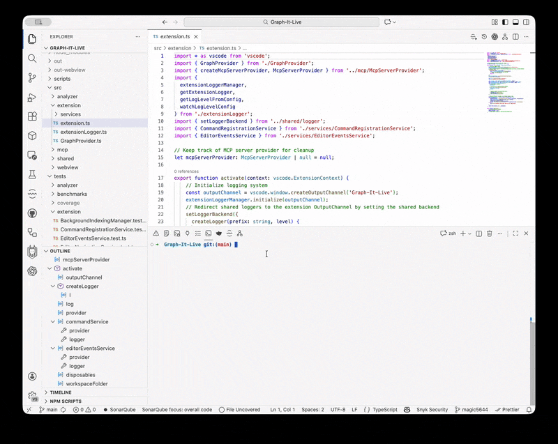

<div align="center">
  
</div>

# Graph-It-Live

A Visual Studio Code extension that visualizes file dependencies in a **real-time interactive graph**. Perfect for understanding code architecture and navigating complex **TypeScript**, **JavaScript**, **Vue**, **Svelte**, and **GraphQL** projects.

<div align="center">
  
</div>

## Features

- **Real-time Dependency Visualization**: Interactive graph showing file dependencies.
- **Multi-Language Support**: First-class support for **TypeScript** (`.ts`, `.tsx`), **JavaScript** (`.js`, `.jsx`), **Vue** (`.vue`), **Svelte** (`.svelte`), and **GraphQL** (`.gql`, `.graphql`).
- **Cycle Detection**: Automatically detects and highlights circular dependencies with red dashed lines and badges.
- **Smart Navigation**: Navigate through your code history with a built-in "Back" button in the graph view.
- **Background Indexing** *(New)*: Optionally index your entire workspace in the background for instant reverse dependency lookups. Uses a separate worker thread to avoid blocking the IDE.
- **Interactive Graph**:
    - **Expand/Collapse**: Dynamically load dependencies by clicking the `+` / `-` buttons on nodes.
    - **Bidirectional Navigation**: Find files that reference the current file (reverse dependencies) by clicking the `◀` button on the root node. With background indexing enabled, this is instant (O(1) lookup).
    - **File Navigation**: Click on any node to instantly open the corresponding file in the editor.
- **VS Code Integration**: Native look and feel using VS Code themes, colors, and fonts. Progress indicator in the status bar during indexing.
- **Powered by ReactFlow & Dagre**: Smooth, automatic graph layout that adjusts as you explore.

## Prerequisites

- **Node.js**: v24 or higher
- **VS Code**: v1.85.0 or higher

## Installation

### From Marketplace
Install directly from the VS Code Marketplace (when published) or search for "Graph-It-Live" in the Extensions view (`Ctrl+Shift+X` or `Cmd+Shift+X`).

### From Open VSX Registry
The extension is also available on the [Open VSX Registry](https://open-vsx.org/). You can install it using a compatible editor (like VSCodium) or by downloading the `.vsix` from the registry page.

### From VSIX
1. Download the `.vsix` file from releases.
2. In VS Code: `Extensions` → `...` (Views and More Actions) → `Install from VSIX...`
3. Select the downloaded `.vsix` file.

## Usage

1. **Open a Project**: Open a folder containing TypeScript, JavaScript, Vue, Svelte, or GraphQL files.
2. **Open the Graph**:
   - Click the **Graph-It-Live** icon in the Activity Bar (left sidebar).
   - Or run the command: `Graph-It-Live: Show Dependency Graph`.
   - Or click the graph icon in the editor title bar when viewing a supported file.
   - View can be moved to another panel by dragging and dropping the tab.
3. **Interact**:
   - **Navigate**: Click a node to open the file.
    - **Expand**: Click the small `+` button on a node to reveal its dependencies.
    - **Reverse Lookup**: Click the `◀` button on the left of the root node to see which files import the current file.
    - **Go Back**: Use the "Back" button in the top-left corner to return to previously viewed files.
   - **Pan/Zoom**: Drag the background to pan; scroll or pinch to zoom.

## Configuration

Customize the extension in VS Code Settings (`Cmd+,` or `Ctrl+,`):

| Setting | Default | Description |
|---------|---------|-------------|
| `graph-it-live.maxDepth` | `50` | Maximum depth of dependencies to analyze initially. |
| `graph-it-live.excludeNodeModules` | `true` | Whether to exclude `node_modules` imports from the graph. |
| `graph-it-live.enableBackgroundIndexing` | `true` | Enable background indexing for instant reverse dependency lookups. When enabled, all workspace files are indexed at startup using a worker thread. Disable it if you encounter performance issues or want to reduce CPU usage. |
| `graph-it-live.persistIndex` | `false` | Persist the reverse index to disk for faster startup. The index is validated using file mtime and size to detect changes. |
| `graph-it-live.indexingConcurrency` | `4` | Number of files to process in parallel during indexing (1-16). Lower values reduce CPU usage. |
| `graph-it-live.indexingStartDelay` | `1000` | Delay in milliseconds before starting background indexing after activation. Allows VS Code to finish startup first. |
| `graph-it-live.enableMcpServer` | `false` | Enable MCP Server for AI/LLM integration. Exposes dependency analysis tools via Model Context Protocol. |

### Background Indexing

When `enableBackgroundIndexing` is enabled:
- The extension indexes all TypeScript, JavaScript, Vue, Svelte, and GraphQL files in your workspace
- Indexing runs in a **separate worker thread** to avoid blocking the IDE
- Progress is shown in the **status bar** (bottom left)
- Reverse dependency lookups (`◀` button) become instant (O(1)) instead of scanning the entire workspace
- Recommended for large projects where reverse lookup performance matters

### GraphQL Support

Graph-It-Live provides full support for GraphQL schema files:

- **File Extensions**: `.gql` and `.graphql` files are fully supported
- **Import Syntax**: Parses GraphQL `#import` directives (e.g., `#import "./fragments/user.gql"`)
- **Cross-Language**: Detects imports of `.gql` files from TypeScript/JavaScript (webpack/vite loaders)
- **Visual Distinction**: GraphQL nodes are displayed with a **pink border** (#e535ab) matching the official GraphQL brand color

### MCP Server (AI/LLM Integration)

Graph-It-Live includes an optional **Model Context Protocol (MCP) Server** that exposes its dependency analysis capabilities to AI assistants and LLMs. When enabled, AI tools like GitHub Copilot can directly query your project's dependency graph.

#### Enabling the MCP Server

Set `graph-it-live.enableMcpServer` to `true` in your VS Code settings. The server will automatically start when the extension activates.

#### Available Tools

The MCP server exposes 7 tools for AI/LLM consumption:

| Tool | Description |
|------|-------------|
| `analyze_dependencies` | Analyze a single file's direct imports and exports |
| `crawl_dependency_graph` | Crawl the full dependency tree from an entry file |
| `find_referencing_files` | Find all files that import a given file (reverse lookup) |
| `expand_node` | Expand a node to show its dependencies beyond known paths |
| `parse_imports` | Parse imports from raw code content without file access |
| `resolve_module_path` | Resolve a module specifier to an absolute path |
| `get_index_status` | Get the current state of the dependency index |

#### How It Works

- Uses **stdio transport** (standard input/output) for communication
- Runs in a **separate worker thread** for non-blocking operation
- Maintains its **own cache** independent of the main extension
- Performs **automatic warmup** on startup to index the workspace
- Returns **enriched JSON** responses optimized for LLM understanding

## Development

### Project Structure

```
Graph-It-Live/
├── src/
│   ├── analyzer/          # Dependency analysis (AST parsing)
│   ├── extension/         # VS Code extension host logic
│   ├── shared/            # Shared types
│   └── webview/           # React + ReactFlow UI
├── tests/                 # Vitest unit tests
└── ...
```

### Setup

1. **Clone**:
   ```bash
   git clone https://github.com/magic5644/Graph-It-Live.git
   cd Graph-It-Live
   ```
2. **Install**:
   ```bash
   npm install
   ```
3. **Run**:
   - Press `F5` in VS Code to start the Extension Development Host.
   - **Watch Mode** (recommended for dev):
     ```bash
     npm run watch
     ```

### Scripts

- `npm run build`: Build for production.
- `npm run watch`: Build and watch for changes.
- `npm test`: Run unit tests with Vitest.
- `npm run lint:fix`: Fix linting issues.
- `npm run package`: Create a `.vsix` package.

## Contributing

Contributions are welcome! Please follow these steps:
1. Fork the repository.
2. Create a feature branch (`git checkout -b feature/amazing-feature`).
3. Commit your changes.
4. Push to the branch and open a Pull Request.

## License

MIT License - see [LICENSE](LICENSE) file for details.

## Author

**magic56** (magic5644)
