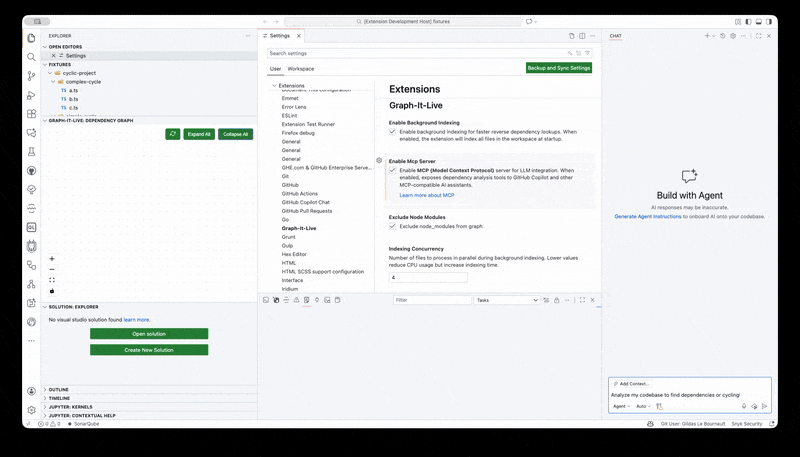
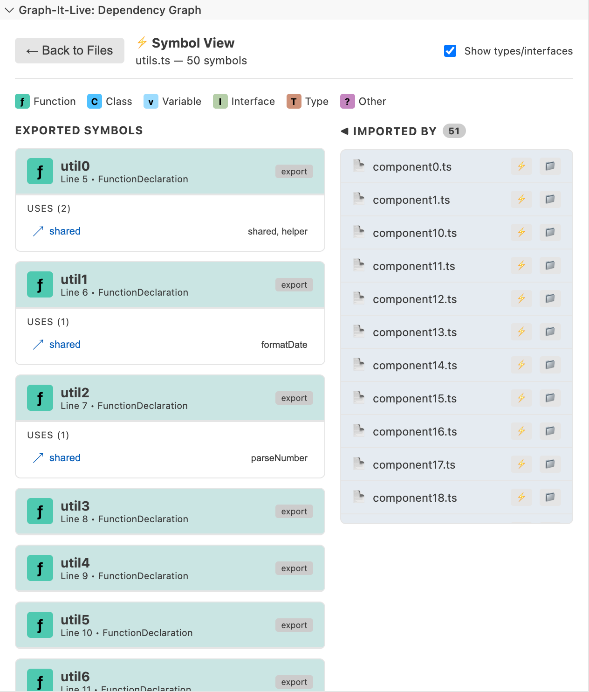
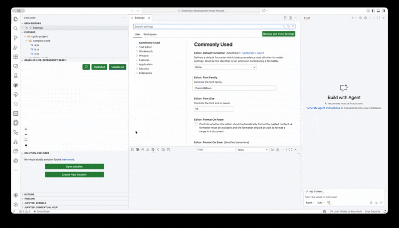

# Graph-It-Live

<div align="center">
  
</div>

[](https://marketplace.visualstudio.com/items?itemName=magic5644.graph-it-live)
[](https://open-vsx.org/extension/magic5644/graph-it-live)
[](https://modelcontextprotocol.io)
[](https://github.com/magic5644/Graph-It-Live/blob/main/LICENSE)

[](https://marketplace.visualstudio.com/items?itemName=magic5644.graph-it-live)
[](https://open-vsx.org/extension/magic5644/graph-it-live)

**Give your AI "eyes" to see your entire codebase structure.**

Graph-It-Live is a dual-purpose tool:

1.**For Humans**: A real-time interactive graph to visualize and navigate dependencies in **TypeScript**, **JavaScript**, **Vue**, **Svelte**, and **GraphQL** projects.
2.**For AI**: A built-in **Model Context Protocol (MCP) Server** that lets assistants like **GitHub Copilot**, **Claude**, and **Cursor** analyze your project's architecture, find impact of changes, and understand complex relationships without hallucinating.

<div align="center">
  
</div>

## 🤖 Supercharge Your AI Assistant

Stop pasting file paths and explaining your project structure. Graph-It-Live exposes **17 powerful dependency analysis tools** directly to your AI assistant via the [Model Context Protocol (MCP)](https://modelcontextprotocol.io).

**What your AI can do with Graph-It-Live:**

* **"Map out the architecture of the `auth` module"** -> AI crawls the dependency tree.
* **"What breaks if I change `User.ts`?"** -> AI performs instant reverse lookup to find all dependents.
* **"What calls `formatDate()` function?"** -> AI finds all symbol-level callers with O(1) lookup.
* **"Show me function-level dependencies in this file"** -> AI analyzes symbol-level relationships.
* **"Analyze the impact of changing `calculateTotal`'s signature"** -> AI detects breaking changes.
* **"Find unused exports in the codebase"** -> AI detects dead code automatically.
* **"Are there circular dependencies?"** -> AI detects cycles automatically.
* **"Explain how data flows from `App.vue` to the API"** -> AI traces the import path.

<div align="center">
  
  <p><em>Example: Asking GitHub Copilot to analyze dependencies using Graph-It-Live tools</em></p>
</div>

## Features

* **MCP Server for AI Integration** *(New)*: Built-in **Model Context Protocol (MCP) Server** exposes dependency analysis tools to AI assistants.
* **Symbol-Level Analysis** *(New)*: Drill down to see function-to-function and class-to-class dependencies within files.
* **Real-time Dependency Visualization**: Interactive graph showing file dependencies.
* **Multi-Language Support**: First-class support for **TypeScript** (`.ts`, `.tsx`), **JavaScript** (`.js`, `.jsx`), **Vue** (`.vue`), **Svelte** (`.svelte`), and **GraphQL** (`.gql`, `.graphql`).
* **Cycle Detection**: Automatically detects and highlights circular dependencies with red dashed lines and badges.
* **Smart Navigation**: Navigate through your code history with a built-in "Back" button in the graph view.
* **Background Indexing** *(New)*: Optionally index your entire workspace in the background for instant reverse dependency lookups. Uses a separate worker thread to avoid blocking the IDE.
* **Interactive Graph**:
  * **Expand/Collapse**: Dynamically load dependencies by clicking the `+` / `-` buttons on nodes.
  * **Bidirectional Navigation**: Find files that reference the current file (reverse dependencies) by clicking the `◀` button on the root node. With background indexing enabled, this is instant (O(1) lookup).
  * **File Navigation**: Click on any node to instantly open the corresponding file in the editor.
  * **Drill-Down** *(New)*: Double-click a file node (or click the ⇊ button on hover) to see symbol-level dependencies within that file.

<div align="center">
  
  <p><em>Symbol-level drill-down: explore function and class dependencies within a file</em></p>
</div>

## Prerequisites

* **Node.js**: v24 or higher
* **VS Code**: v1.96.0 or higher

## Installation

### From Marketplace

Install directly from the VS Code Marketplace (when published) or search for "Graph-It-Live" in the Extensions view (`Ctrl+Shift+X` or `Cmd+Shift+X`).

### From Open VSX Registry

The extension is also available on the [Open VSX Registry](https://open-vsx.org/). You can install it using a compatible editor (like VSCodium) or by downloading the `.vsix` from the registry page.

## Usage

1.**Open a Project**: Open a folder containing TypeScript, JavaScript, Vue, Svelte, or GraphQL files.
2.**Open the Graph**:
    -   Click the **Graph-It-Live** icon in the Activity Bar (left sidebar).
    -   Or run the command: `Graph-It-Live: Show Dependency Graph`.
    -   Or click the graph icon in the editor title bar when viewing a supported file.
3.**Interact**:
    -   **Navigate**: Click a node to open the file.
    -   **Expand**: Click the small `+` button on a node to reveal its dependencies.
    -   **Drill-Down**: Double-click a file node (or click the ⇊ button on hover) to see symbol-level dependencies (functions, classes) within that file.
    -   **Reverse Lookup**: Click the `◀` button on the left of the root node to see which files import the current file.

## Configuration

Customize the extension in VS Code Settings (`Cmd+,` or `Ctrl+,`):

| Setting | Default | Description |
| :--- | :--- | :--- |
| `graph-it-live.enableMcpServer` | `false` | **Enable this for AI features.** Exposes dependency analysis tools via Model Context Protocol. |
| `graph-it-live.maxDepth` | `50` | Maximum depth of dependencies to analyze initially. |
| `graph-it-live.excludeNodeModules` | `true` | Whether to exclude `node_modules` imports from the graph. |
| `graph-it-live.enableBackgroundIndexing` | `true` | Enable background indexing for instant reverse dependency lookups. |

## MCP Server (AI/LLM Integration)

Graph-It-Live includes an optional **Model Context Protocol (MCP) Server** that exposes its dependency analysis capabilities to AI assistants and LLMs.

### Enabling the MCP Server

Set `graph-it-live.enableMcpServer` to `true` in your VS Code settings. The server will automatically start when the extension activates.

<div align="center">
  
</div>

### Available Tools

The MCP server exposes **17 tools** for AI/LLM consumption:

| Tool | Description |
| :--- | :--- |
| `graphItLive_setWorkspace` | Set the project directory to analyze (required first if not auto-detected) |
| `graphItLive_analyzeDependencies` | Analyze a single file's direct imports and exports |
| `graphItLive_crawlDependencyGraph` | Crawl the full dependency tree from an entry file |
| `graphItLive_findReferencingFiles` | Find all files that import a given file (reverse lookup) |
| `graphItLive_expandNode` | Expand a node to discover dependencies beyond known paths |
| `graphItLive_parseImports` | Parse raw import statements without path resolution |
| `graphItLive_resolveModulePath` | Resolve a module specifier to an absolute file path |
| `graphItLive_getSymbolGraph` | Get symbol-level dependencies (functions, classes) within a file |
| `graphItLive_findUnusedSymbols` | Find potentially unused exported symbols for dead code detection |
| `graphItLive_getSymbolDependents` | Find all symbols that depend on a specific symbol |
| `graphItLive_traceFunctionExecution` | Trace the complete execution path through function calls |
| `graphItLive_getSymbolCallers` | Find all callers of a symbol with O(1) instant lookup |
| `graphItLive_analyzeBreakingChanges` | Detect breaking changes when modifying function signatures |
| `graphItLive_getImpactAnalysis` | Full impact analysis combining callers and breaking changes |
| `graphItLive_getIndexStatus` | Get the current state of the dependency index |
| `graphItLive_invalidateFiles` | Invalidate specific files from the cache after modifications |
| `graphItLive_rebuildIndex` | Rebuild the entire dependency index from scratch |

### Manual MCP Server Configuration

If the automatic MCP server registration doesn't work in your editor (e.g., when using Antigravity, Cursor, or if you want to use the server outside of VS Code), you can manually configure the MCP server.

<details>
<summary><strong>Click to expand configuration instructions for VS Code, Cursor, Claude Desktop, etc.</strong></summary>

#### VS Code / VS Code Insiders

Create or edit `.vscode/mcp.json` in your workspace:

```json
{
  "servers": {
    "graph-it-live": {
      "type": "stdio",
      "command": "node",
      "args": ["${extensionPath:magic5644.graph-it-live}/dist/mcpServer.mjs"],
      "env": {
        "WORKSPACE_ROOT": "${workspaceFolder}",
        "EXCLUDE_NODE_MODULES": "true",
        "MAX_DEPTH": "50"
      }
    }
  }
}
```

> **Note**: The `${extensionPath:magic5644.graph-it-live}` variable automatically resolves to the extension's installation directory.

#### Cursor

Create or edit `.cursor/mcp.json` in your workspace or `~/.cursor/mcp.json` for global configuration:

```json
{
  "mcpServers": {
    "graph-it-live": {
      "command": "bash",
      "args": ["-c", "node ~/.cursor/extensions/magic5644.graph-it-live-*/dist/mcpServer.mjs"],
      "env": {
        "WORKSPACE_ROOT": "${workspaceFolder}",
        "EXCLUDE_NODE_MODULES": "true",
        "MAX_DEPTH": "50"
      }
    }
  }
}
```

#### Antigravity (Google's VS Code fork)

> ⚠️ **Partial Support**: Antigravity's MCP integration is experimental.

Create `.vscode/mcp.json` in your workspace:

```json
{
  "mcpServers": {
    "graph-it-live": {
      "command": "node",
      "args": ["${extensionPath:magic5644.graph-it-live}/dist/mcpServer.mjs"],
      "env": {
        "WORKSPACE_ROOT": "${workspaceFolder}",
        "EXCLUDE_NODE_MODULES": "true",
        "MAX_DEPTH": "50"
      }
    }
  }
}
```

#### Claude Desktop

Add to your Claude Desktop configuration (`~/Library/Application Support/Claude/claude_desktop_config.json` on macOS).

First, find your extension path:

```bash
ls ~/.vscode/extensions/ | grep graph-it-live
# Example output: magic5644.graph-it-live-1.0.0
```

Then use the full path in your config:

```json
{
  "mcpServers": {
    "graph-it-live": {
      "command": "bash",
      "args": ["-c", "node ~/.vscode/extensions/magic5644.graph-it-live-*/dist/mcpServer.mjs"],
      "env": {
        "WORKSPACE_ROOT": "/path/to/your/project",
        "EXCLUDE_NODE_MODULES": "true",
        "MAX_DEPTH": "50"
      }
    }
  }
}
```

#### Development / Local Testing

When developing the extension locally:

```json
{
  "mcpServers": {
    "graph-it-live": {
      "command": "node",
      "args": ["/path/to/Graph-It-Live/dist/mcpServer.mjs"],
      "env": {
        "WORKSPACE_ROOT": "/absolute/path/to/your/project",
        "TSCONFIG_PATH": "/absolute/path/to/your/project/tsconfig.json",
        "EXCLUDE_NODE_MODULES": "true",
        "MAX_DEPTH": "50"
      }
    }
  }
}
```

</details>

## Development

### Project Structure

```bash
Graph-It-Live/
├── src/
│   ├── analyzer/          # Dependency analysis (AST parsing)
│   ├── extension/         # VS Code extension host logic
│   ├── shared/            # Shared types
│   └── webview/           # React + ReactFlow UI
├── tests/                 # Vitest unit tests
└── ...
```

### Setup

1.**Clone**:
    ```bash
    git clone https://github.com/magic5644/Graph-It-Live.git
    cd Graph-It-Live
    ```
2.**Install**:
    ```bash
    npm install
    ```
3.**Run**:
    -   Press `F5` in VS Code to start the Extension Development Host.

## License

MIT License - see [LICENSE](LICENSE) file for details.

## Author

**magic56** (magic5644)
