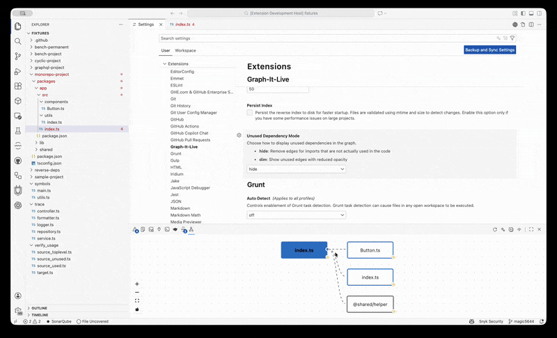
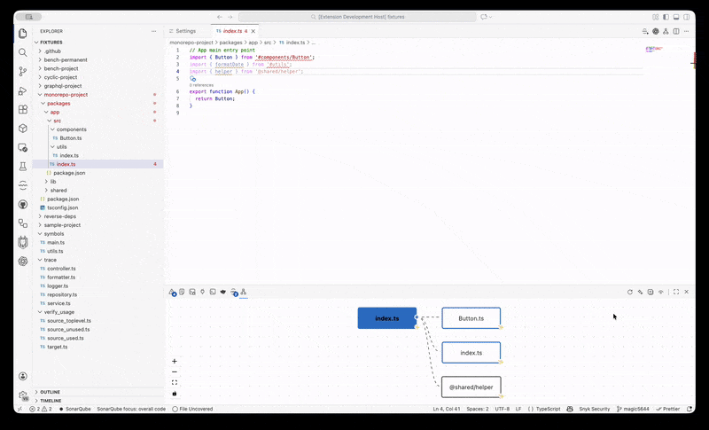
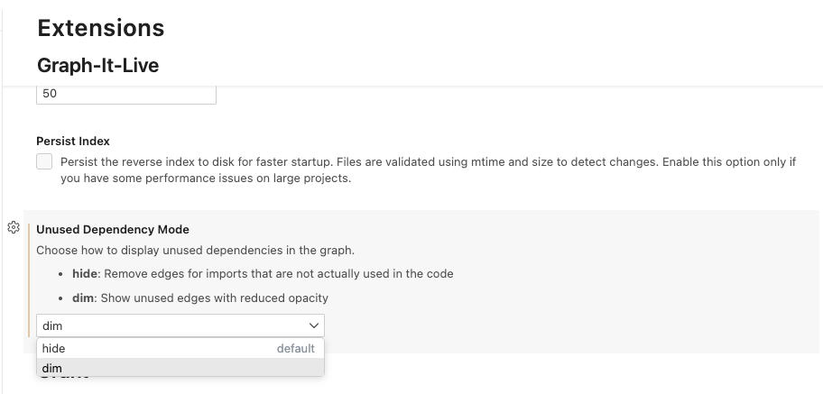

# Graph-It-Live

<div align="center">
  
</div>

[](https://marketplace.visualstudio.com/items?itemName=magic5644.graph-it-live)
[](https://open-vsx.org/extension/magic5644/graph-it-live)
[](https://modelcontextprotocol.io)
[](https://github.com/magic5644/Graph-It-Live/blob/main/LICENSE)
[](https://github.com/magic5644/Graph-It-Live)
[](https://marketplace.visualstudio.com/items?itemName=magic5644.graph-it-live)
[](https://open-vsx.org/extension/magic5644/graph-it-live)

**Give your AI "eyes" to see your entire codebase structure.**

Graph-It-Live is a dual-purpose tool:

1.**For Humans**: A real-time interactive graph to visualize and navigate dependencies in **TypeScript**, **JavaScript**, **Python**, **Rust**,**Vue**, **Svelte**, and **GraphQL** projects.

2.**For AI**: A built-in **Model Context Protocol (MCP) Server** that lets assistants like **GitHub Copilot**, **Claude**, and **Cursor** analyze your project's architecture, find impact of changes, and understand complex relationships without hallucinating.

<div align="center">
  
</div>

## 🤖 Supercharge Your AI Assistant

Stop pasting file paths and explaining your project structure. Graph-It-Live exposes **17 powerful dependency analysis tools** directly to your AI assistant via the [Model Context Protocol (MCP)](https://modelcontextprotocol.io).

**What your AI can do with Graph-It-Live:**

- **"Map out the architecture of the `auth` module"** -> AI crawls the dependency tree.
- **"What breaks if I change `User.ts`?"** -> AI performs instant reverse lookup to find all dependents.
- **"What calls `formatDate()` function?"** -> AI finds all symbol-level callers with O(1) lookup.
- **"Show me function-level dependencies in this file"** -> AI analyzes symbol-level relationships.
- **"Analyze the impact of changing `calculateTotal`'s signature"** -> AI detects breaking changes.
- **"Find unused exports in the codebase"** -> AI detects dead code automatically.
- **"Are there circular dependencies?"** -> AI detects cycles automatically.
- **"Explain how data flows from `App.vue` to the API"** -> AI traces the import path.

<div align="center">
  
  <p><em>Example: Asking GitHub Copilot to analyze dependencies using Graph-It-Live tools</em></p>
</div>

## Features

- **MCP Server for AI Integration** _(New)_: Built-in **Model Context Protocol (MCP) Server** exposes dependency analysis tools to AI assistants.
- **Unused Dependency Filter** _(New)_: Smart filter to show only dependencies that are actually used in your code. Toggle between showing all imports or filtering unused ones with a single click. Configurable to either hide unused edges completely or show them dimmed.

<div align="center">
  
  <p><em>Hide mode: Unused dependencies are completely removed from the graph</em></p>
</div>

<div align="center">
  
  <p><em>Dim mode: Unused dependencies are shown with reduced opacity and dashed lines</em></p>
</div>

- **Symbol-Level Analysis** _(New)_: Drill down to see function-to-function and class-to-class dependencies within files.
- **Real-time Dependency Visualization**: Interactive graph showing file dependencies.
- **Multi-Language Support**: First-class support for **TypeScript** (`.ts`, `.tsx`), **JavaScript** (`.js`, `.jsx`), **Python** (`.py`, `.pyi`), **Rust** (`.rs`), **TOML** (`.toml`), **Vue** (`.vue`), **Svelte** (`.svelte`), and **GraphQL** (`.gql`, `.graphql`).
- **Cycle Detection**: Automatically detects and highlights circular dependencies with red dashed lines and badges.
- **Smart Navigation**: Use VS Code's built-in navigation (Go Back / Go Forward) to move through your code history. Graph-It-Live also exposes navigation actions in the webview or panel menu.
- **Background Indexing** _(New)_: Optionally index your entire workspace in the background for instant reverse dependency lookups. Uses a separate worker thread to avoid blocking the IDE.
- **Interactive Graph**:
  - **Filter Unused Dependencies**: Use the eye/eye-closed toggle button in the toolbar to show only imports that are actually used in the code. Choose between hiding unused edges completely or showing them dimmed.
  - **Expand/Collapse**: Dynamically load dependencies using the node controls available in the webview/panel menu or the node's context menu (hover actions may still appear depending on layout).
  - **Bidirectional Navigation**: Use the "Find Referencing Files" action from a node's context menu or the webview/panel menu to see files that import the selected file. With background indexing enabled, this is instant (O(1) lookup).
  - **File Navigation**: Click on any node to instantly open the corresponding file in the editor.
  - **Drill-Down** _(New)_: Double-click a file node or choose the "Drill Down" action in the node context menu or webview/panel menu to see symbol-level dependencies within that file.

<div align="center">
  
  <p><em>Symbol-level drill-down: explore function and class dependencies within a file</em></p>
</div>

## Prerequisites

- **Node.js**: v18 or higher (v20 LTS recommended)
- **VS Code**: v1.96.0 or higher

**Note**: No build tools required! The extension uses WebAssembly (WASM) parsers, eliminating the need for native compilation tools (Python, C++ compiler, etc.) during installation.

## Known Issues

### ✅ Antigravity Compatibility (Resolved)

**Current Status**: Graph-It-Live now uses **WebAssembly (WASM)** parsers, eliminating native binary dependencies and improving compatibility with restrictive IDE environments like Antigravity.

**Migration**: The extension has migrated from native tree-sitter bindings to `web-tree-sitter` (official WASM port) and `tree-sitter-wasms` (pre-compiled language grammars). This change:

- ✅ Eliminates native compilation requirements during installation
- ✅ Removes code signature verification issues
- ✅ Improves installation reliability across all platforms
- ✅ Enhances security by using pure JavaScript and WASM
- ✅ Reduces package size (WASM files ~2-3 MB vs native binaries)

**Note**: Some unit tests may show WASM-related errors in Node.js environments due to web-tree-sitter compatibility limitations. The extension functions correctly in VS Code's Electron runtime environment. See [WASM Architecture](#wasm-architecture) section below for details.

**Workaround**: Use Graph-It-Live in standard VS Code, VS Code Insiders, Cursor, or other compatible editors.

**Updates**: Follow the GitHub issue for progress updates.

## WASM Architecture

Graph-It-Live uses WebAssembly (WASM) versions of tree-sitter parsers for improved installation reliability, security, and cross-platform compatibility.

### Benefits

- **No Native Compilation**: Installation doesn't require build tools (Python, C++ compiler, etc.)
- **Cross-Platform**: Works identically on Windows, Linux, and macOS
- **Security**: Pure JavaScript and WASM (no native binaries)
- **Lightweight**: WASM files are small (~2-3 MB total)
- **Reliable**: No code signature verification issues in restrictive environments

### Architecture Overview

```
VS Code Extension Host (Electron)
├── WasmParserFactory (Singleton)
│   ├── tree-sitter.wasm (Core WASM runtime)
│   ├── tree-sitter-python.wasm (Python grammar)
│   └── tree-sitter-rust.wasm (Rust grammar)
├── PythonParser (uses WASM)
├── RustParser (uses WASM)
└── Symbol Analyzers (use WASM)
```

### WASM File Locations

WASM files are located in the extension's `dist/wasm/` directory:

- `tree-sitter.wasm` - Core web-tree-sitter runtime
- `tree-sitter-python.wasm` - Python language grammar
- `tree-sitter-rust.wasm` - Rust language grammar

These files are automatically copied during the build process and included in the `.vsix` package.

### Initialization

Parsers initialize asynchronously on first use:

1. Extension activates and provides extension path to parsers
2. First parse operation triggers WASM initialization
3. WasmParserFactory loads core `tree-sitter.wasm`
4. Language-specific WASM files loaded on demand
5. Parser instances cached and reused (singleton pattern)

### Testing Approach

**Unit Tests**: Use mocked parsers for speed and reliability (WASM doesn't work in Node.js)

**E2E Tests**: Use real WASM parsers in VS Code's Electron environment

**Validation**: 90+ E2E tests verify all functionality with real WASM parsers

### Troubleshooting WASM Loading Failures

#### Error: "Extension path required for WASM parser initialization"

**Cause**: Parser created without extension path parameter

**Solution**: This is an internal error. If you encounter this, please report it as a bug. The extension should automatically provide the extension path to all parsers.

#### Error: "LinkError: WebAssembly.instantiate()"

**Cause**: web-tree-sitter compatibility issue in Node.js environment

**Solution**: This error is expected in unit tests and benchmarks. The extension works correctly in VS Code's runtime environment. If you see this error while using the extension in VS Code, please report it as a bug.

#### Error: "WASM file not found"

**Cause**: WASM files missing from `dist/wasm/` directory

**Solution**: 
1. Verify WASM files exist: Check if `dist/wasm/*.wasm` files are present
2. Reinstall the extension from the marketplace
3. If developing locally, run `npm run build` to copy WASM files

**Verification**:
```bash
# Check WASM files in installed extension
ls ~/.vscode/extensions/magic5644.graph-it-live-*/dist/wasm/*.wasm

# Expected output:
# tree-sitter.wasm
# tree-sitter-python.wasm
# tree-sitter-rust.wasm
```

#### Performance Considerations

**WASM Performance**: WASM parsers perform comparably to native parsers in production:

- ✅ All E2E tests pass without timeouts
- ✅ Large project analysis completes successfully
- ✅ Background indexing works efficiently
- ✅ No user-reported performance issues

**Memory Usage**: WASM parsers maintain efficient memory usage:

- ✅ Parser instances cached and reused (singleton pattern)
- ✅ Lazy loading (parsers initialized only when needed)
- ✅ Lightweight WASM files (~2-3 MB total)
- ✅ No memory leaks detected in E2E tests

### Known Limitations

**Node.js Compatibility**: web-tree-sitter is designed for browser/Electron environments and has known issues in pure Node.js contexts:

- ❌ Unit tests with real WASM parsers fail in Node.js
- ❌ Benchmark tests cannot measure WASM performance in Node.js
- ✅ Extension works correctly in VS Code's Electron environment
- ✅ E2E tests validate all functionality with real WASM parsers

**Workaround for Tests**: Unit tests use mocked parsers instead of real WASM for speed and reliability. E2E tests (`npm run test:vscode:vsix`) validate the extension with real WASM parsers in the production environment.

## Installation

### From Marketplace

Install directly from the VS Code Marketplace (when published) or search for "Graph-It-Live" in the Extensions view (`Ctrl+Shift+X` or `Cmd+Shift+X`).

### From Open VSX Registry

The extension is also available on the [Open VSX Registry](https://open-vsx.org/). You can install it using a compatible editor (like VSCodium) or by downloading the `.vsix` from the registry page.

## Usage

1.**Open a Project**: Open a folder containing TypeScript, JavaScript, Python, Rust, TOML, Vue, Svelte, or GraphQL files. 2.**Open the Graph**: - Click the **Graph-It-Live** icon in the Activity Bar (left sidebar). - Or run the command: `Graph-It-Live: Show Dependency Graph`. - Or click the graph icon in the editor title bar when viewing a supported file. 3.**Interact**: - **Navigate**: Click a node to open the file. - **Expand**: Use the "Expand" action from the node context menu or the webview/panel menu to reveal a node's dependencies. - **Drill-Down**: Double-click a file node or choose the "Drill Down" action in the node context menu to see symbol-level dependencies (functions, classes) within that file. - **Reverse Lookup**: Use the "Find Referencing Files" action in the node context menu or the webview/panel menu to see which files import the current file.

### Symbol-Level Drill-Down

Graph-It-Live goes beyond file dependencies - **drill into any file to visualize function-to-function and class-to-class call relationships** powered by the Language Server Protocol (LSP).

**How it works:**

1. **From File Graph**: Double-click any file node (or right-click → "Drill Down")
2. **Symbol Graph View**: See an interactive graph showing:
   - **Functions** in vibrant blue
   - **Classes** in deep purple
   - **Variables/Constants** in amber
   - Call relationships shown as **solid arrows** (function calls) or **dashed arrows** (references)
   - **Cycle detection** with badges for recursive calls
3. **Navigate**: Click any symbol node to jump to its definition in the editor
4. **Breadcrumb Navigation**: Use the breadcrumb bar at the top (`Project > folder > file.ts`) to return to file view
5. **Multi-Language Support**: Works with:
   - **TypeScript/JavaScript** (via built-in LSP)
   - **Python** (via Pylance - install Microsoft Python extension)
   - **Rust** (via rust-analyzer - install rust-analyzer extension)

**Benefits:**

- **Understand code flow** without reading every line
- **Impact analysis** at function level - see what breaks if you change a function signature
- **Find call chains** - trace execution paths through your codebase
- **Refactoring confidence** - visualize dependencies before making changes

<div align="center">
  
  <p><em>Symbol-level view: Purple classes, blue functions, amber variables with call relationships</em></p>
</div>

## Configuration

### Performance Profiles

For optimal performance on your machine, configure the performance profile in VS Code settings:

**Setting**: `graph-it-live.performanceProfile`

- **`default`** _(recommended)_: Balanced settings for most machines (4GB-8GB RAM)
  - Concurrency: 4, Max edges: 2000, Cache: 500/200
- **`low-memory`**: Optimized for resource-constrained machines (<4GB RAM)
  - Concurrency: 2, Max edges: 1000, Cache: 200/100
- **`high-performance`**: Maximizes speed on powerful workstations (16GB+ RAM)
  - Concurrency: 12, Max edges: 5000, Cache: 1500/800
- **`custom`**: Manual configuration - all performance settings become editable

#### Automatic Profile Application

When you select a preset profile (`default`, `low-memory`, or `high-performance`):

- All related performance settings are **automatically configured**
- Settings like `unusedAnalysisConcurrency`, `maxCacheSize`, etc. update instantly
- Individual settings become read-only to prevent conflicts

Select **`custom`** profile to unlock manual control of all performance parameters:

- `graph-it-live.unusedAnalysisConcurrency`: Parallel file analysis (1-16)
- `graph-it-live.unusedAnalysisMaxEdges`: Skip auto-analysis threshold (0=unlimited)
- `graph-it-live.maxCacheSize`: Dependency cache size (50-2000)
- `graph-it-live.maxSymbolCacheSize`: Symbol cache size (50-1000)
- `graph-it-live.indexingConcurrency`: Background indexing parallelism (1-16)

### General Settings

Customize the extension in VS Code Settings (`Cmd+,` or `Ctrl+,`):

<div align="center">
  
  <p><em>Configure how unused dependencies are displayed: hide (remove completely) or dim (show with reduced opacity)</em></p>
</div>

| Setting                                    | Default   | Description                                                                                                                                                                    |
| :----------------------------------------- | :-------- | :----------------------------------------------------------------------------------------------------------------------------------------------------------------------------- |
| `graph-it-live.performanceProfile`         | `default` | Performance preset: `default`, `low-memory`, `high-performance`, or `custom` for manual control. When set to a preset, related performance settings are applied automatically. |
| `graph-it-live.enableMcpServer`            | `false`   | Enable the MCP (Model Context Protocol) server for AI/LLM integration. Only enable if you need AI assistants to access project analysis tools.                                 |
| `graph-it-live.enableMcpDebugLogging`      | `false`   | Privacy-sensitive debug logging for the MCP server (creates `~/mcp-debug.log`). Enable only for troubleshooting; logs rotate automatically. See Security Guide.                |
| `graph-it-live.maxDepth`                   | `50`      | Maximum dependency depth to analyze during crawls and initial graph generation.                                                                                                |
| `graph-it-live.excludeNodeModules`         | `true`    | Exclude `node_modules` imports from the graph to reduce noise and improve performance.                                                                                         |
| `graph-it-live.enableBackgroundIndexing`   | `true`    | Enable background indexing of the workspace for fast reverse dependency lookups (O(1) queries).                                                                                |
| `graph-it-live.persistIndex`               | `false`   | Persist the reverse index to disk for faster startup. Index entries are validated by `mtime`/size.                                                                             |
| `graph-it-live.indexingConcurrency`        | `4`       | Number of files to process in parallel during background indexing (1-16). Editable only when `performanceProfile` is `custom`.                                                 |
| `graph-it-live.indexingStartDelay`         | `1000`    | Delay (ms) before starting background indexing after activation; allows VS Code to finish startup.                                                                             |
| `graph-it-live.logLevel`                   | `info`    | Logging verbosity: `debug`, `info`, `warn`, `error`, or `none`.                                                                                                                |
| `graph-it-live.unusedDependencyMode`       | `hide`    | How to display unused dependencies: `hide` removes them, `dim` shows them with reduced opacity and dashed styling.                                                             |
| `graph-it-live.unusedAnalysisConcurrency`  | `4`       | Number of source files to analyze in parallel for unused dependency detection (1-16). Lower values reduce memory usage. Editable only when `performanceProfile` is `custom`.   |
| `graph-it-live.unusedAnalysisMaxEdges`     | `2000`    | Skip automatic unused dependency analysis if the graph has more edges than this threshold. Set to `0` for no limit. Editable only when `performanceProfile` is `custom`.       |
| `graph-it-live.persistUnusedAnalysisCache` | `false`   | Cache unused dependency analysis results to disk to speed up subsequent loads. Results are invalidated on file change.                                                         |
| `graph-it-live.maxUnusedAnalysisCacheSize` | `200`     | Maximum number of source files to cache for unused dependency analysis (LRU eviction). Adjust to tune memory vs hit-rate.                                                      |
| `graph-it-live.maxCacheSize`               | `500`     | Maximum number of file dependency analyses to keep in memory cache. Useful to control memory usage.                                                                            |
| `graph-it-live.maxSymbolCacheSize`         | `200`     | Maximum number of symbol analysis results to keep in memory cache.                                                                                                             |

## MCP Server (AI/LLM Integration)

Graph-It-Live includes an optional **Model Context Protocol (MCP) Server** that exposes its dependency analysis capabilities to AI assistants and LLMs.

### Enabling the MCP Server

Set `graph-it-live.enableMcpServer` to `true` in your VS Code settings. The server will automatically start when the extension activates.

<div align="center">
  
</div>

### Available Tools

The MCP server exposes **17 tools** for AI/LLM consumption:

| Tool                                   | Description                                                                |
| :------------------------------------- | :------------------------------------------------------------------------- |
| `graphitlive_set_workspace`            | Set the project directory to analyze (required first if not auto-detected) |
| `graphitlive_analyze_dependencies`     | Analyze a single file's direct imports and exports                         |
| `graphitlive_crawl_dependency_graph`   | Crawl the full dependency tree from an entry file                          |
| `graphitlive_find_referencing_files`   | Find all files that import a given file (reverse lookup)                   |
| `graphitlive_expand_node`              | Expand a node to discover dependencies beyond known paths                  |
| `graphitlive_parse_imports`            | Parse raw import statements without path resolution                        |
| `graphitlive_resolve_module_path`      | Resolve a module specifier to an absolute file path                        |
| `graphitlive_get_symbol_graph`         | Get symbol-level dependencies (functions, classes) within a file           |
| `graphitlive_find_unused_symbols`      | Find potentially unused exported symbols for dead code detection           |
| `graphitlive_get_symbol_dependents`    | Find all symbols that depend on a specific symbol                          |
| `graphitlive_trace_function_execution` | Trace the complete execution path through function calls                   |
| `graphitlive_get_symbol_callers`       | Find all callers of a symbol with O(1) instant lookup                      |
| `graphitlive_analyze_breaking_changes` | Detect breaking changes when modifying function signatures                 |
| `graphitlive_get_impact_analysis`      | Full impact analysis combining callers and breaking changes                |
| `graphitlive_get_index_status`         | Get the current state of the dependency index                              |
| `graphitlive_invalidate_files`         | Invalidate specific files from the cache after modifications               |
| `graphitlive_rebuild_index`            | Rebuild the entire dependency index from scratch                           |

Note: Tool names were renamed from `graphItLive_*` to `graphitlive_*` (snake_case).

### TOON Format (Token-Optimized Output)

All MCP tools now support an optional `format` parameter to reduce token consumption for large datasets:

```json
{
  "tool": "graphitlive_crawl_dependency_graph",
  "params": {
    "entryFile": "/path/to/main.ts",
    "format": "toon"
  }
}
```

**Available formats**:

- `json` (default): Standard JSON output
- `toon`: Compact Token-Oriented Object Notation (saves 30-60% tokens)
- `markdown`: JSON wrapped in markdown code blocks

**Example TOON Output**:

```
files(file,deps,line)
[main.ts,fs|path,10]
[utils.ts,os|crypto,20]

# Token Savings
JSON: 125 tokens
TOON: 48 tokens
Savings: 77 tokens (61.6%)
```

**Learn more**: See [TOON Format Documentation](./docs/TOON_FORMAT.md) for complete specifications and usage examples.

### Manual MCP Server Configuration

If the automatic MCP server registration doesn't work in your editor (e.g., when using Antigravity, Cursor, or if you want to use the server outside of VS Code), you can manually configure the MCP server.

<details>
<summary><strong>Click to expand configuration instructions for VS Code, Cursor, Claude Desktop, etc.</strong></summary>

#### VS Code / VS Code Insiders

Create or edit `.vscode/mcp.json` in your workspace:

```json
{
  "servers": {
    "graph-it-live": {
      "type": "stdio",
      "command": "node",
      "args": ["${extensionPath:magic5644.graph-it-live}/dist/mcpServer.mjs"],
      "env": {
        "WORKSPACE_ROOT": "${workspaceFolder}",
        "EXCLUDE_NODE_MODULES": "true",
        "MAX_DEPTH": "50"
      }
    }
  }
}
```

> **Note**: The `${extensionPath:magic5644.graph-it-live}` variable automatically resolves to the extension's installation directory.

#### Cursor

Create or edit `.cursor/mcp.json` in your workspace or `~/.cursor/mcp.json` for global configuration:

```json
{
  "mcpServers": {
    "graph-it-live": {
      "command": "bash",
      "args": [
        "-c",
        "node ~/.cursor/extensions/magic5644.graph-it-live-*/dist/mcpServer.mjs"
      ],
      "env": {
        "WORKSPACE_ROOT": "${workspaceFolder}",
        "EXCLUDE_NODE_MODULES": "true",
        "MAX_DEPTH": "50"
      }
    }
  }
}
```

#### Antigravity (Google's VS Code fork)

> ⚠️ **NOT CURRENTLY SUPPORTED**: Graph-It-Live is currently **incompatible** with Antigravity due to native binary code signing restrictions.
>
> **Issue**: Antigravity enforces strict code signature verification (Team ID matching) on native modules. The tree-sitter parsers used by this extension fail with "different Team IDs" errors.
>
> **Status**: An issue has been opened with the Antigravity development team. We are exploring WASM-based solutions and other workarounds.
>
> **Recommendation**: Use Graph-It-Live in standard VS Code, VS Code Insiders, or Cursor instead.

If/when Antigravity support becomes available, create `.vscode/mcp.json` in your workspace:

```json
{
  "mcpServers": {
    "graph-it-live": {
      "command": "node",
      "args": ["${extensionPath:magic5644.graph-it-live}/dist/mcpServer.mjs"],
      "env": {
        "WORKSPACE_ROOT": "${workspaceFolder}",
        "EXCLUDE_NODE_MODULES": "true",
        "MAX_DEPTH": "50"
      }
    }
  }
}
```

#### Claude Desktop

Add to your Claude Desktop configuration (`~/Library/Application Support/Claude/claude_desktop_config.json` on macOS).

First, find your extension path:

```bash
ls ~/.vscode/extensions/ | grep graph-it-live
# Example output: magic5644.graph-it-live-1.0.0
```

Then use the full path in your config:

```json
{
  "mcpServers": {
    "graph-it-live": {
      "command": "bash",
      "args": [
        "-c",
        "node ~/.vscode/extensions/magic5644.graph-it-live-*/dist/mcpServer.mjs"
      ],
      "env": {
        "WORKSPACE_ROOT": "/path/to/your/project",
        "EXCLUDE_NODE_MODULES": "true",
        "MAX_DEPTH": "50"
      }
    }
  }
}
```

#### Development / Local Testing

When developing the extension locally:

```json
{
  "mcpServers": {
    "graph-it-live": {
      "command": "node",
      "args": ["/path/to/Graph-It-Live/dist/mcpServer.mjs"],
      "env": {
        "WORKSPACE_ROOT": "/absolute/path/to/your/project",
        "TSCONFIG_PATH": "/absolute/path/to/your/project/tsconfig.json",
        "EXCLUDE_NODE_MODULES": "true",
        "MAX_DEPTH": "50"
      }
    }
  }
}
```

</details>

## Development

For comprehensive development instructions, see:

- **[DEVELOPMENT.md](DEVELOPMENT.md)** - Complete development guide (setup, build, testing, WASM architecture)
- **[CONTRIBUTING.md](CONTRIBUTING.md)** - Contribution guidelines and workflow

### Quick Start

1. **Clone**:

```bash
git clone https://github.com/magic5644/Graph-It-Live.git
cd Graph-It-Live
```

2. **Install dependencies**:

```bash
npm install
```

3. **Build**:

```bash
npm run build
```

4. **Run in development**:

- Press `F5` in VS Code to start the Extension Development Host. Remember to open the `extension.ts` file.

### Project Structure

```bash
Graph-It-Live/
├── src/
│   ├── analyzer/          # Dependency analysis (AST parsing)
│   ├── extension/         # VS Code extension host logic
│   ├── shared/            # Shared types
│   └── webview/           # React + ReactFlow UI
├── tests/                 # Vitest unit tests
├── docs/                  # Technical documentation
├── DEVELOPMENT.md         # Development guide
└── CONTRIBUTING.md        # Contribution guidelines
```

---

## 🛠️ Build, Test, and Packaging Commands

All commands must be run from the project root.

| Command                             | Description                                                                                             |
| ----------------------------------- | ------------------------------------------------------------------------------------------------------- |
| `npm install`                       | Install dependencies. No native compilation required - uses WASM parsers for cross-platform compatibility. |
| `npm run build`                     | Build the extension bundle via `esbuild.js`. Automatically copies WASM files to `dist/wasm/`.                                                            |
| `npm run watch`                     | Rebuild automatically on file changes.                                                                  |
| `npm test` / `npm run test:unit`    | Run unit tests (Vitest) with mocked parsers.                                                                                |
| `npm run test:coverage`             | Generate coverage report (see `tests/coverage/`).                                                       |
| `npm run test:vscode`               | Run VS Code e2e tests from source (development mode) with real WASM parsers.                                                   |
| `npm run test:vscode:vsix`          | Run VS Code e2e tests from the packaged .vsix (production mode, required before release) with real WASM parsers.               |
| `npm run lint` / `npm run lint:fix` | Lint TypeScript code (ESLint).                                                                          |
| `npm run check:types`               | Strict type checking with `tsc`.                                                                        |
| `npm run package`                   | Build the `.vsix` package for distribution. Includes WASM files in the package.                                                             |
| `npm run package:verify`            | Verify that the package contains **no .map files** (mandatory before commit/release). Also verifies WASM files are included.                   |

### Package Verification (MANDATORY before any build-related commit)

After any change to `esbuild.js`, `.vscodeignore`, or dependencies in `package.json`:

```bash
npm run build -- --production
npm run package
npm run package:verify
# Expected: "✅ No .map files in package"
# If any files are listed, fix .vscodeignore before proceeding!

# Verify WASM files are included
npx vsce ls | grep "\.wasm$"
# Expected: dist/wasm/tree-sitter.wasm, dist/wasm/tree-sitter-python.wasm, dist/wasm/tree-sitter-rust.wasm

ls -lh *.vsix
```

### Tips

- **E2E tests**: Add an e2e test for any new user-facing feature (command, UI, setting).
- **Cross-platform**: All code and commands must work on Windows, Linux, and macOS.

---

## License

MIT License - see [LICENSE](LICENSE) file for details.

## Acknowledgements

Language icons provided by [SuperTinyIcons](https://github.com/edent/SuperTinyIcons) - a collection of miniscule SVG versions of website and app logos, under CC0-1.0 license.

## Author

**magic56** (magic5644)
