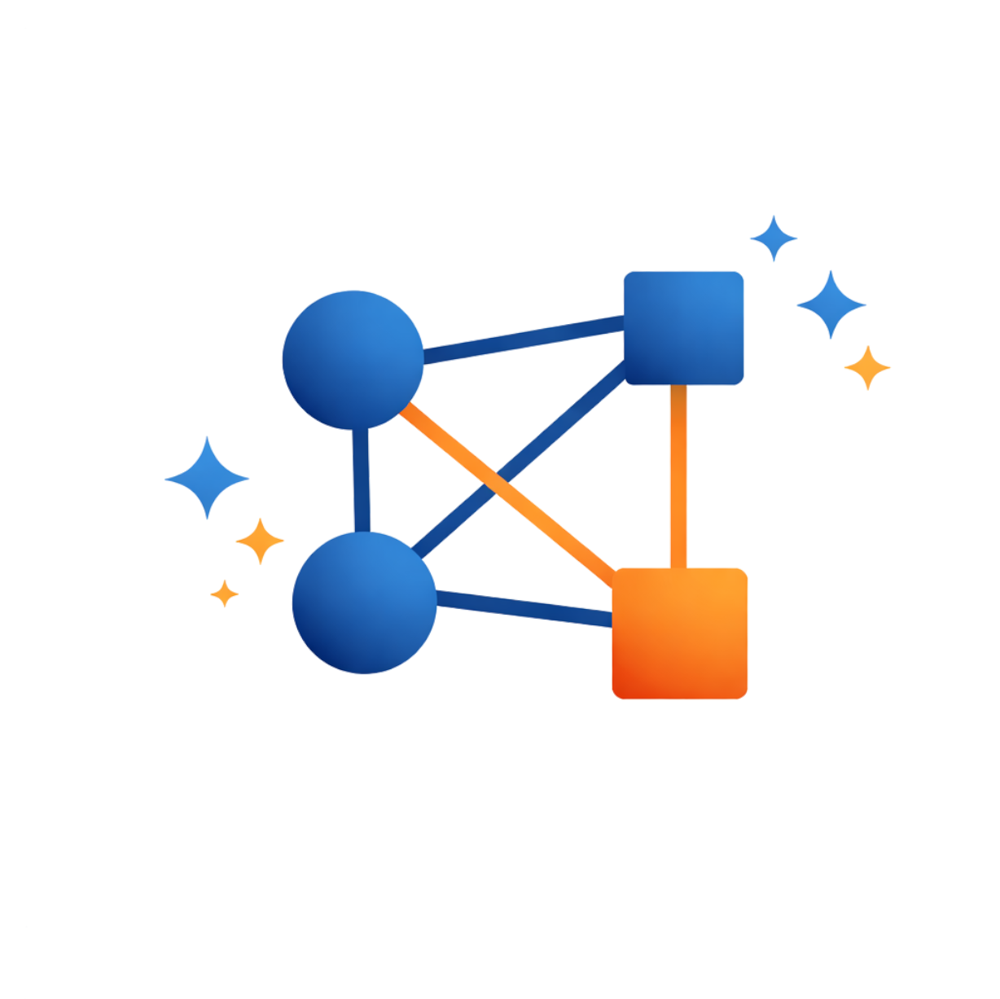
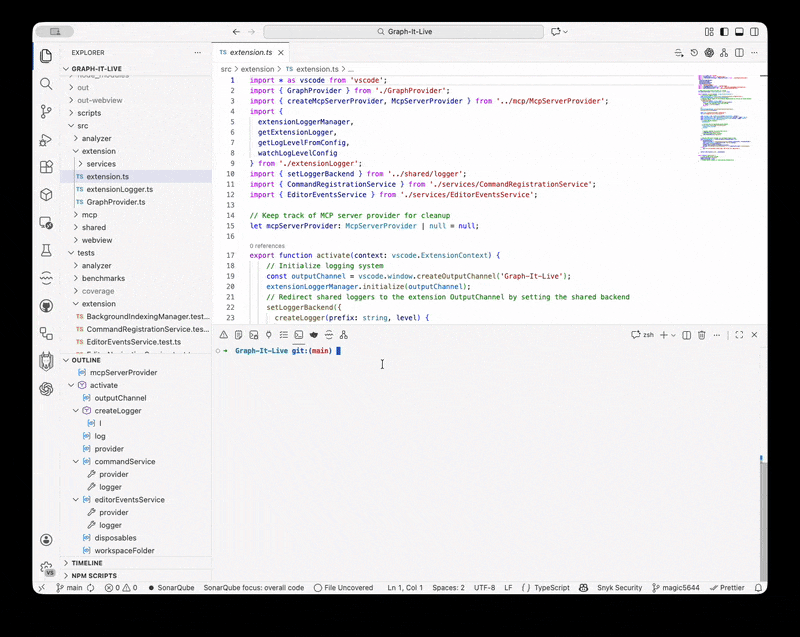
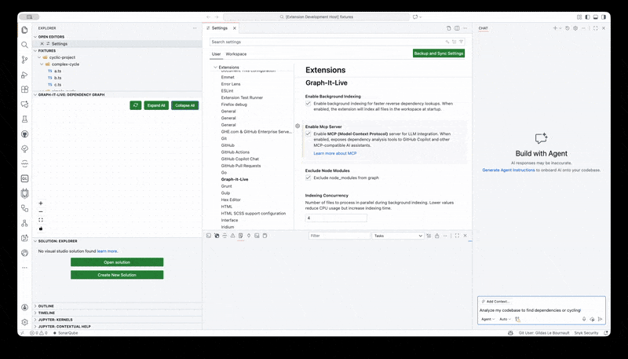
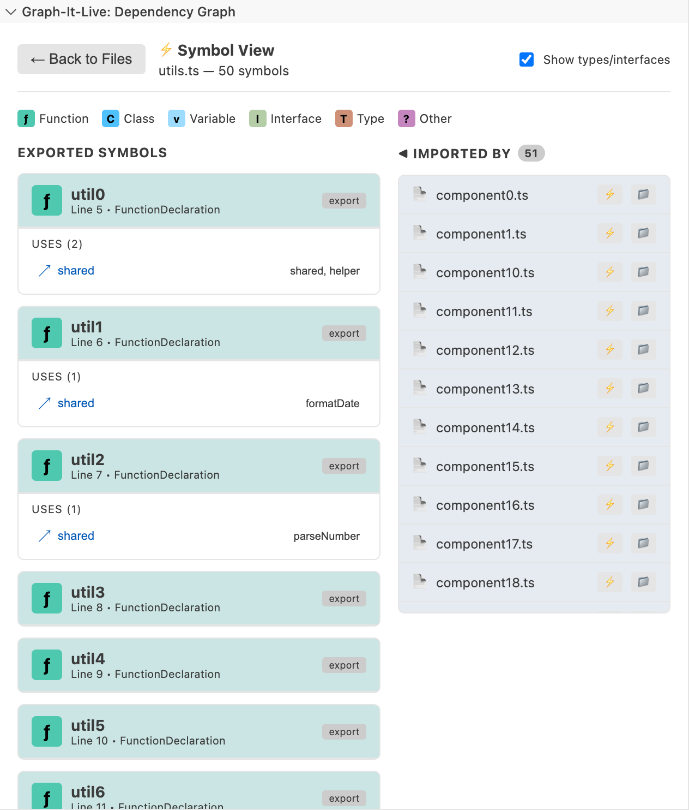
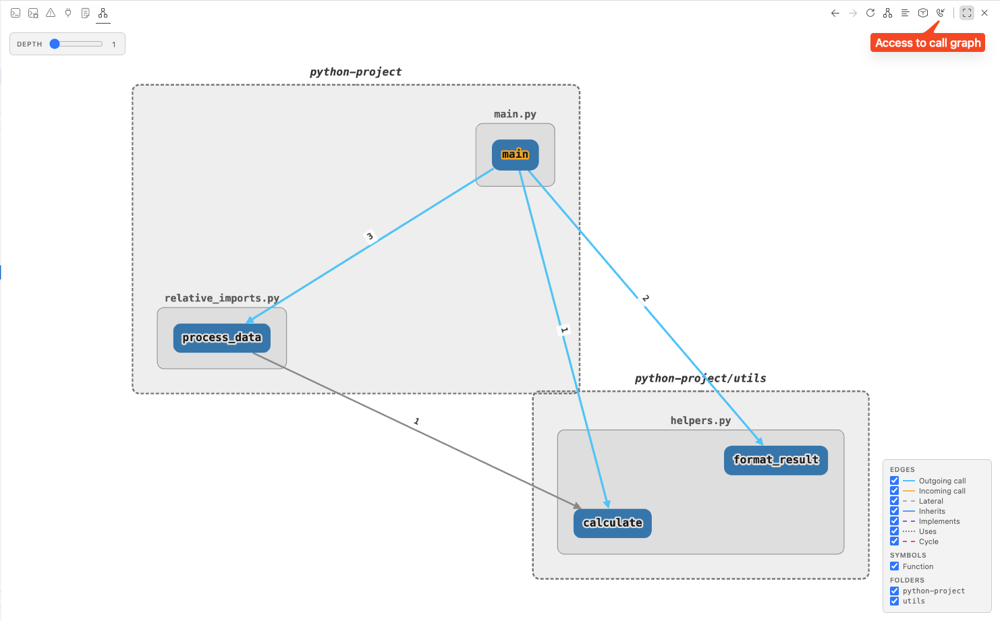
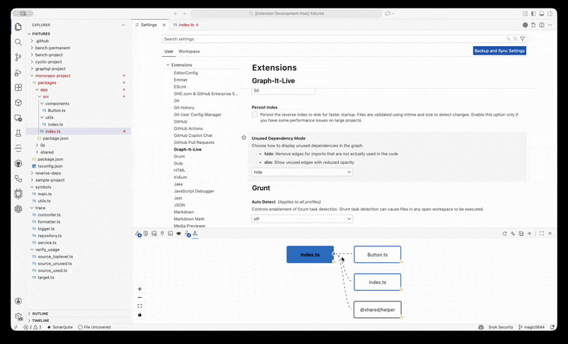
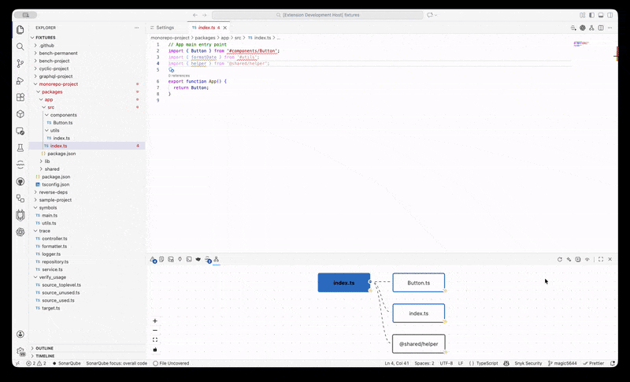
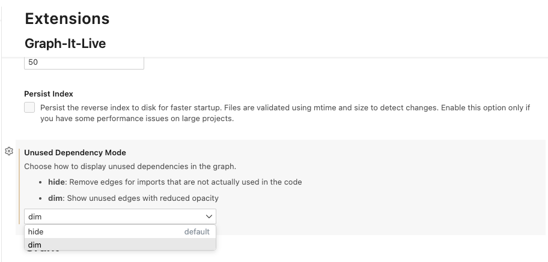
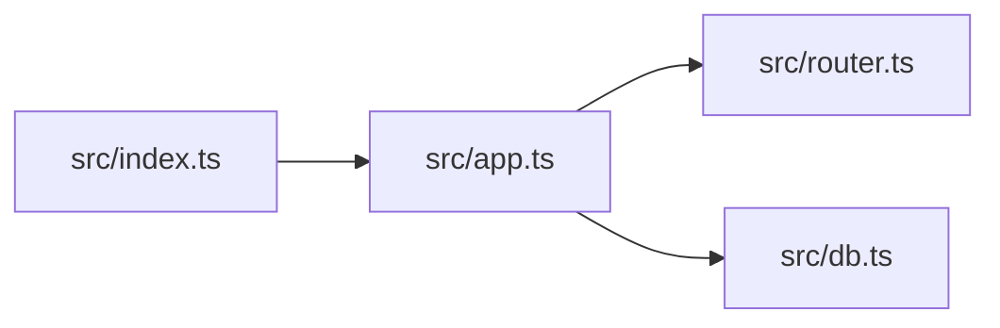
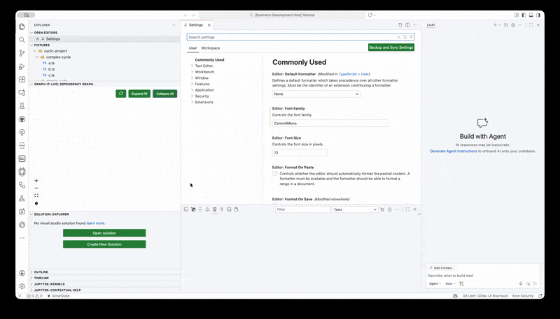

# Graph-It-Live

<div align="center">
  

  **The AI-first dependency intelligence platform for VS Code.**

  See your codebase the way your AI does — as a graph.

</div>

[](https://marketplace.visualstudio.com/items?itemName=magic5644.graph-it-live)
[](https://marketplace.visualstudio.com/items?itemName=magic5644.graph-it-live)
[](https://open-vsx.org/extension/magic5644/graph-it-live)
[](https://open-vsx.org/extension/magic5644/graph-it-live)
[](https://www.npmjs.com/package/@magic5644/graph-it-live)
[](https://modelcontextprotocol.io)
[](https://github.com/magic5644/Graph-It-Live/blob/main/LICENSE)
[](https://github.com/magic5644/Graph-It-Live)

---

Graph-It-Live turns your codebase into a live, interactive dependency graph — one that both **you** and your **AI assistant** can query in real time.

Built for **architects** who need the big picture and **developers** who need to ship safely, it combines three analysis layers in one tool:

| Layer | What you see | Powered by |
|-------|-------------|------------|
| **File Graph** | File-to-file import relationships | Regex + AST parsing |
| **Symbol View** | Function/class call hierarchy inside a file | AST (ts-morph) |
| **Live Call Graph** | Cross-file symbol call relationships | Tree-sitter + SQLite |

All three layers are also exposed to AI via a **21-tool MCP server**, so your assistant can answer architecture questions with zero hallucination.

<div align="center">
  
</div>

---

## Why Graph-It-Live?

| Pain point | Without Graph-It-Live | With Graph-It-Live |
|---|---|---|
| "What breaks if I touch this file?" | Grep + hope | One-click reverse dependency lookup |
| "Explain this module's architecture" | Read 30 files | AI generates a codemap in seconds |
| "Are there circular deps?" | Manual tracing | Auto-detected, red-highlighted cycles |
| "What calls this function across the project?" | Global search + noise | Live Call Graph with depth control |
| "Onboard a new developer" | Hours of walkthroughs | Interactive graph + AI-generated overviews |

---

## Table of Contents

- [Graph-It-Live](#graph-it-live)
  - [Why Graph-It-Live?](#why-graph-it-live)
  - [Table of Contents](#table-of-contents)
  - [🤖 Supercharge Your AI Assistant](#-supercharge-your-ai-assistant)
    - [What your AI can do with Graph-It-Live](#what-your-ai-can-do-with-graph-it-live)
    - [🗺️ Codemap Generation *(New)*](#️-codemap-generation-new)
    - [📊 File Logic Analysis *(New)*](#-file-logic-analysis-new)
  - [👁️ Features for Humans](#️-features-for-humans)
    - [File Dependency Graph](#file-dependency-graph)
    - [Symbol-Level Drill-Down](#symbol-level-drill-down)
    - [🔷 Live Call Graph *(New)*](#-live-call-graph-new)
    - [Unused Dependency Filter](#unused-dependency-filter)
  - [Prerequisites](#prerequisites)
  - [Installation](#installation)
    - [From Marketplace](#from-marketplace)
    - [From Open VSX Registry](#from-open-vsx-registry)
  - [Usage](#usage)
  - [Configuration](#configuration)
    - [Performance Profiles](#performance-profiles)
    - [All Settings](#all-settings)
  - [Standalone CLI](#standalone-cli)
  - [Agent Skill](#agent-skill)
  - [MCP Server (AI/LLM Integration)](#mcp-server-aillm-integration)
    - [Setup](#setup)
    - [Available Tools](#available-tools)
    - [TOON Format (Token-Optimized Output)](#toon-format-token-optimized-output)
    - [Native LM Tools (Copilot Agent Mode)](#native-lm-tools-copilot-agent-mode)
    - [Manual MCP Server Configuration](#manual-mcp-server-configuration)
      - [VS Code / VS Code Insiders](#vs-code--vs-code-insiders)
      - [Cursor](#cursor)
      - [Claude Desktop](#claude-desktop)
      - [Development / Local Testing](#development--local-testing)
      - [Windsurf](#windsurf)
      - [Antigravity](#antigravity)
  - [Development](#development)
    - [Quick Start](#quick-start)
    - [Project Structure](#project-structure)
    - [Build \& Test Commands](#build--test-commands)
  - [WASM Architecture](#wasm-architecture)
    - [Architecture](#architecture)
    - [Testing](#testing)
    - [Troubleshooting](#troubleshooting)
  - [License](#license)
  - [Acknowledgements](#acknowledgements)
  - [Author](#author)

---

## 🤖 Supercharge Your AI Assistant

Stop pasting file paths and explaining your project structure. Graph-It-Live exposes **21 powerful dependency analysis tools** directly to your AI assistant via the [Model Context Protocol (MCP)](https://modelcontextprotocol.io), and **20 native LM Tools** directly in Copilot Agent mode (no MCP setup required).

**Works with:** GitHub Copilot, Claude (Desktop & Code), Cursor, Windsurf, Antigravity, and any MCP-compatible client.

### What your AI can do with Graph-It-Live

| You ask | AI uses | Result |
|---------|---------|--------|
| *"Map out the architecture of the auth module"* | `crawl_dependency_graph` | Full dependency tree as structured data |
| *"What breaks if I change User.ts?"* | `find_referencing_files` | All dependent files with O(1) lookup |
| *"Give me an overview of Spider.ts"* | `generate_codemap` | Exports, internals, deps, dependents, call flow — in one call |
| *"What calls formatDate() across the project?"* | `get_symbol_callers` | All callers with instant lookup |
| *"Show function-level flow in this file"* | `analyze_file_logic` | Intra-file call hierarchy |
| *"Analyze the impact of changing calculateTotal's signature"* | `get_impact_analysis` | Breaking change detection + all affected callers |
| *"Find unused exports in the codebase"* | `find_unused_symbols` | Dead code detection |
| *"Are there circular dependencies?"* | `crawl_dependency_graph` | Cycle detection built in |

<div align="center">
  
  <p><em>GitHub Copilot querying Graph-It-Live to analyze a project's dependency structure</em></p>
</div>

### 🗺️ Codemap Generation *(New)*

The `graphitlive_generate_codemap` tool gives your AI a **complete structural overview of any file** in a single call — no more chaining 5 different tools.

**What it returns:**

```
┌─────────────────────────────────────────────────┐
│  Spider.ts  (247 lines, TypeScript)             │
├─────────────────────────────────────────────────┤
│  EXPORTS: Spider, SpiderOptions                 │
│  INTERNALS: crawlFile, resolveImport, visitNode │
│  DEPENDENCIES: Parser.ts, PathResolver.ts, ...  │
│  DEPENDENTS: SpiderBuilder.ts, extension.ts     │
│  CALL FLOW: crawl → crawlFile → resolveImport  │
│  CYCLES: none                                   │
└─────────────────────────────────────────────────┘
```

**Use cases:**

- **Onboarding:** *"Give me an overview of every file in src/analyzer/"* — AI maps the full module
- **Pre-refactor audit:** *"Generate codemaps for all files that import UserService"* — understand coupling before changing
- **Documentation:** *"Create architecture docs from codemaps"* — structured data → Markdown in seconds
- **Code review:** *"What does this new file export and who depends on it?"* — instant context

> **Token-efficient:** Output uses a compact format optimised for LLM consumption. Combine with `format: "toon"` for up to 60% token savings.

<!-- TODO: Add screenshot or video of AI generating a codemap -->

### 📊 File Logic Analysis *(New)*

The `graphitlive_analyze_file_logic` tool reveals the **call hierarchy inside a single file** — which functions call which, in what order.

**Example prompt:** *"Show me how data flows through src/mcp/mcpServer.ts"*

**AI response (powered by the tool):**
```
Entry points: initializeServer(), main()
  └── initializeServer()
      ├── registerAllTools()      [call #1]
      ├── setupFileWatcher()      [call #2]
      └── startListening()        [call #3]
          └── handleToolCall()
              ├── validateWorkspace()
              └── invokeWorker()
```

**Use cases:**

- **Understand complex files** without reading every line
- **Find entry points** and trace execution paths
- **Detect internal cycles** (recursive calls between functions)
- **Refactoring confidence** — see what internal logic is affected

<!-- TODO: Add screenshot of AI analyzing file logic -->

---

## 👁️ Features for Humans

### File Dependency Graph

The core of Graph-It-Live: a **real-time interactive graph** showing file-to-file import relationships across your project.

- **Multi-language:** TypeScript, JavaScript, Python, Rust, C#, Go, Java, Vue, Svelte, GraphQL
- **Cycle detection:** Circular dependencies highlighted with red dashed lines and badges
- **Smart navigation:** Click any node to open the file; expand/collapse dependencies dynamically
- **Reverse lookup:** Right-click → "Find Referencing Files" for instant reverse dependency discovery
- **Background indexing:** Workspace indexed in a background thread for O(1) queries

<div align="center">
  
  <p><em>Interactive file dependency graph with expand/collapse and cycle detection</em></p>
</div>

### Symbol-Level Drill-Down

Go beyond file dependencies — **drill into any file to visualize function-to-function and class-to-class call relationships** powered by AST analysis (ts-morph for TypeScript/JavaScript, tree-sitter for Python/Rust).

**How it works:**

1. **From the File Graph:** Double-click any file node (or right-click → "Drill Down")
2. **Instant symbol graph:** See an interactive tree showing:
   - **Functions** in vibrant blue
   - **Classes** in deep purple
   - **Variables/Constants** in amber
   - **→ calls** — outgoing calls from each symbol
   - **← called by** — incoming callers (including from other files)
   - **Recursive calls** with cycle badges
3. **Click-to-navigate:** Click any symbol to jump to its definition
4. **Breadcrumb nav:** `Project > folder > file.ts` — one click to return to file view

**Multi-language support (symbol drill-down):**
- TypeScript / JavaScript (ts-morph AST)
- Python (tree-sitter WASM)
- Rust (tree-sitter WASM)

> **Note:** C#, Go, and Java are supported at the **file dependency graph level** (L1) and the **Live Call Graph** level (L3). Symbol drill-down (intra-file view, L2) is not yet available for these languages.

**Benefits:**
- **Understand code flow** without reading every line
- **See who calls your exports** — incoming dependencies from other files
- **Detect recursive calls** — cycle detection with visual indicators
- **Refactoring confidence** — visualize all internal dependencies

<div align="center">
  
  <p><em>Symbol drill-down: purple classes, blue functions, amber variables with call relationships</em></p>
</div>

### 🔷 Live Call Graph *(New)*

The **Live Call Graph** visualises **cross-file symbol call relationships** across your entire project in a Cytoscape.js panel backed by an in-memory SQLite database.

Unlike the Symbol View (which shows relationships *within* a single file via AST), the Call Graph shows how symbols call each other *across files* using Tree-sitter AST extraction.

**Key capabilities:**

| Feature | Description |
|---------|-------------|
| **Cross-file analysis** | See function calls that span multiple files |
| **Neighbourhood queries** | BFS expansion from any symbol, configurable depth (1–5) |
| **Cycle detection** | Mutual-recursion and self-recursion highlighted in red |
| **Compound node layout** | Symbols grouped by folder for visual clarity |
| **Call order numbering** | CALLS edges numbered to show invocation order |
| **Theme-aware** | Adapts to dark, light, and high-contrast VS Code themes |
| **Live refresh** | On file save, the graph updates automatically (500ms debounce) |
| **Filter legend** | Toggle visibility by symbol type (function, class, variable) and by folder |

**How to use:**

1. Open a source file and place the cursor on a symbol (function, class, method…). Then open the command palette → `Graph-It-Live: Show Call Graph` or click the "Call Graph" button in the sidebar toolbar
2. The extension indexes your workspace (Tree-sitter AST extraction)
3. Click any symbol to re-center the neighbourhood
4. **Drag any node** (symbol or entire file/folder group) to rearrange the layout freely
5. Use the depth slider to expand or narrow the view
6. Filter by symbol type or folder using the legend overlay

<div align="center">
  
  <p><em>Live Call Graph — cross-file symbol relationships with cycle detection and folder grouping</em></p>
</div>

**Language support (Live Call Graph):**
- TypeScript / JavaScript (including Vue, Svelte)
- Python
- Rust
- C# *(New)*
- Go *(New)*
- Java *(New)*

<!-- TODO: Add a short video/gif showing the call graph in action (indexing → symbol click → depth change → live refresh on save) -->

### Unused Dependency Filter

Smart filter to show only dependencies that are actually used in your code. Toggle between showing all imports or filtering unused ones with a single click.

- **Hide mode:** Unused dependencies completely removed from the graph
- **Dim mode:** Unused dependencies shown with reduced opacity and dashed lines

<div align="center">
  
  <p><em>Hide mode: Unused dependencies completely removed</em></p>
</div>

<div align="center">
  
  <p><em>Dim mode: Unused dependencies shown with reduced opacity</em></p>
</div>

---

## Prerequisites

- **Node.js**: v20 or higher
- **VS Code**: v1.96.0 or higher

**No build tools required** — the extension uses WebAssembly (WASM) parsers. No Python, C++ compiler, or native compilation needed.

## Installation

### From Marketplace

Search for **"Graph-It-Live"** in the Extensions view (`Ctrl+Shift+X` / `Cmd+Shift+X`), or install from the [VS Code Marketplace](https://marketplace.visualstudio.com/items?itemName=magic5644.graph-it-live).

### From Open VSX Registry

Also available on the [Open VSX Registry](https://open-vsx.org/extension/magic5644/graph-it-live) for VSCodium and other compatible editors.

## Usage

1. **Open a Project** — TypeScript, JavaScript, Python, Rust, C#, Go, Java, Vue, Svelte, or GraphQL
2. **Open the Graph** — Click the Graph-It-Live icon in the Activity Bar, or run `Graph-It-Live: Show Dependency Graph`
3. **Interact:**
   - **Click** a node → open the file
   - **Double-click** a node → drill down to symbol view
   - **Right-click** a node → expand, collapse, find referencing files
   - **Command palette** → `Show Call Graph` for cross-file symbol analysis

---

## Configuration

### Performance Profiles

Choose a performance profile based on your machine:

| Profile | RAM | Concurrency | Max Edges | Cache |
|---------|-----|-------------|-----------|-------|
| **`default`** *(recommended)* | 4-8 GB | 4 | 2000 | 500/200 |
| **`low-memory`** | < 4 GB | 2 | 1000 | 200/100 |
| **`high-performance`** | 16 GB+ | 12 | 5000 | 1500/800 |
| **`custom`** | Any | Manual | Manual | Manual |

Set via `graph-it-live.performanceProfile` in VS Code settings.

With **`custom`** profile, you can fine-tune:
- `unusedAnalysisConcurrency` (1-16)
- `unusedAnalysisMaxEdges` (0 = unlimited)
- `maxCacheSize` (50-2000)
- `maxSymbolCacheSize` (50-1000)
- `indexingConcurrency` (1-16)

### All Settings

<div align="center">
  
  <p><em>Configure how unused dependencies are displayed: hide (remove completely) or dim (show with reduced opacity)</em></p>
</div>

| Setting                                    | Default   | Description                                                                                                                                                                    |
| :----------------------------------------- | :-------- | :----------------------------------------------------------------------------------------------------------------------------------------------------------------------------- |
| `graph-it-live.performanceProfile`         | `default` | Performance preset: `default`, `low-memory`, `high-performance`, or `custom` for manual control.                                                                               |
| `graph-it-live.enableMcpServer`            | `false`   | Enable the MCP server for AI/LLM integration.                                                                                                                                  |
| `graph-it-live.enableMcpDebugLogging`      | `false`   | Privacy-sensitive debug logging for MCP (creates `~/mcp-debug.log`). Enable only for troubleshooting.                                                                          |
| `graph-it-live.maxDepth`                   | `50`      | Maximum dependency depth to analyze.                                                                                                                                           |
| `graph-it-live.excludeNodeModules`         | `true`    | Exclude `node_modules` imports from the graph.                                                                                                                                 |
| `graph-it-live.enableBackgroundIndexing`   | `true`    | Enable background indexing for O(1) reverse dependency lookups.                                                                                                                |
| `graph-it-live.persistIndex`               | `false`   | Persist reverse index to disk for faster startup.                                                                                                                              |
| `graph-it-live.indexingConcurrency`        | `4`       | Parallel file processing during indexing (1-16).                                                                                                                               |
| `graph-it-live.indexingStartDelay`         | `1000`    | Delay (ms) before starting background indexing after activation.                                                                                                               |
| `graph-it-live.logLevel`                   | `info`    | Logging verbosity: `debug`, `info`, `warn`, `error`, or `none`.                                                                                                               |
| `graph-it-live.unusedDependencyMode`       | `hide`    | How to display unused dependencies: `hide` or `dim`.                                                                                                                           |
| `graph-it-live.unusedAnalysisConcurrency`  | `4`       | Parallel file analysis for unused detection (1-16).                                                                                                                            |
| `graph-it-live.unusedAnalysisMaxEdges`     | `2000`    | Skip auto unused analysis above this edge count (0 = no limit).                                                                                                               |
| `graph-it-live.persistUnusedAnalysisCache` | `false`   | Cache unused analysis results to disk.                                                                                                                                         |
| `graph-it-live.maxUnusedAnalysisCacheSize` | `200`     | Max cached unused analysis results (LRU eviction).                                                                                                                             |
| `graph-it-live.maxCacheSize`               | `500`     | Max cached file dependency analyses.                                                                                                                                           |
| `graph-it-live.maxSymbolCacheSize`         | `200`     | Max cached symbol analysis results.                                                                                                                                            |
| `graph-it-live.preIndexCallGraph`          | `true`    | Pre-index the call graph database at startup for near-instant first query.                                                                                                     |
| `graph-it-live.symbolViewLayout`           | `hierarchical` | Layout for symbol drill-down: `hierarchical`, `force-directed`, or `radial`.                                                                                              |

---

## Standalone CLI

Graph-It-Live is also available as a standalone npm package — no VS Code required.

```bash
npm install -g @magic5644/graph-it-live
```

After install, `graph-it` is available on your PATH:

```bash
graph-it --version              # Show installed version
graph-it --help                 # Full help with MCP config snippets
graph-it scan                   # Index/re-index the workspace
graph-it summary                # Workspace overview
graph-it summary <file>         # Per-file codemap (exports, internals, deps, call flow)
graph-it trace <file#Symbol>    # Trace execution flow from an entry symbol
graph-it explain <file>         # File logic analysis — intra-file call hierarchy
graph-it path <file>            # Full dependency graph from a file
graph-it check <file>           # Detect unused exported symbols (dead code)
graph-it serve                  # Launch MCP stdio server (for AI clients)
graph-it tool --list            # List all 21 MCP tools
graph-it tool <mcp-tool> [args] # Run any MCP tool directly from the terminal
graph-it update                 # Update graph-it to the latest version
graph-it install                # Symlink the binary into your system PATH (opt-in)
```

**Without installing globally:**

```bash
npx @magic5644/graph-it-live scan
npx @magic5644/graph-it-live serve
```

**Output formats:** All analysis commands support `--format json|toon|markdown`. Use `toon` for AI consumption (30–60% token savings). The `trace` and `path` commands additionally support `--format mermaid` to generate a Mermaid diagram of the call or dependency flow:

```bash
graph-it summary <file> --format toon
graph-it path <file> --format markdown
graph-it path <file> --format mermaid          # → Mermaid flowchart of dependency graph
graph-it trace <file#Symbol> --format mermaid  # → Mermaid sequence/flowchart of execution trace
```

Example `--format mermaid` output for `graph-it path src/index.ts`:


```mermaid
graph LR
  src/index.ts --> src/app.ts
  src/app.ts --> src/router.ts
  src/app.ts --> src/db.ts
```

This output can be pasted directly into any Markdown renderer (GitHub, Notion, VS Code Preview, etc.) or piped to a diagramming tool.

**Workspace flag:** Use `--workspace <path>` (or `-w`) to specify the project root explicitly; defaults to the current working directory.

**Use as MCP server (no VS Code):** Run `graph-it serve` and point your AI client at it — see [Manual MCP Server Configuration](#manual-mcp-server-configuration).

---

## Agent Skill

A **Graph-It-Live skill** is available for AI agents (GitHub Copilot, Claude Code, Cursor, and others). It gives your agent pre-built knowledge of all Graph-It-Live tools, workflows, and best practices — so it can use the extension and CLI without any manual guidance.

Install it with:

```bash
npx skills add magic5644/skills/graph-it-live
```

Once installed, your agent automatically knows how to query the dependency graph, use MCP tools, generate codemaps, detect breaking changes, and more.

---

## MCP Server (AI/LLM Integration)

Graph-It-Live includes an optional **MCP server** that exposes its full analysis engine to AI assistants and LLMs.

### Setup

**Option A — VS Code extension:**

1. Set `graph-it-live.enableMcpServer` to `true` in VS Code settings
2. The server starts automatically when the extension activates
3. Your AI assistant detects the tools via MCP auto-discovery

**Option B — Standalone CLI (no VS Code required):**

1. Install: `npm install -g @magic5644/graph-it-live`
2. Run `graph-it serve` — starts an MCP stdio server pointing at your current directory
3. Configure your AI client to invoke `graph-it serve` as the MCP server command (see [Manual MCP Server Configuration](#manual-mcp-server-configuration))

<div align="center">
  
</div>

### Available Tools

The MCP server exposes **21 tools** for AI/LLM consumption. All tools except `set_workspace` are also available as **native LM Tools** (`#graphResolve`, `#graphBreaking`, `#graphCallGraph`, etc.) directly in Copilot Agent mode — no MCP server required for those.

| Tool | Description |
| :--- | :---------- |
| `graphitlive_set_workspace` | Set the project directory to analyze |
| `graphitlive_analyze_dependencies` | Analyze a single file's direct imports and exports |
| `graphitlive_crawl_dependency_graph` | Crawl the full dependency tree from an entry file |
| `graphitlive_find_referencing_files` | Find all files that import a given file (reverse lookup) |
| `graphitlive_expand_node` | Expand a node to discover dependencies beyond known paths |
| `graphitlive_parse_imports` | Parse raw import statements without path resolution |
| `graphitlive_verify_dependency_usage` | Verify whether a specific dependency is actually used in a file |
| `graphitlive_resolve_module_path` | Resolve a module specifier to an absolute file path |
| `graphitlive_get_symbol_graph` | Get symbol-level dependencies (functions, classes) within a file |
| `graphitlive_find_unused_symbols` | Find potentially unused exported symbols (dead code detection) |
| `graphitlive_get_symbol_dependents` | Find all symbols that depend on a specific symbol |
| `graphitlive_trace_function_execution` | Trace the complete execution path through function calls |
| `graphitlive_get_symbol_callers` | Find all callers of a symbol with O(1) instant lookup |
| `graphitlive_analyze_breaking_changes` | Detect breaking changes when modifying function signatures |
| `graphitlive_get_impact_analysis` | Full impact analysis combining callers and breaking changes |
| `graphitlive_get_index_status` | Get the current state of the dependency index |
| `graphitlive_invalidate_files` | Invalidate specific files from the cache after modifications |
| `graphitlive_rebuild_index` | Rebuild the entire dependency index from scratch |
| `graphitlive_analyze_file_logic` | Analyze symbol-level call hierarchy and code flow within a file |
| `graphitlive_generate_codemap` | Generate a comprehensive structured overview of any source file |
| `graphitlive_query_call_graph` | Query cross-file callers/callees via BFS on the call graph SQLite database |

### TOON Format (Token-Optimized Output)

All tools support an optional `format` parameter to reduce token consumption:

```json
{
  "tool": "graphitlive_crawl_dependency_graph",
  "params": {
    "entryFile": "/path/to/main.ts",
    "format": "toon"
  }
}
```

| Format | Description | Token Savings |
|--------|-------------|---------------|
| `json` *(default)* | Standard JSON output | — |
| `toon` | Compact Token-Oriented Object Notation | 30-60% |
| `markdown` | JSON wrapped in markdown code blocks | — |

See [TOON Format Documentation](./docs/architecture/TOON_FORMAT.md) for full specifications.

### Native LM Tools (Copilot Agent Mode)

All 20 analysis tools are also available **natively in GitHub Copilot** — no MCP server required. Reference them with `#` in Agent mode:

| Reference | Tool | Description |
|---|---|---|
| `#graphFindRefs` | `find_referencing_files` | All files that import a given file |
| `#graphDeps` | `analyze_dependencies` | Direct imports and exports of a file |
| `#graphCrawl` | `crawl_dependency_graph` | Full dependency tree from an entry file |
| `#graphSymbols` | `get_symbol_graph` | Symbol-level dependencies within a file |
| `#graphUnused` | `find_unused_symbols` | Dead code detection |
| `#graphCallers` | `get_symbol_callers` | All callers of a symbol |
| `#graphImpact` | `get_impact_analysis` | Full impact analysis |
| `#graphIndexStatus` | `get_index_status` | Current state of the dependency index |
| `#graphImports` | `parse_imports` | Raw import statements |
| `#graphCodemap` | `generate_codemap` | Comprehensive file structural overview |
| `#graphExpand` | `expand_node` | Incremental dependency exploration |
| `#graphVerifyUsage` | `verify_dependency_usage` | Is an import actually used? |
| `#graphInvalidate` | `invalidate_files` | Flush cache for specific files |
| `#graphRebuildIndex` | `rebuild_index` | Full index rebuild |
| `#graphDependents` | `get_symbol_dependents` | All symbols depending on a given symbol |
| `#graphTrace` | `trace_function_execution` | Full recursive call chain |
| `#graphFileLogic` | `analyze_file_logic` | Intra-file call hierarchy |
| `#graphResolve` | `resolve_module_path` | Resolve a module specifier to its absolute path |
| `#graphBreaking` | `analyze_breaking_changes` | Detect breaking changes between two file versions |
| `#graphCallGraph` | `query_call_graph` | BFS callers/callees via the SQLite call graph index |

> **Note:** `#graphCallGraph` requires the Call Graph panel (`graph-it-live.showCallGraph`) to be opened at least once to build the index.

### Manual MCP Server Configuration

If automatic MCP registration doesn't work in your editor, you can configure the server manually.

<details>
<summary><strong>Click to expand configuration instructions for VS Code, Cursor, Claude Desktop, Windsurf, etc.</strong></summary>

#### VS Code / VS Code Insiders

Create or edit `.vscode/mcp.json` in your workspace:

```json
{
  "servers": {
    "graph-it-live": {
      "type": "stdio",
      "command": "graph-it",
      "args": ["serve"],
      "env": {
        "WORKSPACE_ROOT": "${workspaceFolder}",
        "EXCLUDE_NODE_MODULES": "true",
        "MAX_DEPTH": "50"
      }
    }
  }
}
```

> **Fallback (if CLI not installed):** replace `"command": "graph-it"` with `"command": "node"` and add `"args": ["${extensionPath:magic5644.graph-it-live}/dist/mcpServer.mjs"]`.

#### Cursor

Create or edit `.cursor/mcp.json` in your workspace or `~/.cursor/mcp.json` for global configuration:

```json
{
  "mcpServers": {
    "graph-it-live": {
      "command": "graph-it",
      "args": ["serve"],
      "env": {
        "WORKSPACE_ROOT": "${workspaceFolder}",
        "EXCLUDE_NODE_MODULES": "true",
        "MAX_DEPTH": "50"
      }
    }
  }
}
```

> **Fallback (if CLI not installed):** `"command": "bash", "args": ["-c", "node ~/.cursor/extensions/magic5644.graph-it-live-*/dist/mcpServer.mjs"]`

#### Claude Desktop

Add to `~/Library/Application Support/Claude/claude_desktop_config.json` (macOS):

```json
{
  "mcpServers": {
    "graph-it-live": {
      "command": "graph-it",
      "args": ["serve"],
      "env": {
        "WORKSPACE_ROOT": "/path/to/your/project",
        "EXCLUDE_NODE_MODULES": "true",
        "MAX_DEPTH": "50"
      }
    }
  }
}
```

> **Fallback (if CLI not installed):** `"command": "bash", "args": ["-c", "node ~/.vscode/extensions/magic5644.graph-it-live-*/dist/mcpServer.mjs"]`

#### Development / Local Testing

```json
{
  "mcpServers": {
    "graph-it-live": {
      "command": "node",
      "args": ["/path/to/Graph-It-Live/dist/mcpServer.mjs"],
      "env": {
        "WORKSPACE_ROOT": "/absolute/path/to/your/project",
        "TSCONFIG_PATH": "/absolute/path/to/your/project/tsconfig.json",
        "EXCLUDE_NODE_MODULES": "true",
        "MAX_DEPTH": "50"
      }
    }
  }
}
```

#### Windsurf

Create or edit `~/.codeium/windsurf/mcp_config.json`:

```json
{
  "mcpServers": {
    "graph-it-live": {
      "command": "graph-it",
      "args": ["serve"],
      "env": {
        "WORKSPACE_ROOT": "${workspaceFolder}",
        "EXCLUDE_NODE_MODULES": "true",
        "MAX_DEPTH": "50"
      }
    }
  }
}
```

> **Fallback (if CLI not installed):** `"command": "bash", "args": ["-c", "node ~/.windsurf/extensions/magic5644.graph-it-live-*/dist/mcpServer.mjs"]`

#### Antigravity

Create or edit `.antigravity/mcp.json` in your workspace or configure globally:

```json
{
  "mcpServers": {
    "graph-it-live": {
      "command": "graph-it",
      "args": ["serve"],
      "env": {
        "WORKSPACE_ROOT": "${workspaceFolder}",
        "EXCLUDE_NODE_MODULES": "true",
        "MAX_DEPTH": "50"
      }
    }
  }
}
```

> **Fallback (if CLI not installed):** `"command": "bash", "args": ["-c", "node ~/.vscode/extensions/magic5644.graph-it-live-*/dist/mcpServer.mjs"]`

</details>

---

## Development

For comprehensive development instructions, see:

- **[DEVELOPMENT.md](DEVELOPMENT.md)** — Setup, build, testing, WASM architecture
- **[CONTRIBUTING.md](CONTRIBUTING.md)** — Contribution guidelines, branch naming, commit conventions
- **[docs/development/CODING_STANDARDS.md](docs/development/CODING_STANDARDS.md)** — TypeScript conventions and code style rules
- **[docs/development/CROSS_PLATFORM_TESTING.md](docs/development/CROSS_PLATFORM_TESTING.md)** — Cross-platform compatibility requirements (Windows/Linux/macOS)
- **[docs/architecture/TOON_FORMAT.md](docs/architecture/TOON_FORMAT.md)** — Token-Optimized Output format specification for AI tools
- **[docs/architecture/PERFORMANCE_OPTIMIZATIONS.md](docs/architecture/PERFORMANCE_OPTIMIZATIONS.md)** — Performance tuning and caching strategies

### Quick Start

```bash
git clone https://github.com/magic5644/Graph-It-Live.git
cd Graph-It-Live
npm install
npm run build
# Press F5 in VS Code to launch the Extension Development Host
```

### Project Structure

```
Graph-It-Live/
├── src/
│   ├── analyzer/              # Dependency analysis (AST, Tree-sitter, SQLite)
│   │   └── callgraph/         # Live Call Graph engine
│   ├── extension/             # VS Code extension host
│   │   └── services/          # Service layer (graph, symbol, call graph, indexing)
│   ├── mcp/                   # MCP server (20 AI tools)
│   ├── shared/                # Types, protocols, utilities
│   └── webview/               # React UI (ReactFlow + Cytoscape.js)
│       ├── callgraph/         # Call graph panel entry point
│       └── components/
│           ├── reactflow/     # File graph + symbol view
│           └── cytoscape/     # Live call graph rendering
├── tests/                     # 1494+ tests (Vitest + VS Code E2E)
├── resources/queries/         # Tree-sitter .scm queries (TS, Python, Rust)
└── docs/                      # Technical documentation
```

### Build & Test Commands

| Command | Description |
|---------|-------------|
| `npm run build` | Bundle via esbuild + copy WASM files |
| `npm run build:cli` | Build standalone CLI only (`dist/graph-it.js`) |
| `npm run watch` | Rebuild on change |
| `npm test` | Run unit tests (Vitest, mocked parsers) |
| `npm run test:cli` | Run CLI unit tests |
| `npm run test:vscode` | E2E tests from source with real WASM |
| `npm run test:vscode:vsix` | E2E tests from .vsix (pre-release) |
| `npm run lint` | Lint TypeScript (ESLint) |
| `npm run check:types` | Strict type checking |
| `npm run package` | Build .vsix package |
| `npm run package:verify` | Verify no .map files in package |

---

## WASM Architecture

Graph-It-Live uses **WebAssembly** tree-sitter parsers for cross-platform compatibility and security:

- No native compilation needed — no Python, C++ compiler, or build tools
- Pure JavaScript + WASM (~2-3 MB total)
- Works identically on Windows, Linux, and macOS
- Parsers: `tree-sitter.wasm`, `tree-sitter-python.wasm`, `tree-sitter-rust.wasm`

<details>
<summary><strong>Click to expand WASM technical details</strong></summary>

### Architecture

```
VS Code Extension Host (Electron)
├── WasmParserFactory (Singleton)
│   ├── tree-sitter.wasm (Core runtime)
│   ├── tree-sitter-python.wasm (Python grammar)
│   └── tree-sitter-rust.wasm (Rust grammar)
├── PythonParser, RustParser (use WASM)
└── GraphExtractor (tree-sitter queries for call graph)
```

### Testing

- **Unit tests:** Mocked parsers (WASM doesn't run in Node.js)
- **E2E tests:** Real WASM parsers in VS Code's Electron environment
- **90+ E2E tests** validate all functionality with real parsers

### Troubleshooting

| Error | Cause | Solution |
|-------|-------|---------|
| "Extension path required" | Internal error | Report as bug |
| "LinkError: WebAssembly.instantiate()" | Node.js limitation | Expected in unit tests; works in VS Code |
| "WASM file not found" | Missing from dist/wasm/ | Run `npm run build` or reinstall |

</details>

---

## License

MIT License — see [LICENSE](LICENSE) file for details.

## Acknowledgements

Language icons provided by [SuperTinyIcons](https://github.com/edent/SuperTinyIcons) — CC0-1.0 license.

## Author

**magic56** (magic5644)
