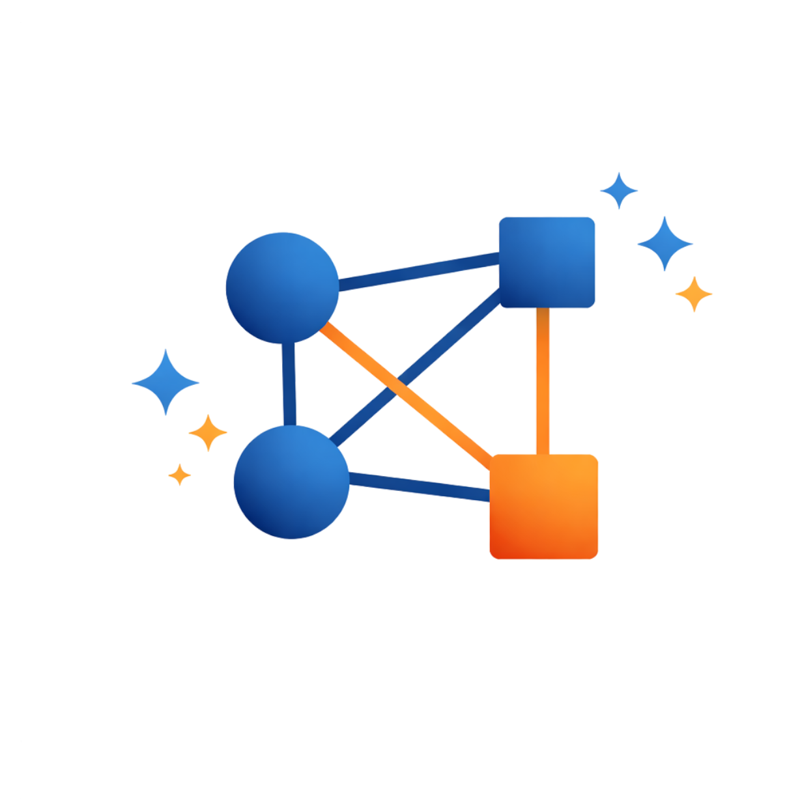
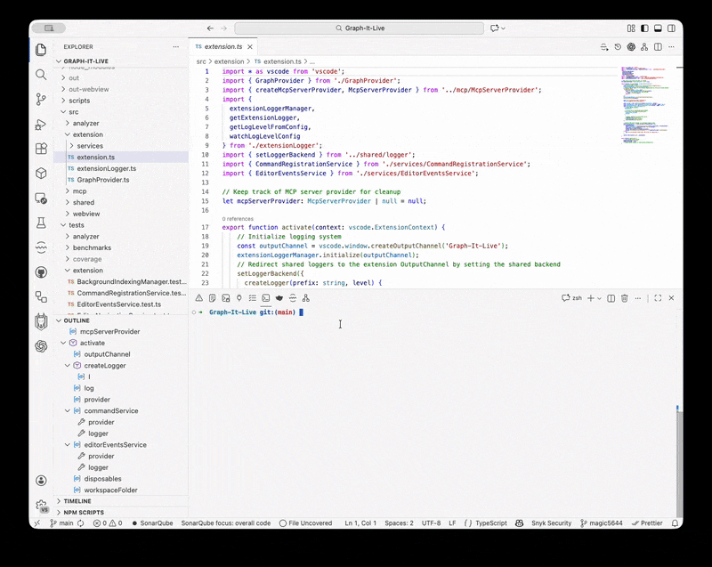
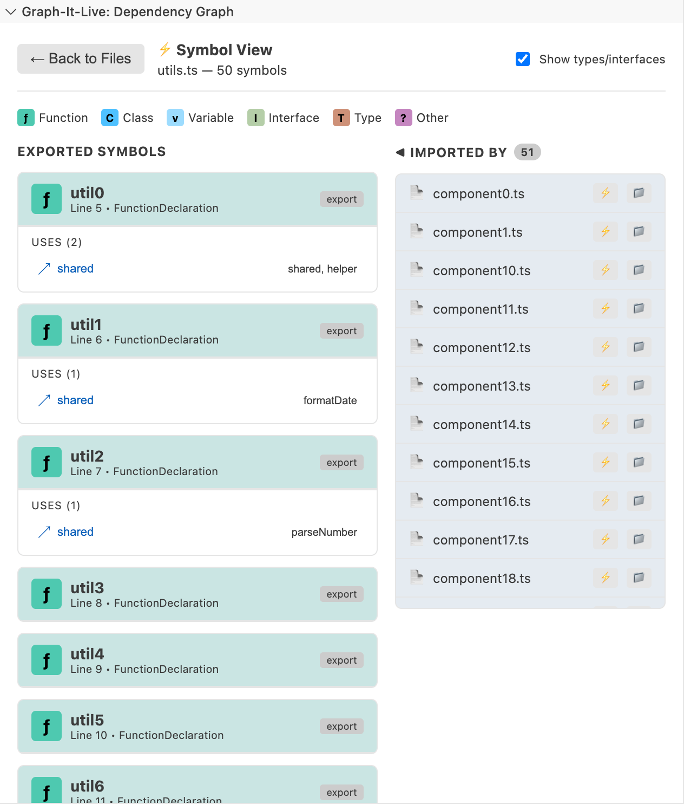
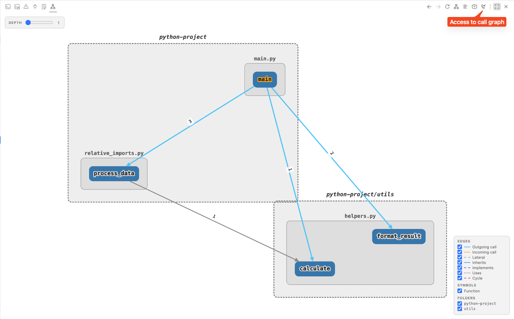
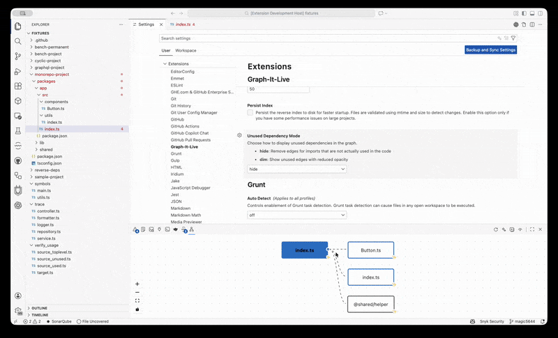
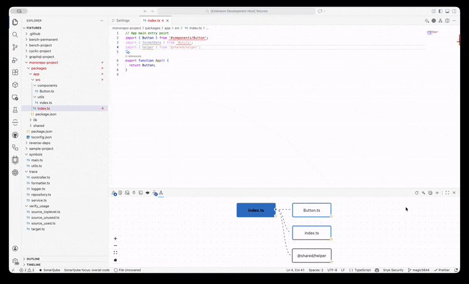

# Graph-It-Live

<div align="center">
  

  **See your codebase as a graph — in VS Code, your CLI, and your AI assistant.**

</div>

[](https://marketplace.visualstudio.com/items?itemName=magic5644.graph-it-live)
[](https://marketplace.visualstudio.com/items?itemName=magic5644.graph-it-live)
[](https://open-vsx.org/extension/magic5644/graph-it-live)
[](https://open-vsx.org/extension/magic5644/graph-it-live)
[](https://www.npmjs.com/package/@magic5644/graph-it-live)
[](LICENSE)

Graph-It-Live analyzes imports, symbols, calls, cycles, unused exports, and change impact. Use it as a VS Code extension, a standalone CLI, or an MCP/native tool provider for GitHub Copilot and other AI clients. Analysis runs locally and returns evidence from your codebase.

## Table of Contents

- [What it does](#what-it-does)
- [Quick start](#quick-start)
- [Features](#features)
- [Standalone CLI](#standalone-cli)
- [AI integrations](#ai-integrations)
- [Configuration](#configuration)
- [CI review gate](#ci-review-gate)
- [Supported languages](#supported-languages)
- [Documentation](#documentation)
- [Development](#development)
- [License](#license)

## What it does

Graph-It-Live provides three views of a codebase:

| View | Answers | Analysis layer |
| --- | --- | --- |
| **File graph** | Which files import this file? What depends on this module? | Regex and AST parsing |
| **Symbol view** | Which functions and classes call each other in this file? | AST analysis |
| **Live call graph** | Which symbols call each other across files? | Tree-sitter and SQLite |

Use the same graph data to navigate code, review refactors, generate codemaps, and give AI assistants focused context instead of entire source files.

<div align="center">
  
</div>

## Quick start

### VS Code extension

**Requirements:** VS Code 1.96 or later. Install from the [VS Code Marketplace](https://marketplace.visualstudio.com/items?itemName=magic5644.graph-it-live) or [Open VSX](https://open-vsx.org/extension/magic5644/graph-it-live).

1. Open a project.
2. Open the Graph-It-Live view from the Activity Bar.
3. Run **Graph-It-Live: Show Dependency Graph** from the Command Palette.
4. Click a file to open it, double-click it for the Symbol View, or use **Show Call Graph** for cross-file calls.

Supported projects include TypeScript, JavaScript, Python, Rust, C#, Go, Java, Vue, Svelte, and GraphQL.

### First useful actions

| Goal | Action |
| --- | --- |
| Explore imports | Open the dependency graph and expand a file node |
| Inspect functions | Switch to **Symbol View** or double-click a file |
| Find callers | Open **Show Call Graph** with a symbol selected |
| Find reverse dependencies | Use **Show Reverse Dependencies** |
| Hide unused imports | Enable **Filter Unused Dependencies** |
| Refresh analysis | Run **Refresh Graph** or **Force Graph-It-Live re-index** |

## Features

### File dependency graph

- Visualize file-to-file imports across a workspace.
- Detect circular dependencies and highlight cycles.
- Expand and collapse nodes as you explore.
- Open files directly from graph nodes.
- Find reverse dependencies with an indexed lookup.

### Symbol View

Drill into TypeScript, JavaScript, Python, or Rust files to see functions, classes, variables, outgoing calls, incoming callers, and recursive calls. Click a symbol to navigate to its definition.

<div align="center">
  
</div>

### Live Call Graph

The Live Call Graph shows cross-file symbol relationships in a Cytoscape.js panel.

- Expand callers and callees with a depth from 1 to 5.
- Group symbols by folder.
- Number calls in invocation order.
- Highlight self-recursion and mutual recursion.
- Filter by symbol type or folder.
- Refresh automatically after file saves.

<div align="center">
  
</div>

The Live Call Graph supports TypeScript, JavaScript, Vue, Svelte, Python, Rust, C#, Go, and Java. C#, Go, and Java are supported in the file graph and Live Call Graph; Symbol View support is currently limited to TypeScript, JavaScript, Python, and Rust.

### Unused dependencies and impact analysis

- Hide or dim unused dependencies.
- Detect unused exported symbols.
- Trace execution from a function or symbol.
- Identify callers affected by a signature change.
- Generate a codemap with exports, internals, dependencies, dependents, and call flow.

<div align="center">
  
  
</div>

## Standalone CLI

Use the same analysis engine without VS Code. Install it globally:

```bash
npm install -g @magic5644/graph-it-live
```

Or run it with `npx`:

```bash
npx @magic5644/graph-it-live scan
```

Common commands:

```text
graph-it scan                         Index the workspace
graph-it summary                      Show a workspace overview
graph-it summary <file>               Generate a file codemap
graph-it trace <file#Symbol>          Trace execution from a symbol
graph-it explain <file>               Explain intra-file call flow
graph-it path <file>                  Show a dependency path
graph-it check [path]                 Find unused exported symbols
graph-it query "<question>"           Ask a natural-language graph question
graph-it context "<question>"         Retrieve bounded graph context
graph-it wiki                         Generate a navigable Markdown wiki
graph-it serve                        Start the MCP stdio server
graph-it export [path]                Export the graph as HTML
graph-it --help                       Show all commands and options
```

Analysis commands support `--format json|toon|markdown`. `trace` and `path` also support `--format mermaid`. Use `--workspace <path>` or `-w` to analyze a project other than the current directory.

See the [complete CLI reference](docs/CLI.md), including installation troubleshooting, REPL commands, output formats, and tool details.

### Unified graph context

`graph-it context` combines imports, symbols, calls, tests, impact, paths, hubs, and communities in one bounded response. It supports `search`, `neighbors`, `path`, `impact`, `refactor`, and `overview` modes.

```bash
graph-it context "what calls the request handler" --scope 'src/**' --format toon
graph-it context --mode path --from src/api.ts#handle --to src/db.ts#query
graph-it context --mode impact --seeds src/api.ts#handle --depth 3 --format json
```

Use `--detail compact` and `--token-budget` for agent-oriented responses. See the [TOON format specification](docs/architecture/TOON_FORMAT.md) for the output format and measurement protocol.

## AI integrations

Graph-It-Live exposes local graph analysis to GitHub Copilot, Claude, Cursor, Windsurf, Antigravity, and other MCP-compatible clients.

### Native Copilot tools

When the extension is installed, use these tools in Copilot Agent mode without configuring MCP:

| Tool group | Capabilities |
| --- | --- |
| Navigation | Dependencies, reverse dependencies, imports, module resolution, workspace index status |
| Symbols | Symbol graphs, callers, dependents, execution traces |
| Refactoring | Breaking changes, impact analysis, unused symbols, dead-code scans |
| Context | File logic, codemaps, unified graph context, natural-language graph queries |
| Call graph | Cross-file caller/callee queries and neighbourhood expansion |

The graph-context tool is available as `#graphContext`. Other native references include `#graphDeps`, `#graphFindRefs`, `#graphCallers`, `#graphImpact`, `#graphCodemap`, `#graphTrace`, `#graphDeadCode`, and `#graphQuery`.

### MCP server

The MCP server exposes 27 graph-analysis tools. Enable it in VS Code with `graph-it-live.enableMcpServer`, or start it from the CLI:

```bash
graph-it serve
```

For VS Code, add `.vscode/mcp.json`:

```json
{
  "servers": {
    "graph-it-live": {
      "type": "stdio",
      "command": "graph-it",
      "args": ["serve"],
      "env": {
        "WORKSPACE_ROOT": "${workspaceFolder}"
      }
    }
  }
}
```

For Cursor, use `.cursor/mcp.json` with the same server definition under `mcpServers` instead of `servers`. The same `graph-it serve` command works with Claude Desktop, Claude Code, Windsurf, and Antigravity. See the [CLI/MCP documentation](docs/CLI.md) for client-specific configuration and environment variables.

For Codex CLI:

```bash
codex mcp add graph-it-live --env WORKSPACE_ROOT=/path/to/project -- graph-it serve
```

### Portable agent plugin

The [`plugins/graph-it-live/`](plugins/graph-it-live/) directory is an Agent Plugin package for
Claude Code, GitHub Copilot, Cursor, VS Code, and Codex. It contains the portable `plugin.json`,
`mcp.json`, and the four Graph-It-Live skills from [magic5644/skills](https://github.com/magic5644/skills),
plus native manifests for Claude Code and Codex. Install that directory with the client’s plugin
installer. The repository also includes marketplace catalogs at [`.claude-plugin/marketplace.json`](.claude-plugin/marketplace.json)
and [`.agents/plugins/marketplace.json`](.agents/plugins/marketplace.json) for discovery. The MCP entry
resolves `@magic5644/graph-it-live@latest`, keeping the CLI and MCP server in the same npm release;
a workflow synchronizes the plugin and marketplace versions after each npm publish.

### Agent skill

Install the Graph-It-Live skill for an AI agent:

```bash
npx skills add magic5644/skills/graph-it-live
```

The skill documents graph queries, codemaps, impact analysis, dead-code detection, and safe refactoring workflows.

## Configuration

Set these options in VS Code settings:

| Setting | Default | Purpose |
| --- | --- | --- |
| `graph-it-live.performanceProfile` | `default` | Select `default`, `low-memory`, `high-performance`, or `custom` |
| `graph-it-live.enableMcpServer` | `false` | Enable the built-in MCP server |
| `graph-it-live.maxDepth` | `50` | Limit dependency traversal depth |
| `graph-it-live.excludeNodeModules` | `true` | Exclude dependencies from `node_modules` |
| `graph-it-live.enableBackgroundIndexing` | `true` | Build reverse-dependency indexes in the background |
| `graph-it-live.unusedDependencyMode` | `hide` | Hide or dim unused dependencies |
| `graph-it-live.preIndexCallGraph` | `true` | Pre-index the Live Call Graph |
| `graph-it-live.symbolViewLayout` | `hierarchical` | Select `hierarchical`, `force-directed`, or `radial` |

For concurrency, cache, persistence, logging, and unused-analysis settings, see the [development guide](DEVELOPMENT.md).

## CI review gate

The `graph-it review-pr` command performs a deterministic local Git diff review before CI. It reports exported TypeScript signature changes and, when the local index supports them, cycle evidence, unused exports, dependents, and likely test files.

The reusable GitHub Action is informational by default. Set `fail-on-risk: high` or `critical` to gate a pull request. Add it to a consumer workflow with [`docs/examples/graph-it-review-gate.yml`](docs/examples/graph-it-review-gate.yml).

Use `pull_request`, not `pull_request_target`, for untrusted pull requests. The action analyzes the consumer checkout in an isolated temporary directory and sends only a sanitized report to GitHub.

## Supported languages

| Language | File graph | Symbol View | Live Call Graph |
| --- | :---: | :---: | :---: |
| TypeScript / JavaScript | Yes | Yes | Yes |
| Vue / Svelte | Yes | Yes | Yes |
| Python | Yes | Yes | Yes |
| Rust | Yes | Yes | Yes |
| C# / Go / Java | Yes | No | Yes |
| GraphQL | Yes | No | No |

## Documentation

- [CLI reference](docs/CLI.md) — commands, REPL, output formats, and MCP tools
- [Development guide](DEVELOPMENT.md) — setup, builds, tests, and WASM architecture
- [Contributing guide](CONTRIBUTING.md) — contribution workflow and conventions
- [System architecture](docs/architecture/codemaps/architecture.md)
- [Class hierarchy](docs/architecture/codemaps/class-hierarchy.md)
- [TOON format](docs/architecture/TOON_FORMAT.md)
- [Coding standards](docs/development/CODING_STANDARDS.md)
- [Cross-platform testing](docs/development/CROSS_PLATFORM_TESTING.md)
- [Performance optimizations](docs/architecture/PERFORMANCE_OPTIMIZATIONS.md)
- [Documentation index](docs/README.md)

## Development

Requirements: Node.js 22 or later and npm.

```bash
git clone https://github.com/magic5644/Graph-It-Live.git
cd Graph-It-Live
npm install
npm run build
```

Press F5 in VS Code to launch the Extension Development Host.

| Command | Purpose |
| --- | --- |
| `npm run build` | Build the extension and copy WASM assets |
| `npm test` | Run unit tests |
| `npm run test:cli` | Run CLI tests |
| `npm run test:vscode` | Run VS Code E2E tests |
| `npm run lint` | Run ESLint |
| `npm run check:types` | Run strict TypeScript checks |
| `npm run package` | Build the VSIX package |
| `npm run package:verify` | Verify package contents |

See [DEVELOPMENT.md](DEVELOPMENT.md) for the full project structure, test strategy, WASM details, and troubleshooting.

## License

MIT. See [LICENSE](LICENSE).

Language icons are provided by [SuperTinyIcons](https://github.com/edent/SuperTinyIcons) under the CC0-1.0 license.
