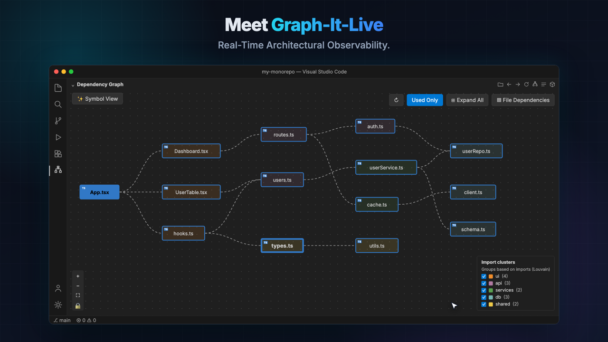
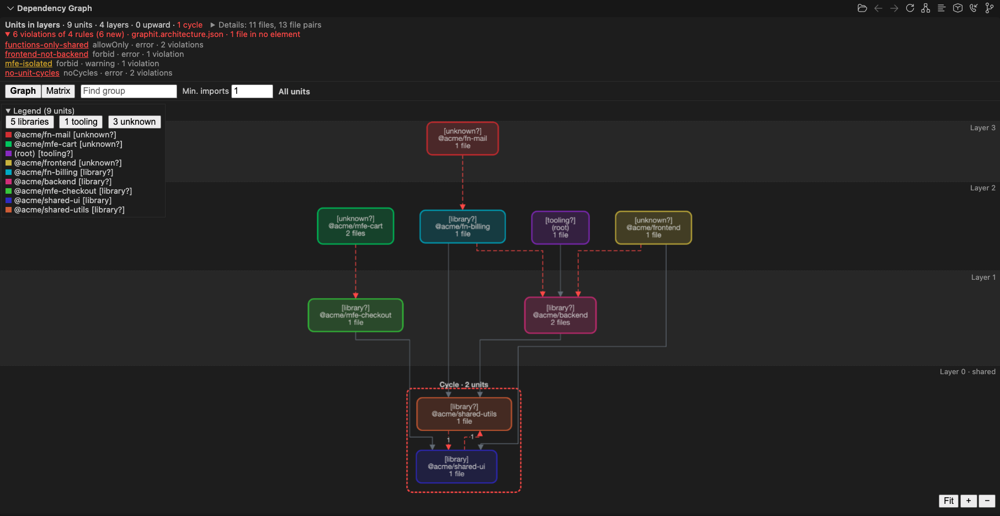
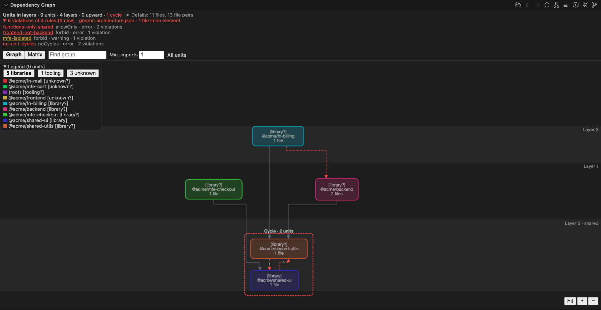
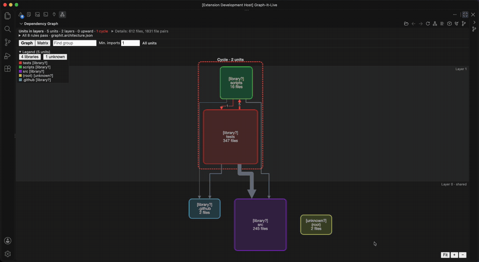
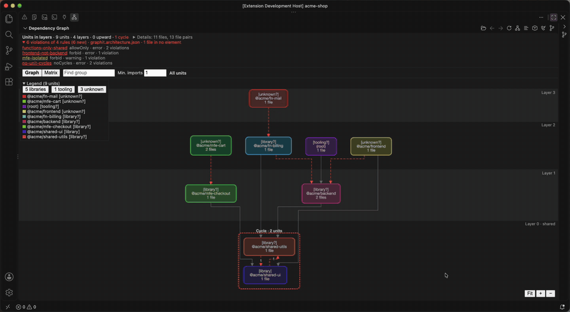
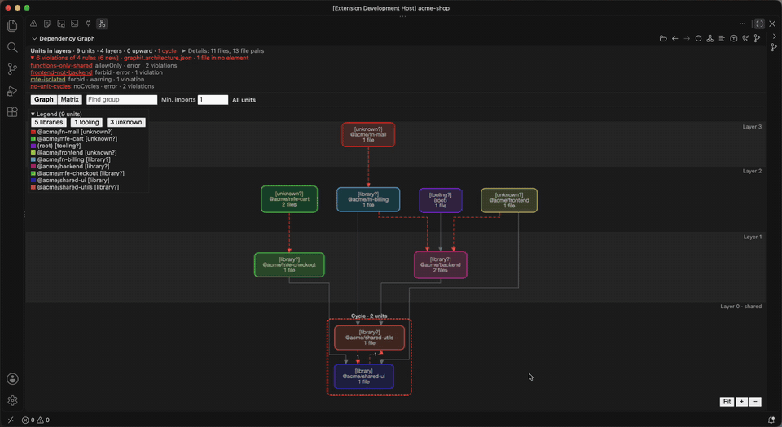
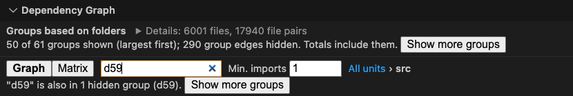
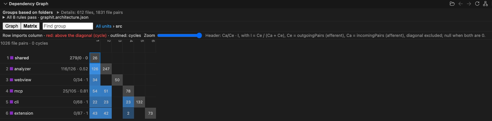
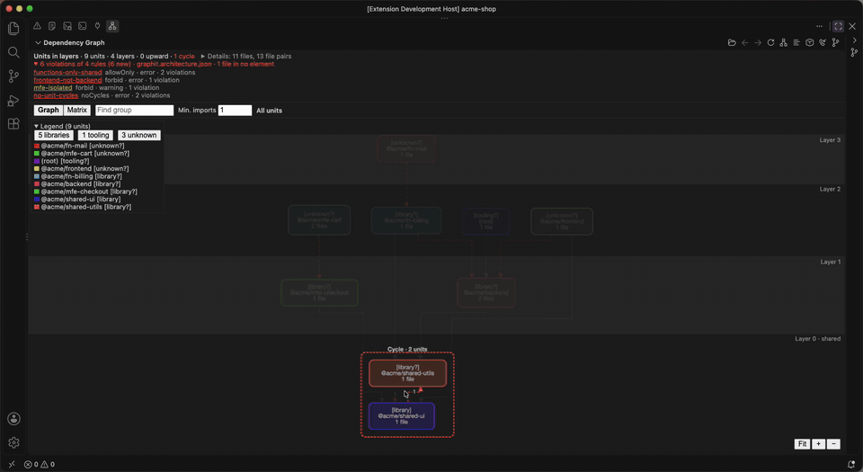
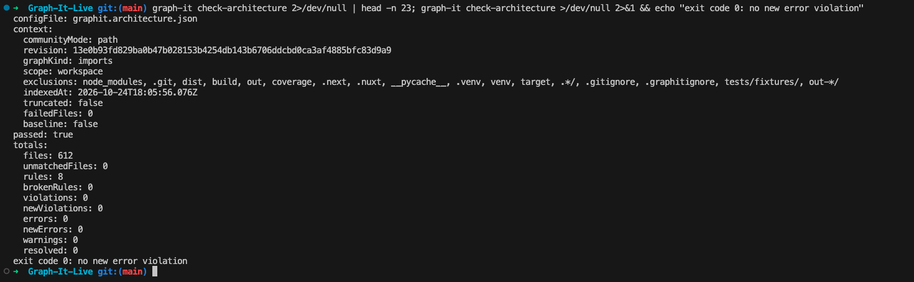

# Graph-It-Live

<div align="center">
  

  **See your codebase as a graph — in VS Code, your CLI, and your AI assistant.**

</div>

[](https://marketplace.visualstudio.com/items?itemName=magic5644.graph-it-live)
[](https://marketplace.visualstudio.com/items?itemName=magic5644.graph-it-live)
[](https://open-vsx.org/extension/magic5644/graph-it-live)
[](https://open-vsx.org/extension/magic5644/graph-it-live)
[](https://www.npmjs.com/package/@magic5644/graph-it-live)
[](LICENSE)

Graph-It-Live analyzes imports, symbols, calls, cycles, unused exports, and change impact. Use it as a VS Code extension, a standalone CLI, or an MCP/native tool provider for GitHub Copilot and other AI clients. Analysis runs locally and returns evidence from your codebase.

### ▶ Watch the 75-second tour

[](media/graph-it-live-promo.mp4)

Click the image to play the video (sound on). It walks through the file graph with Louvain import clusters, the Dependency Structure Matrix, boundary rules declared in `graphit.architecture.json`, and an AI agent fixing a rule violation through the Graph-It-Live MCP server.

## Table of Contents

- [What it does](#what-it-does)
- [Quick start](#quick-start)
- [Features](#features)
- [Standalone CLI](#standalone-cli)
- [AI integrations](#ai-integrations)
- [Configuration](#configuration)
- [CI review gate](#ci-review-gate)
- [Supported languages](#supported-languages)
- [Documentation](#documentation)
- [Development](#development)
- [License](#license)

## What it does

Graph-It-Live provides three views of a codebase:

| View | Answers | Analysis layer |
| --- | --- | --- |
| **File graph** | Which files import this file? What depends on this module? | Regex and AST parsing |
| **Symbol view** | Which functions and classes call each other in this file? | AST analysis |
| **Live call graph** | Which symbols call each other across files? | Tree-sitter and SQLite |

Use the same graph data to navigate code, review refactors, generate codemaps, and give AI assistants focused context instead of entire source files.

<div align="center">
  
</div>

## Quick start

### VS Code extension

**Requirements:** VS Code 1.96 or later. Install from the [VS Code Marketplace](https://marketplace.visualstudio.com/items?itemName=magic5644.graph-it-live) or [Open VSX](https://open-vsx.org/extension/magic5644/graph-it-live).

1. Open a project.
2. Open the Graph-It-Live view from the Activity Bar.
3. Run **Graph-It-Live: Show Dependency Graph** from the Command Palette.
4. Click a file to open it, double-click it for the Symbol View, or use **Show Call Graph** for cross-file calls.

Supported projects include TypeScript, JavaScript, Python, Rust, C#, Go, Java, Vue, Svelte, and GraphQL.

### First useful actions

| Goal | Action |
| --- | --- |
| Explore imports | Open the dependency graph and expand a file node |
| Inspect functions | Switch to **Symbol View** or double-click a file |
| Find callers | Open **Show Call Graph** with a symbol selected |
| Find reverse dependencies | Use **Show Reverse Dependencies** |
| Hide unused imports | Enable **Filter Unused Dependencies** |
| Refresh analysis | Run **Refresh Graph** or **Force Graph-It-Live re-index** |

## Features

### File dependency graph

- Visualize file-to-file imports across a workspace.
- Detect circular dependencies and highlight cycles.
- Expand and collapse nodes as you explore.
- Open files directly from graph nodes.
- Find reverse dependencies with an indexed lookup.

### Symbol View

Drill into TypeScript, JavaScript, Python, or Rust files to see functions, classes, variables, outgoing calls, incoming callers, and recursive calls. Click a symbol to navigate to its definition.

<div align="center">
  
</div>

### Live Call Graph

The Live Call Graph shows cross-file symbol relationships in a Cytoscape.js panel.

- Expand callers and callees with a depth from 1 to 5. A view shows at most 500 symbols, nearest hops first; a notice counts the hidden ones.
- Group symbols by folder.
- Number calls in invocation order.
- Highlight self-recursion and mutual recursion.
- Filter by symbol type or folder.
- Refresh automatically after file saves.

<div align="center">
  
</div>

The Live Call Graph supports TypeScript, JavaScript, Vue, Svelte, Python, Rust, C#, Go, and Java. C#, Go, and Java are supported in the file graph and Live Call Graph; Symbol View support is currently limited to TypeScript, JavaScript, Python, and Rust.

### Architecture view

*Switch to Architecture View* (title bar of the *Dependency Graph* view, icon `$(type-hierarchy)`) shows the whole workspace as collapsed groups with the directed import edges between them. It uses the same groups and counts as `graph-it architecture --groups` and the `explore_architecture` MCP tool.

<div align="center">

</div>

*Units in layers with their roles, a cycle outlined, and the rules of `graphit.architecture.json` with their violations (test fixture monorepo). Open it with *Switch to Architecture View* in the *Dependency Graph* view title bar.*


- Groups follow `graph-it-live.communityMode`: folders (`path`) or import communities (`louvain`). Changing the setting rebuilds the view.
- In `path` mode the view opens on the **units**, as `graph-it architecture --level units` reports them: each package (a folder holding a `package.json`, npm/yarn/pnpm workspace member or not), or each top-level folder when the workspace has no package; files outside every package form the *(root)* unit. Units are laid out in layers, top to bottom: units nobody depends on (apps, functions) at the top, shared libraries at the bottom, so every edge points down. A band behind each row names its layer (*Layer 2*, *Layer 1*, *Layer 0 · shared*). Units that depend on each other share a layer and sit in one dashed red **cycle block** titled *Cycle · N units*; their edges are drawn red, like any upward edge, and every red edge shows its file-pair count without a hover. The header sums it up on one line ("24 units · 6 layers · 3 upward · 1 cycle · 120 weaker edges hidden"); click the cycle count to show the block. Each unit has its own colour, in the same hue in every theme (a light fill on light and dark themes, a border without fill on high-contrast themes); the collapsible legend over the canvas lists them, and a click on a unit there selects it. Edge width grows with the file-pair count. Only the strongest edges, up to 3 per unit, are drawn (upward and cycle edges always are); the header says how many weaker edges are hidden, and *Min. imports per edge* shows edges by weight instead. Labels stay readable at the fitted zoom: a large picture keeps its top in view and pans. Double-click a unit to enter it: its folder groups (the 50 largest, see *Show more groups* below), in the unit's colour, laid out in layers the same way, with the edges of a cycle spread over several rows; *All units* in the breadcrumb or *Escape* goes back. A folder holding sub-folders has a double border: double-click it to enter its level, its sub-folders and the edges between them (its own files form one more block), down to the folders that only hold files, which a double-click expands. Each entered folder adds a step to the breadcrumb; any step, or *Escape*, goes back up to that level with the zoom and position it was left with. `graph-it architecture --folder <key>` and `explore_architecture` with `folder` report the same levels and counts.
- Each unit carries a **role**, inferred from its manifest and files, never from the code's meaning. The badge on the unit reads `[role?]` when inferred and `[role]` when declared; its tooltip lists the evidence. The legend counts the units per role ("1 function, 4 libraries…"); click a role to draw only its units, click again to draw them all. `graph-it architecture --level units` and `explore_architecture` with `level: "units"` report the same `role`, `confidence` (`inferred` or `declared`), `evidence` and `roleCounts`. A unit matching several roles takes the first in the table; the other matches stay as evidence.

  | Role | Evidence (any of) |
  | --- | --- |
  | `function` | `@types/aws-lambda`, `aws-lambda`, `@azure/functions` or `firebase-functions` dependency; `serverless.yml`, `host.json`, or a SAM `template.yaml` in the unit; an exported `handler` in its entry (`main`, `index.*`, `handler.*`) |
  | `micro-frontend` | `@module-federation/*` or `single-spa` dependency; `ModuleFederationPlugin` in a bundler config |
  | `frontend` | `react`, `vue`, `@angular/core`, `svelte` or `solid-js` dependency, with an `index.html` or a bundler config (vite, webpack, next, nuxt, rspack, `angular.json`) |
  | `service` | `express`, `fastify`, `@nestjs/core`, `koa` or `hono` dependency; a `Dockerfile` with `EXPOSE` |
  | `library` | none of the above, and imported by another unit (unless all its files are tooling) |
  | `tooling` | only scripts, tests or config files (`scripts/`, `tools/`, `e2e/`, `tests/`, `.github/`, `*.test.*`, `*.config.*`), even when imported |
  | `unknown` | nothing conclusive |

  Only the unit's manifest, top-level configs, `index.html` and entry are read, inside the workspace and up to 1 MiB each; nothing is executed. Declare a role in the `roles` key of `graphit.architecture.json` to override the inferred one: `"roles": { "@acme/legacy-*": "library", "lambdas/*": "function" }` (unit keys or package names, `*` allowed, first match wins). See [Architecture rules](#architecture-rules) for a complete file.

<div align="center">

</div>

*Role badges and legend: `[library?]` is inferred, `[library]` declared in `graphit.architecture.json`; click a role in the legend to keep only its units.*

- Imports of a workspace package by its name (`@scope/lib`, or `lib`) land on the package's source files through the `node_modules` link the package manager created, so cross-package edges are counted.
- A group node shows its file count; an edge counts the distinct file-to-file imports between two groups. Files outside any group appear as a dashed *unassigned* node.
- Hover or click a group (or an edge) to highlight its neighbourhood: the rest fades and only the highlighted edges show their import count. The selected group gets a focus ring, and *Find* matches a ring over the editor's find-match colour, never the unit's own colour. *Escape* or a click on the background clears it.
- Click a group to focus it: only that group and the groups it is linked to stay drawn, and the view fits them. The breadcrumb above the graph is one path (*All units › apps/web › src/components › …*): each step returns to its level with the zoom and position it was left with, and the *×* after a focused group or an entered group leaves it. A click on the background also shows everything again.
- **Keyboard**: *Tab* focuses the canvas; the arrow keys select the nearest group in that direction (a screen reader announces its name, layer, edges and cycle), *Enter* enters it, *Escape* goes back, *Tab* leaves the canvas. *Fit* (*0*), *Zoom in* (*+*) and *Zoom out* (*-*) sit in the canvas's bottom-right corner; *Fit* shows the whole level, however far it must zoom out, while the automatic fit on opening or entering a level keeps labels readable (a larger level is anchored at the top, the rest reached by panning).
- Double-click a group (or press *Enter* once it is selected) to enter it: it opens into its files, 200 at a time, most imported first (*+N more files* loads the next ones), and the view zooms on it. Its group edges stay; the edges of a file (to other files or groups, each labelled with its import count) appear when you hover or select it. At most 500 files are drawn at once. Leave a group with its *×* in the breadcrumb or *Escape*.

<div align="center">

</div>

*Graph-It-Live itself: double-click `src` to enter its folders (extension and cli on top, shared at the bottom), double-click `analyzer`, *Fit* the whole level, then go back up with the breadcrumb (or *Escape*).*

- Click any edge to list the file pairs behind it, 50 at a time, in the evidence panel; each path opens the file. *Escape* closes the panel. On a unit edge (its tooltip ends with *click files*) the pairs are sorted by target file, so a target's importers sit together, and a red edge's title ends with *(upward)* or *(cycle)*.

<div align="center">

</div>

*Click an edge for the file pairs behind it, then a file to open it.*

- **Selection actions**: a selected file, group or unit (click, arrow keys, the units legend, or a matrix row) shows an action bar in the canvas's bottom-left corner, reachable with *Tab*; right-click a node for the same actions at the pointer. A file offers *Open file* and *Show in Dependency Graph* (the sidebar switches to the file graph rooted on it); every selection offers *Dependents by group*.
- **Dependents by group** lists, in a *Dependents* tab next to the evidence panel, the groups whose files import the selection directly or through other files: "Depends on `<seed>`: X files in Y groups (static imports)", the groups other than the selection's own, then one row per group with its direct importers, all its dependents and the minimum depth (1 = imports the selection directly), nearest first. A row expands to its files, 50 at a time; each opens on click. Dependents inside the selection's own group are counted apart. Counts come from every static import pair of the workspace, drawn or not, at the level shown: units at the units level, else the level's groups (files outside an entered folder by their top folder). Reached groups get a ring on the graph (thicker for direct importers) and a tint in the matrix, the selection is outlined and the other groups are dimmed; *Clear* or *Escape* removes it, and entering another level clears it. Dynamic imports the analyzer resolves count; runtime-only use does not. For symbol-level impact use `get_impact_analysis`.

<div align="center">

</div>

*Select a unit (or a group, or a file), then *Dependents by group* in the bottom-left action bar: every group that imports it, directly or not, nearest first; expand a row for its files.*

- *Find group* highlights and centres the drawn groups whose name or folder contains the text. A match among the groups left out by the cap is still reported ("`x` is also in 1 hidden group…", with *Show more groups*), never as no group; in the matrix it selects and scrolls to the first matching row. *Min. imports per edge* hides the weaker group edges; the header states how many are shown, and totals still include the hidden ones.

<div align="center">

</div>

*On a level of 61 groups (a 6,000-file generated workspace) the view draws the 50 largest, says how many are hidden, and *Find* still reports a match among them, with *Show more groups*.*

- *Graph | Matrix* switches the drawn level (units, an entered unit or folder, or the Louvain groups) to its **dependency structure matrix**, with every group of the level, not only the drawn ones. Rows and columns share one order: layer 0 first (groups that depend on no other group of the level), the groups of a cycle kept together, then by name. A cell counts the file pairs where a file of its row imports a file of its column, shaded by count (log scale), the number written once zoomed in; the diagonal counts the pairs inside a group. In this order every dependency of a layered architecture sits below the diagonal: a red cell above it belongs to a cycle, and each cycle is outlined (inside a cycle, rows are ordered by name, so its blue cells are cycle edges too). Each row header shows `Ca/Ce · I`: incoming pairs, outgoing pairs and the instability `I = Ce / (Ca + Ce)` (diagonal excluded, *–* without any pair across the group's boundary). Click a cell for its file pairs in the evidence panel (a unit's own pairs, on the diagonal, have no unit edge to list: enter the unit instead); click a row header (or press *Enter* on it) to enter that unit or folder; arrow keys move between cells, *Escape* goes back. Only the cells in view are drawn, so several hundred groups scroll smoothly. Switching views keeps the level and the selected group. `graph-it architecture --matrix` (`--format csv` for spreadsheets) and `explore_architecture` with `view: "matrix"` report the same rows, cells and totals.

<div align="center">

</div>

**Matrix* on Graph-It-Live's `src`: rows and columns in layer order, so a layered architecture fills only the lower triangle; `Ca/Ce · I` per row. Enter a unit, then click *Matrix*.*

- The header's *Details* line opens the totals (files, file pairs within and between groups) from the full graph, the parse failures and where the counts come from. A level whose nodes import nothing from each other says so on the canvas. A level (the Louvain groups, an entered unit or folder) draws its 50 largest groups; the header says how many groups and group edges are hidden, totals still include them, and *Show more groups* draws up to 150 per level for the rest of the session. Groups without an import to or from another drawn group of the level are counted in the header and packed in rows below the others, so they never crowd the graph. A stale mark, *Refresh* of an unchanged workspace, *Min. imports per edge* and *Show more groups* keep the entered level, the focused group, the find and, unless new groups must be laid out, the zoom and position.
- The view is built when it opens, on *Refresh*, and when the setting changes, showing *Building architecture: N of M files* and the percent meanwhile; with no source file to analyse it says why and offers *Open settings*, and a failed build offers *Retry*. Changing or deleting a file of the graph, or creating a source file, only shows a *Files changed* banner (files the view never read, such as build output, do not): a build reads every file, so you decide when to *Refresh*. Editing `graphit.architecture.json`, its baseline, or a `package.json` or `tsconfig*.json` file shows the banner too; after a `package.json` or `tsconfig*.json` change the extension also re-indexes the dependency graph, since imports may now resolve elsewhere.
- It analyses the configured workspace folder. Use the *Graph*, *List* or *Symbol* buttons to leave it.

### Architecture rules

Write the intended architecture in `graphit.architecture.json` at the workspace root; the Architecture view, `graph-it check-architecture` and the `check_architecture` MCP tool check every static import against it. Rules are your annotation: the tool only compares import pairs with them.

```json
{
  "$schema": "https://raw.githubusercontent.com/magic5644/Graph-It-Live/main/schemas/architecture.schema.json",
  "elements": {
    "functions": { "path": "functions/*", "each": true },
    "frontend": { "path": "frontend/" },
    "mfe": { "path": "mfe/*", "each": true },
    "backend": { "path": "backend/" },
    "shared": { "unit": ["@acme/shared-*"] }
  },
  "rules": [
    { "name": "functions-only-shared", "from": "functions", "allowOnly": ["shared"], "severity": "error",
      "reason": "Functions are deployed alone; they share code only through libraries." },
    { "name": "frontend-not-backend", "from": ["frontend", "mfe"], "forbid": ["backend"], "severity": "error" },
    { "name": "mfe-isolated", "from": "mfe", "forbid": ["mfe"], "severity": "warning" },
    { "name": "no-unit-cycles", "noCycles": "units", "severity": "error" }
  ],
  "roles": {
    "@acme/shared-*": "library",
    "tools/*": "tooling"
  }
}
```

The file has three top-level keys. Do not mix up `rules` and `roles`:

| Key | Answers | Effect |
| --- | --- | --- |
| `elements` | Which files belong together? | Names sets of files for the rules |
| `rules` | Which imports are allowed? | Violations in the view, `check-architecture` exit code |
| `roles` | What is each unit? | Badge `[role]` instead of `[role?]`, legend counts, `role` selectors of elements |

All three are optional; a file without `rules` checks nothing.

To write the file for your workspace:

1. Run `graph-it architecture --level units` (or open the Architecture view) and note the unit keys: package folders, else top-level folders, plus `(root)` for files outside them.
2. Under `elements`, name each part of your architecture by `path`, `unit` or `role`. Every source file should belong to an element: `check-architecture` reports the others as `unmatchedFiles`.
3. Under `rules`, write what each element may import (`allowOnly`) or must not import (`forbid`), with a `reason`.
4. Optionally, under `roles`, fix every role the view infers wrongly or marks `[unknown?]`. Keys are unit keys or package names from step 1, not element names.
5. Run `graph-it check-architecture`: it should report 0 violations, no unmatched file and no config warning.

A single-package repository (no `package.json` below the root) has its top-level folders as units. Graph-It-Live's own [`graphit.architecture.json`](graphit.architecture.json) is such a file: elements split `src/` into layers, and `roles` declares the units:

```json
"roles": {
  "src": "library",
  "tests": "tooling",
  "scripts": "tooling",
  ".github": "tooling",
  "(root)": "tooling"
}
```

- An **element** is a named set of files, selected by `path` (gitignore-style patterns, as in `.graphitignore`), `unit` (package names or unit keys of `graph-it architecture --level units`, `*` allowed) and/or `role` (unit roles, e.g. `{ "role": "function" }`). With `each: true` every matched folder or unit is an instance of its own: `mfe → mfe` then means "another micro-frontend", never a file of the same one.
- **Rules**: `forbid` (the listed elements may not be imported), `allowOnly` (only the listed elements and the importer's own instance may be), `noCycles` (`"units"` or an `each` element: no import cycle between them). `severity` is `error` (default), `warning` or `off`; `reason` is shown with every violation. A rule that could never report (`noCycles` on, or `forbid` of itself from, an element without `each`) is refused.
- The view shows "N violations of M rules (K new)", or "All N rules pass" when nothing breaks one, with a Rules panel: each rule with its count, a click lists its file pairs in the evidence panel. Violating edges are dashed red, violating matrix cells framed red, their rules in the tooltip. Editing the config or the baseline marks the view stale; *Refresh* checks again. An invalid config is reported with the JSON path of each error.

<div align="center">

</div>

*Rules panel of an npm-workspaces monorepo (test fixture): click a rule to list the file pairs that break it, then a file to open it. Add a `graphit.architecture.json` at the workspace root to get the panel.*

- `graph-it check-architecture` exits with 1 when an `error` violation is not in the baseline, so it can gate CI; `--format sarif` lets GitHub code scanning annotate the importing line. On a codebase that already breaks the rules, `graph-it check-architecture --update-baseline` writes `graphit.architecture.baseline.json`: only new violations fail, and resolved ones are listed so the baseline can shrink. See [check-architecture](docs/CLI.md#check-architecture).

<div align="center">

</div>

*`graph-it check-architecture` on this repository: its own `graphit.architecture.json` declares 8 layer rules, every file belongs to an element, and nothing breaks a rule, so the command exits 0 and can gate CI.*

- Files selected by no element are counted, and a pattern matching nothing is a config warning. The `$schema` gives completion and validation in editors.

### Unused dependencies and impact analysis

- Hide or dim unused dependencies.
- Detect unused exported symbols.
- Trace execution from a function or symbol.
- Identify callers affected by a signature change.
- Generate a codemap with exports, internals, dependencies, dependents, and call flow.

<div align="center">
  
  
</div>

## Standalone CLI

Use the same analysis engine without VS Code. Install it globally:

```bash
npm install -g @magic5644/graph-it-live
```

Or run it with `npx`:

```bash
npx @magic5644/graph-it-live scan
```

Common commands:

```text
graph-it scan                         Index the workspace
graph-it summary                      Show a workspace overview
graph-it summary <file>               Generate a file codemap
graph-it trace <file#Symbol>          Trace execution from a symbol
graph-it explain <file>               Explain intra-file call flow
graph-it path <file>                  Show a dependency path
graph-it check [path]                 Find unused exported symbols
graph-it architecture --groups        Show the workspace architecture by community
graph-it check-architecture           Check imports against graphit.architecture.json
graph-it query "<question>"           Ask a natural-language graph question
graph-it context "<question>"         Retrieve bounded graph context
graph-it wiki                         Generate a navigable Markdown wiki
graph-it serve                        Start the MCP stdio server
graph-it export [path]                Export the graph as HTML
graph-it --help                       Show all commands and options
```

Analysis commands support `--format json|toon|markdown`. `trace`, `path` and `architecture` also support `--format mermaid`, `architecture --matrix` supports `--format csv`, and `check-architecture` supports `--format sarif`. Use `--workspace <path>` or `-w` to analyze a project other than the current directory.

See the [complete CLI reference](docs/CLI.md), including installation troubleshooting, REPL commands, output formats, and tool details.

### Unified graph context

`graph-it context` combines imports, symbols, calls, tests, impact, paths, hubs, and communities in one bounded response. It supports `search`, `neighbors`, `path`, `impact`, `refactor`, and `overview` modes.

```bash
graph-it context "what calls the request handler" --scope 'src/**' --format toon
graph-it context --mode path --from src/api.ts#handle --to src/db.ts#query
graph-it context --mode impact --seeds src/api.ts#handle --depth 3 --format json
```

Use `--detail compact` and `--token-budget` for agent-oriented responses. See the [TOON format specification](docs/architecture/TOON_FORMAT.md) for the output format and measurement protocol.

## AI integrations

Graph-It-Live exposes local graph analysis to GitHub Copilot, Claude, Cursor, Windsurf, Antigravity, and other MCP-compatible clients.

### Native Copilot tools

When the extension is installed, use these tools in Copilot Agent mode without configuring MCP:

| Tool group | Capabilities |
| --- | --- |
| Navigation | Dependencies, reverse dependencies, imports, module resolution, workspace index status |
| Symbols | Symbol graphs, callers, dependents, execution traces |
| Refactoring | Breaking changes, impact analysis, unused symbols, dead-code scans, Git diff review |
| Context | File logic, codemaps, unified graph context, natural-language graph queries |
| Call graph | Cross-file caller/callee queries and neighbourhood expansion |

The graph-context tool is available as `#graphContext`. Other native references include `#graphDeps`, `#graphFindRefs`, `#graphCallers`, `#graphImpact`, `#graphCodemap`, `#graphTrace`, `#graphDeadCode`, `#graphReviewPr`, and `#graphQuery`.

### MCP server

The MCP server exposes 24 graph-analysis tools. Enable it in VS Code with `graph-it-live.enableMcpServer`, or start it from the CLI:

```bash
graph-it serve
```

For VS Code, add `.vscode/mcp.json`:

```json
{
  "servers": {
    "graph-it-live": {
      "type": "stdio",
      "command": "graph-it",
      "args": ["serve"],
      "env": {
        "WORKSPACE_ROOT": "${workspaceFolder}"
      }
    }
  }
}
```

For Cursor, use `.cursor/mcp.json` with the same server definition under `mcpServers` instead of `servers`. The same `graph-it serve` command works with Claude Desktop, Claude Code, Windsurf, and Antigravity. See the [CLI/MCP documentation](docs/CLI.md) for client-specific configuration and environment variables.

For Codex CLI:

```bash
codex mcp add graph-it-live --env WORKSPACE_ROOT=/path/to/project -- graph-it serve
```

### Portable agent plugin

The [`plugins/graph-it-live/`](plugins/graph-it-live/) directory is the portable Agent Plugin package.
It bundles the MCP server and four skills: `graph-it-live`, `onboarding-express`, `dead-code-hunter`,
and `pr-review`. Install it with the client you use:

#### Claude Code

From Claude Code, add the repository marketplace and install the plugin:

```text
claude plugin marketplace add magic5644/Graph-It-Live
/plugin install graph-it-live@graph-it-live
```

For a local checkout, start a session with `claude --plugin-dir ./plugins/graph-it-live`.

#### GitHub Copilot CLI

```text
copilot plugin marketplace add magic5644/Graph-It-Live
copilot plugin install graph-it-live@graph-it-live
```

#### VS Code

1. Open the Command Palette.
2. Run **Chat: Install Plugin From Source**.
3. Select `plugins/graph-it-live/`.

The VS Code extension itself remains available from the [VS Code Marketplace](https://marketplace.visualstudio.com/items?itemName=magic5644.graph-it-live)
and [Open VSX](https://open-vsx.org/extension/magic5644/graph-it-live).

#### Cursor

Open the **Plugins** panel, choose **Install from local source**, and select
`plugins/graph-it-live/`.

#### Codex

Add the repository's [Codex marketplace catalog](.agents/plugins/marketplace.json) to a configured
plugin marketplace, then open `/plugins` in Codex and install **Graph-It-Live**.

#### Windsurf, Antigravity, and other MCP clients

These clients can use the MCP server directly. Add this server entry to the client's MCP configuration:

```json
{
  "graph-it-live": {
    "type": "stdio",
    "command": "npx",
    "args": ["-y", "@magic5644/graph-it-live@latest", "serve"]
  }
}
```

Use the client's MCP configuration file and its expected top-level key (`servers` or `mcpServers`).
See the [MCP server instructions](#mcp-server) for ready-to-copy VS Code, Cursor, and Codex examples.

The repository also includes marketplace catalogs for [Claude Code](.claude-plugin/marketplace.json)
and [Codex](.agents/plugins/marketplace.json). The MCP entry pins the
latest published `@magic5644/graph-it-live` version and starts it with `npx --prefer-offline`, so a
cached package starts without a registry lookup; a workflow updates the pin, the plugin manifests and
the marketplace versions after each npm publish.

### Agent skill

Install the Graph-It-Live skill for an AI agent:

```bash
npx skills add magic5644/skills/graph-it-live
```

The skill documents graph queries, codemaps, impact analysis, dead-code detection, and safe refactoring workflows.

## Configuration

### Branch Watch

Branch Watch is disabled by default. Enable `graph-it-live.branchWatch.enabled` for a workspace folder, select a local Git base branch and optionally a local or remote head branch, and use the native Branch status view to inspect changes automatically (it starts collapsed in the Graph-It-Live panel: expand it, or run `Graph-It-Live: Show Branch Status`). Branch selections are stored per workspace in the ignored `.graph-it/branch-watch.json`; the `baseRef` and `headRef` settings are retained only as a legacy fallback. An empty head uses the current branch plus the final on-disk state; an explicit head compares committed branch refs and does not include untracked workspace files. It never fetches, runs tests, or reports test success. The view shows file impact for supported languages, TS/JS signature evidence, cycle history when the graphs are complete, and explicit limitations. Impact traversal is intentionally bounded (depth 3 and at most 200 affected files), so a partial result is reported with its risk and confidence instead of being presented as complete. Right-click any message row and choose `Copy Message` to pass the exact text to an LLM or issue. The reminder `Tests must pass before delivery.` is informational.

Branch Watch requires the Graph-It-Live workspace root to be a supported Git repository. A folder without Git, an unborn or detached repository, conflicts, an inaccessible index, or an unsupported VCS is shown as `Branch watch unavailable`; the normal graph and CLI/MCP tools remain available.

Set these options in VS Code settings:

| Setting | Default | Purpose |
| --- | --- | --- |
| `graph-it-live.branchWatch.enabled` | `false` | Enable Branch Watch for the workspace folder |
| `graph-it-live.performanceProfile` | `default` | Select `default`, `low-memory`, `high-performance`, or `custom` |
| `graph-it-live.enableMcpServer` | `false` | Enable the built-in MCP server |
| `graph-it-live.maxDepth` | `50` | Limit dependency traversal depth |
| `graph-it-live.excludeNodeModules` | `true` | Exclude dependencies from `node_modules` |
| `graph-it-live.enableBackgroundIndexing` | `true` | Build reverse-dependency indexes in the background |
| `graph-it-live.unusedDependencyMode` | `hide` | Hide or dim unused dependencies |
| `graph-it-live.communityMode` | `path` | Group graph communities by folder (`path`) or by import structure (`louvain`); same as CLI `--communities` |
| `graph-it-live.preIndexCallGraph` | `true` | Pre-index the Live Call Graph |
| `graph-it-live.symbolViewLayout` | `hierarchical` | Select `hierarchical`, `force-directed`, or `radial` |

Workspace indexing (extension, CLI, and MCP) skips paths listed in the root `.gitignore`, plus `tests/fixtures/` and `out-*/` by default. Add a root `.graphitignore` with gitignore syntax to exclude more paths, or negate a rule to include it again, for example `!tests/fixtures/`.

`performanceProfile` sets indexing concurrency, cache sizes, and unused-analysis limits. To tune them by hand, select `custom` and edit the **Advanced: Performance overrides** section (search `@tag:advanced graph-it-live` in the Settings editor). The other profiles ignore these overrides.

## CI review gate

The `graph-it review-pr` command performs a deterministic local Git diff review before CI. It compares exported TypeScript and JavaScript signatures, follows bounded dependent-symbol impact, and reports cycle evidence, unused exports, test candidates, and consumer standing. Consumers are classified as updated in the diff, covered by a test path, or unverified. The score reflects the highest-risk changed symbol; a high risk is report data, not a failing exit status.

By default, `--base <ref>` is compared with the current working tree, including staged and unstaged file contents. Pass `--head <ref>` to compare two Git refs. Use `--depth` and `--max-files` to bound impact traversal and changed-file analysis. See the [`review-pr` CLI reference](docs/CLI.md#review-pr) for scoring thresholds, output formats, limitations, and examples.

The reusable GitHub Action is informational by default. Set `fail-on-risk: high` or `critical` to gate a pull request. Add it to a consumer workflow with [`docs/examples/graph-it-review-gate.yml`](docs/examples/graph-it-review-gate.yml).

Use `pull_request`, not `pull_request_target`, for untrusted pull requests. The action analyzes the consumer checkout in an isolated temporary directory and sends only a sanitized report to GitHub.

## Supported languages

| Language | File graph | Symbol View | Live Call Graph |
| --- | :---: | :---: | :---: |
| TypeScript / JavaScript | Yes | Yes | Yes |
| Vue / Svelte | Yes | Yes | Yes |
| Python | Yes | Yes | Yes |
| Rust | Yes | Yes | Yes |
| C# / Go / Java | Yes | No | Yes |
| GraphQL | Yes | No | No |

## Documentation

- [CLI reference](docs/CLI.md) — commands, REPL, output formats, and MCP tools
- [Development guide](DEVELOPMENT.md) — setup, builds, tests, and WASM architecture
- [Contributing guide](CONTRIBUTING.md) — contribution workflow and conventions
- [System architecture](docs/architecture/codemaps/architecture.md)
- [Class hierarchy](docs/architecture/codemaps/class-hierarchy.md)
- [TOON format](docs/architecture/TOON_FORMAT.md)
- [Coding standards](docs/development/CODING_STANDARDS.md)
- [Cross-platform testing](docs/development/CROSS_PLATFORM_TESTING.md)
- [Performance optimizations](docs/architecture/PERFORMANCE_OPTIMIZATIONS.md)
- [Documentation index](docs/README.md)

## Development

Requirements: Node.js 22 or later and npm.

```bash
git clone https://github.com/magic5644/Graph-It-Live.git
cd Graph-It-Live
npm install
npm run build
```

Press F5 in VS Code to launch the Extension Development Host.

| Command | Purpose |
| --- | --- |
| `npm run build` | Build the extension and copy WASM assets |
| `npm test` | Run unit tests |
| `npm run test:cli` | Run CLI tests |
| `npm run test:vscode` | Run VS Code E2E tests |
| `npm run lint` | Run ESLint |
| `npm run check:types` | Run strict TypeScript checks |
| `npm run package` | Build the VSIX package |
| `npm run package:verify` | Verify package contents |

See [DEVELOPMENT.md](DEVELOPMENT.md) for the full project structure, test strategy, WASM details, and troubleshooting.

## License

MIT. See [LICENSE](LICENSE).

Language icons are provided by [SuperTinyIcons](https://github.com/edent/SuperTinyIcons) under the CC0-1.0 license.

## Star History

<a href="https://www.star-history.com/?repos=magic5644%2FGraph-It-Live&type=date&legend=top-left">
 <picture>
   <source media="(prefers-color-scheme: dark)" srcset="https://api.star-history.com/chart?repos=magic5644/Graph-It-Live&type=date&theme=dark&legend=top-left&sealed_token=tKWEQ11VLzMx4dC3ZHvyM8J379zHlmU2lUlVABHWQ0yWeTNDwbvy9zxbYFSFiAod0MZ9RHDFy-KYuzkXEI37LhEfGiMP0nsPPtRiLlYlkl53OsTFff_MFSn2SNJXeoPlb3AzuInU8ln9JYhKJIZs4-LgsJ2R8z5pGIFFQBJmfiWvlywCcW-8XbztB03E" />
   <source media="(prefers-color-scheme: light)" srcset="https://api.star-history.com/chart?repos=magic5644/Graph-It-Live&type=date&legend=top-left&sealed_token=tKWEQ11VLzMx4dC3ZHvyM8J379zHlmU2lUlVABHWQ0yWeTNDwbvy9zxbYFSFiAod0MZ9RHDFy-KYuzkXEI37LhEfGiMP0nsPPtRiLlYlkl53OsTFff_MFSn2SNJXeoPlb3AzuInU8ln9JYhKJIZs4-LgsJ2R8z5pGIFFQBJmfiWvlywCcW-8XbztB03E" />
   
 </picture>
</a>
