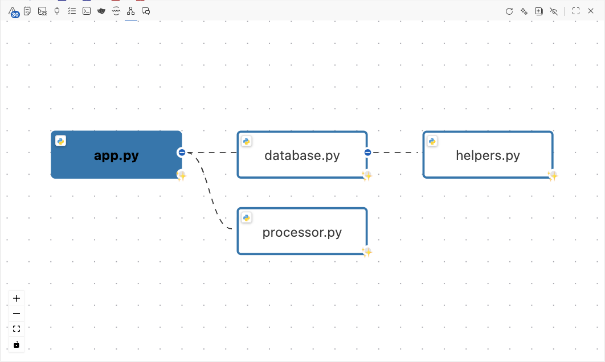
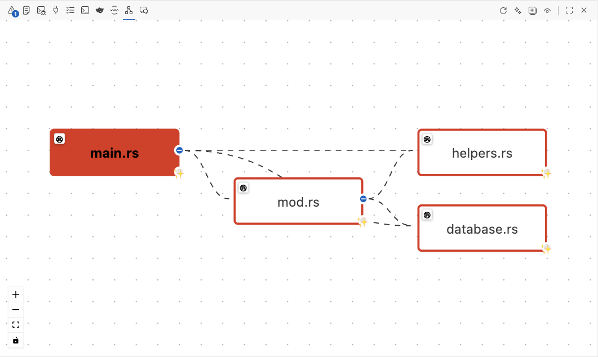

# Changelog
## v1.6.1 (Not yet published)

### Dependencies

- **Upgraded tree-sitter-python** to 0.25.0 for improved Python parsing capabilities
- **Configuration**: Added `.npmrc` with `legacy-peer-deps=true` to handle tree-sitter version conflicts
  - `tree-sitter-rust@0.24.0` requires `tree-sitter@^0.22.1`
  - `tree-sitter-python@0.25.0` requires `tree-sitter@^0.25.0`
  - Using `tree-sitter@0.25.0` until tree-sitter-rust publishes a compatible version
  - This configuration is temporary and will be removed when tree-sitter-rust updates
- **Build & CI**: Added `--no-dependencies` flag to all `vsce` commands to bypass peer dependency validation
  - Updated npm scripts: `package`, `package:vsix`, `package:verify`, `publish`
  - Updated CI workflows: `build.yml` and `main.yml` to use `--no-dependencies` with `vsce ls` and `vsce publish`

## v1.6.0

### New Features

- **Python Language Support**: Full support for Python projects with tree-sitter-based analysis
  - Parse Python imports: `import`, `from ... import`, relative imports (`.`, `..`)
  - Symbol-level analysis: extract functions, classes, and methods from Python files
  - Resolve Python modules: handle `__init__.py`, package structure, and module paths
  - Detect unused imports in Python files using AST-based analysis
  - Automatic exclusion of `__pycache__`, `.venv`, and `venv` directories
  - File extensions supported: `.py` (Python source), `.pyi` (type stubs)
  - MCP tools fully compatible with Python analysis

  

    
    
<em>Graph-It-Live now supports Python projects with tree-sitter-based analysis</em>

  

- **Rust Language Support**: Full support for Rust projects with tree-sitter-based analysis
  - Parse Rust imports: `use path::to::module`, `mod declarations`, `extern crate`
  - Symbol-level analysis: extract functions (`pub fn`, `async fn`), structs, enums, traits, and impl blocks
  - Resolve Rust modules: handle relative paths (`crate::`, `super::`, `self::`), `.rs` files and `mod.rs` patterns
  - Detect visibility modifiers (`pub`) for accurate exported symbol tracking
  - Track symbol-level dependencies within Rust projects (internal and external calls)

  

    
    
<em>Graph-It-Live now supports Rust projects with tree-sitter-based analysis</em>

  

- **Language Icons**: Visual language indicators on file nodes
  - Each file node displays a language-specific icon in the top-left corner
  - Supported languages: TypeScript, JavaScript, Python, Rust, Vue, Svelte, GraphQL, and more
  - SVG-based icons with fallback to text badges
  - Helps quickly identify file types in large dependency graphs

## v1.5.0

### Improvements

- **Unused Dependency Filter**: Smart filter to visualize only the dependencies that are actually used in your code
  - New toolbar button (eye icon) to toggle between showing all dependencies and filtering unused ones
  - Two display modes configurable via settings:
    - **hide** (default): Completely removes unused edges from the graph for a cleaner view
    - **dim**: Shows unused edges with reduced opacity (0.3) and dashed lines for visual distinction
  - Works for both outgoing dependencies (what you import) and incoming references (files that import you)
  - Uses AST-based analysis to determine if an imported symbol is actually used in the code
  - State persists across sessions for consistent experience
  - New configuration setting: `graph-it-live.unusedDependencyMode`
  - Commands:
    - `graph-it-live.enableUnusedFilter`: Enable the filter (shows eye icon)
    - `graph-it-live.disableUnusedFilter`: Disable the filter (shows eye-closed icon)

- **Filter State Management**: Filter state is now properly synchronized between the extension backend and webview
  - New `updateFilter` message type for lightweight state updates without rebuilding the graph
  - Preserves expanded nodes and referencing files when toggling the filter
  - Context key `graph-it-live.unusedFilterActive` controls toolbar button visibility

### Performances

- **Bounded Unused Analysis Cache with LRU Eviction**: Fixed unbounded memory growth in unused dependency analysis cache
  - Implemented **LRU (Least Recently Used)** eviction strategy when cache limit is reached
  - Default limit: **200 source files** (configurable via `graph-it-live.maxUnusedAnalysisCacheSize`)
  - **Proactive cleanup**: Expired entries (>24h) automatically removed every 30 minutes
  - **Metrics tracking**: Hit rate, eviction count, and cache utilization now monitored
  - **Impact**: Prevents memory issues on large projects (thousands of files) while maintaining performance
  - Cache entries track last access time for intelligent eviction

- **Avoid Double Crawl on Usage Check**: Eliminated redundant graph crawling when unused dependency analysis is enabled
  - Previously crawled the entire dependency graph twice: once for initial display, once for usage enrichment
  - Now reuses the initial graph structure when performing usage analysis
  - **Impact**: 50% reduction in crawl operations (~500ms saved on 200-file projects)
  - Particularly beneficial on large projects with deep dependency trees
  - No behavioral changes, purely a performance optimization

- **Low-Memory Machine Optimizations**: Comprehensive performance improvements for resource-constrained environments
  - **Configurable Concurrency**: New setting `graph-it-live.unusedAnalysisConcurrency` (1-16, default: 4) to limit parallel AST processing
  - **Graph Size Thresholds**: New setting `graph-it-live.unusedAnalysisMaxEdges` (default: 2000) to skip auto-analysis on massive graphs
  - **Persistent Disk Cache**: New setting `graph-it-live.persistUnusedAnalysisCache` stores analysis results to disk
    - Avoids re-parsing between extension reloads and VS Code restarts
    - Invalidates cached results when files change (mtime-based validation)
    - Expires cache entries after 24 hours automatically
    - Debounced disk writes (5s) to reduce I/O overhead
  - **Performance Profiles**: New setting `graph-it-live.performanceProfile` with 4 presets:
    - `low-memory`: concurrency=2, maxEdges=1000, cache=200/100 (ideal for <8GB RAM)
    - `default`: concurrency=4, maxEdges=2000, cache=500/200 (balanced for most machines)
    - `high-performance`: concurrency=12, maxEdges=5000, cache=1500/800 (for powerful workstations)
    - `custom`: **NEW** - Manual configuration mode where all performance settings become user-editable
  - **Automatic Profile Application**: When selecting a preset profile (default/low-memory/high-performance):
    - Settings are automatically updated in VS Code configuration
    - Related fields become read-only to prevent conflicts
    - Custom profile allows full manual control of all performance parameters
  - **Configurable Caches**: Fine-tune memory usage with individual cache size limits:
    - `graph-it-live.maxCacheSize`: LRU cache for dependency analysis (50-2000, default: 500)
    - `graph-it-live.maxSymbolCacheSize`: LRU cache for symbol graphs (50-1000, default: 200)
  - Profile presets override individual settings for easy one-click optimization

- **Incremental Filter Updates**: Toggling the filter no longer rebuilds the entire graph from scratch
  - Only updates edge visibility and styling, preserving all current view state
  - Significantly faster toggle response time on large graphs

- **Optimized Unused Edge Analysis**: Dramatically improved performance for large repositories
  - **Batch Processing**: Groups edges by source file to minimize redundant AST parsing (parse each file once, check all targets)
  - **Concurrency Control**: Limits concurrent AST analysis to 8 files at a time to prevent memory explosion
  - **Smart Caching**: Leverages existing symbol graph cache to avoid re-parsing files
  - **Early Exits**: Skips analysis for ignored directories (node_modules, etc.) to save processing time
  - **Progress Logging**: Provides real-time feedback on analysis progress for large codebases
  - **Memory Efficient**: Processes edges in batches instead of loading all results in memory at once
  - Example: On a 1000-edge graph, reduces AST parsing from 1000 calls to ~200 calls (one per unique source file)

### Security Fixes

- **MCP Payload Size Limits**: Added progressive size limits to all MCP tool parameters to prevent memory exhaustion and DoS attacks
  - **File paths**: 1 KB limit (~200 chars) - covers deeply nested paths
  - **Symbol names**: 500 bytes limit - covers reasonable function/class names
  - **File content** (oldContent/newContent): 1 MB limit (~40K lines) - catches legitimate large files while rejecting minified bundles
  - **Generic strings** (module specifiers, etc.): 10 KB limit
  - **Null byte injection prevention**: All string schemas reject null bytes (\0)
  - **Unicode support**: Limits are byte-based and handle multi-byte characters correctly
  - **Clear error messages**: Validation failures include specific limits and field names
  - **Impact**: Protects against accidental or malicious oversized payloads without affecting legitimate use cases
  - See [Payload Limits Documentation](docs/MCP_PAYLOAD_LIMITS.md) for complete details

- **P1 - MCP Debug Logging Now Opt-In**: Fixed privacy issue where MCP server logged project paths and environment info to `~/mcp-debug.log` without user consent
  - Debug logging is now **disabled by default** to prevent exposure of sensitive project information
  - New setting `graph-it-live.enableMcpDebugLogging` allows explicit opt-in for troubleshooting
  - Implemented automatic log rotation (5MB max per file, keeps last 2 files) to prevent unbounded disk usage
  - **Action Required**: If you need debug logs for troubleshooting, enable the new setting explicitly
  - **Privacy Impact**: Prevents accidental exposure of project paths in shared environments, backups, or support scenarios

- **MCP Server Default Configuration**: The MCP server is now **disabled by default** (`graph-it-live.enableMcpServer: false`)
  - Users must explicitly enable it in settings to use AI/LLM integration features
  - Reduces resource usage for users who don't need MCP functionality
  - Aligns with documentation and recommended setup for opt-in usage

## v1.4.1

### Performance Improvements

- **Major Bundle Size Optimization**: 
  - ts-morph AST analysis now runs in dedicated worker thread for improved responsiveness

- **React Production Mode**: Enabled production builds for webview
  - React/React-DOM optimized for production (removed dev warnings and checks)

### Improvements
- Optimize esbuild builds by generating and saving metafiles for bundle analysis when `--metafile` argument is provided.
- Reduce esbuild bundle size by defining `process.env.NODE_ENV` as `"production"` during the webview build.
- Dependency update: Upgrade `zod` to v4 for improved type safety and features.
- Added `AstWorkerHost` and `AstWorker` for lazy-loading ts-morph analysis
- Spider now supports `getCacheStats()` (sync) and `getCacheStatsAsync()` (with AST worker stats)

## v1.4.0

### New Features

- **TOON Format as Default**: TOON format is now the default response format for all MCP tools
  - Automatically reduces token consumption by 30-60% without configuration
  - All 17 MCP tools now use TOON by default
  - Clear documentation promoting TOON as the recommended format
  - LLMs will automatically benefit from token savings

- **Enhanced SEO and Discoverability**: Improved MCP tool descriptions for better LLM discoverability
  - Added concrete examples to all 7 symbol-level analysis tools
  - 100% of tools now include usage examples
  - Updated parameter descriptions to promote TOON format benefits
  - SEO score improved from 72% to 80%

- **TOON Format Support**: Added Token-Oriented Object Notation (TOON) format for optimized token consumption
  - New `response_format` parameter on all MCP tools (`json`, `toon`, `markdown`)
  - Reduces token usage by 30-60% for large structured datasets
  - Automatic token savings reporting in responses
  - Complete documentation in `docs/TOON_FORMAT.md`
  - Full round-trip conversion support with `jsonToToon()` and `toonToJson()`
  - Special character escaping and array serialization
  - Smart object name inference based on data structure

### Improvements

- **Tool Descriptions**: All MCP tool descriptions now follow WHEN/WHY/RETURNS pattern consistently
- **Examples Added**: 
  - `graphitlive_get_symbol_graph`: 3 concrete usage examples
  - `graphitlive_find_unused_symbols`: 3 dead code detection examples
  - `graphitlive_get_symbol_dependents`: 3 impact analysis examples
  - `graphitlive_trace_function_execution`: 3 execution tracing examples
  - `graphitlive_get_symbol_callers`: 3 reverse dependency examples
  - `graphitlive_analyze_breaking_changes`: 3 signature validation examples
  - `graphitlive_get_impact_analysis`: 3 blast radius analysis examples

### API Changes

- **Breaking Change**: Default `response_format` changed from `json` to `toon` for all MCP tools
  - To use JSON format explicitly, set `response_format: 'json'` in tool calls
  - TOON format provides 30-60% token savings and is now the recommended default
- **New shared exports**: Added `jsonToToon`, `toonToJson`, `estimateTokenSavings` to `src/shared/index.ts`
- **Enhanced response formatter**: All MCP tool responses now support TOON format output
- **Type definitions**: New `OutputFormat` type and `OutputFormatSchema` for format validation

## v1.3.6

### Bug Fixes

- **Fix file change event handling**: Resolved issues with file change detection that could lead to missed or duplicate analyses
  - Correctly prioritizes delete > change > create events
  - Ensures single analysis per file change, even with multiple rapid events
  - Improved debouncing logic to prevent redundant refreshes
  - Addresses edge cases with external file watchers interfering with save events

### Improvements

- **MCP tool names renamed**: Tool names now use `graphitlive_*` (snake_case) instead of `graphItLive_*`. Update any hardcoded tool references accordingly. If tool names are discovered dynamically and not hardcoded in scripts or prompts, there is no impact.
- **MCP Server**: Added tool response schemas, annotations, and structured responses to improve compatibility and validation.

## v1.3.5

### Improvements

- **File Change Event Coalescence**: Optimized file change detection to prevent redundant analysis
  - Intelligently coalesces save events and file watcher events into single processing pass
  - Event priority system (delete > change > create) ensures correct handling
  - Per-file debouncing (300ms) reduces unnecessary refreshes
  - Prevents duplicate analysis when saving files with external watchers active

## v1.3.4

### New Features

- **Node Expansion Progress Tracking**: Real-time visualization of expansion progress with cancellation support
  - Overlay displays file count and progress during expansion
  - Cancel button to stop ongoing operations
  - Status indicators (in-progress, completed, cancelled, error)
- **Auto Fit View on Resize**: Graph automatically adjusts zoom and position when the webview is resized
  - Debounced RAF scheduler for smooth, performant updates
  - Maintains optimal view of the graph when switching panel positions

### Improvements

- **Better Expand/Collapse Handling**: Significantly improved logic for managing node expansion and collapse states
  - Fixed issues where nodes would disappear after expand/collapse operations
  - More reliable state synchronization between expanded and visible nodes
  - Enhanced merge algorithm for graph updates
- **Unused Symbol Detection**: Improved accuracy by checking internal dependencies within the file
  - Now considers references between exported symbols (e.g., exported types used in exported functions)
  - Reduces false positives when detecting dead code
  - Uses AST-based internal export dependency graph

### Architecture

- **Modular Spider Service Layer**: Refactored core analyzer into specialized services for better maintainability
  - `SpiderCacheCoordinator`: Centralized cache coherence management
  - `SpiderGraphCrawler`: Dependency graph traversal logic
  - `SpiderSymbolService`: Symbol-level analysis features
  - `SpiderIndexingService`: Background indexing operations
  - `SpiderDependencyAnalyzer`: Single file dependency analysis
  - `SpiderReferenceLookup`: Reverse dependency lookups

## v1.3.3

### Improvements

**Architecture Refactoring**:
- **Enhanced service layer architecture**: Refactored `GraphProvider` by extracting functionality into 10 specialized service modules for improved maintainability and reliability

**Analyzer Enhancements**:
- **New helper modules**: Added specialized modules for better code organization and performance

**Performance & Reliability**:
- Improved background indexing stability with better state synchronization
- Enhanced file change detection with clearer separation of concerns
- More robust cache invalidation and index updates
- Better error handling across the codebase

## v1.3.2

### Bug Fixes

**Critical ReverseIndex Bug Fix**:
- **Fixed reference persistence issue**: References would disappear from the reverse index after file re-analysis, causing the "Get References" button to incorrectly show no parent files. This affected both the VS Code extension and the MCP server.

**Webview State Management**:
- **Fixed stale references display**: After navigating to a new file, the webview would retain old references and not request new ones

**Initial Indexing Display**:
- **Fixed missing parent counts on initial load**: When opening a file before background indexing completed, parent counts wouldn't appear

**Refresh Button Bug**:
- **Fixed refresh clearing symbol view**: Clicking the refresh button in symbol view would incorrectly switch back to file view, causing GraphQL files and other files in symbol mode to appear empty

**ReverseIndex Degradation During Navigation**:
- **Fixed progressive loss of dependencies and references**: When navigating between files through the webview, references would progressively disappear because cached files weren't updating the ReverseIndex

## v1.3.1

### Bug Fixes

  
  
<em>small UI fix</em>

- UI Fix: Correct **icon display** for symbol view button in drill-down mode.
- UI Fix: Remove redundant button in webview.
- UI Fix: **Adjust node height**.
- UI Fix: Correct symbol view icon.
- UI Fix: All **actions buttons** (refresh, expand/collapse, switch view) are now in the top-right corner of webview or panel menu for consistency.
- Logging Fix: Ensure log messages from webview are correctly sent to extension logger.

## v1.3.0

### New Features

- **Symbol-Level Drill-Down View**: Double-click any file node to explore function-to-function and class-to-class dependencies within files. Navigate back with the "Back to Files" button.

  
  
<em>Symbol-level dependencies: see how functions and classes relate within a file</em>

- **O(1) Symbol Reverse Index**: Instant lookup of symbol callers via `SymbolReverseIndex`
  - Separates runtime callers from type-only imports (`isTypeOnly`)
  - Background indexing builds symbol-level reverse lookup table
  - 6x+ faster than O(n) scanning for caller queries
- **Breaking Change Detection**: Analyze impact of function signature changes
  - Detects added/removed/modified parameters and return type changes
  - Reports all affected callers that may need updates
- **Enhanced MCP Tools**: Added 8 new tools for AI/LLM integration (17 total)
  - `graphItLive_setWorkspace`: Set project directory for analysis
  - `graphItLive_getSymbolGraph`: Analyze symbol-level dependencies within a file
  - `graphItLive_findUnusedSymbols`: Detect unused exported symbols (dead code)
  - `graphItLive_getSymbolDependents`: Find all symbols depending on a specific symbol
  - `graphItLive_traceFunctionExecution`: Trace complete execution path through function calls
  - `graphItLive_getSymbolCallers`: O(1) instant lookup of symbol callers
  - `graphItLive_analyzeBreakingChanges`: Detect breaking changes in function signatures
  - `graphItLive_getImpactAnalysis`: Full impact analysis combining callers and breaking changes

### Improvements

- **Inline class expansion**: Class members expand inside the node (accordion-style), not as separate graph nodes
- **Line navigation**: Clicking on a symbol navigates to its exact line in the editor
- **Webview default position**: Now, in first installation, the graph view panel appears in the bottom panel by default for better visibility. You can move it back to the side panel or wherever you prefer.

  
  
<em>Webview default position: bottom panel for better visibility</em>

- **New commands**: You can check current indexing status with `Graph-It-Live: Show Indexing Status` and reindex the workspace with `Graph-It-Live: Reindex Workspace`.

## v1.2.1

- Enhance file dependencies resolution with better support of monorepos workspaces.

## v1.2.0

- Introduce support for MCP (Multi-Context Processing) server to enable AI/LLM integrations. Use it with Github Copilot, Cursor, Antigravity, etc. Let's chat about your code!

  
  
<em>Using Graph-It-Live dependency analysis tools with GitHub Copilot</em>

- Add new configuration option `graph-it-live.enableMcpServer` to enable/disable MCP server.

  
  
<em>Enabling the MCP Server in VS Code Settings</em>

- Better indexation performance with configurable concurrency via `graph-it-live.indexingConcurrency`.

## v1.1.5

- Add support for GraphQL schema files (`.gql` and `.graphql`).
- GraphQL nodes are now displayed with a pink border (#e535ab) matching the official GraphQL brand color.
- Implement import parsing for GraphQL `#import` directives.
- Enhance reference lookup by indexing files

## v1.1.4

- Fix a bug that caused incorrect display on Windows systems.

## v1.1.3

- Improve cross-platform path handling.

## v1.1.2

- Fix a bug that show orphan cycle edge in certain cases.
