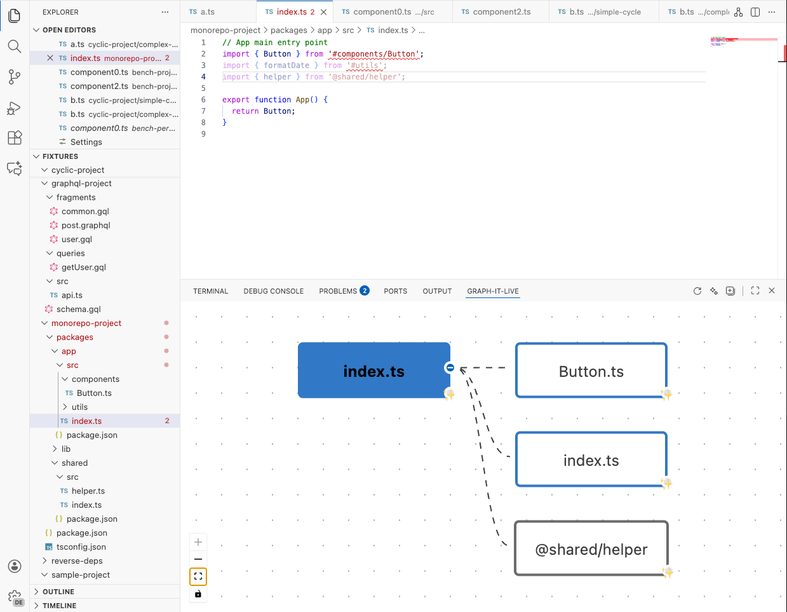
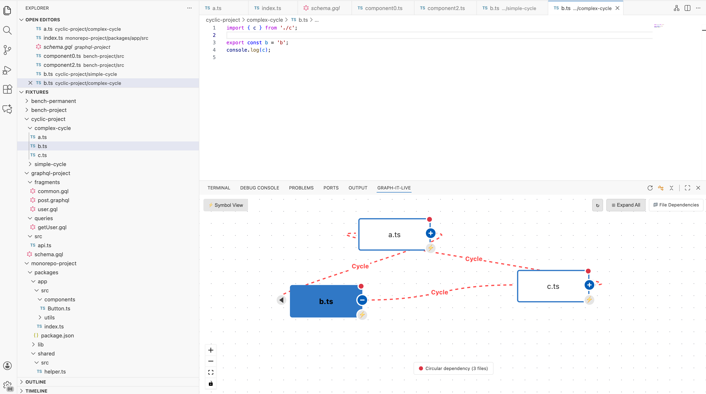

# Changelog

## v1.3.6

### Breaking Changes

- **MCP tool names renamed**: Tool names now use `graphitlive_*` (snake_case) instead of `graphItLive_*`. Update any hardcoded tool references accordingly. If tool names are discovered dynamically and not hardcoded in scripts or prompts, there is no impact.

### Bug Fixes

- **Fix file change event handling**: Resolved issues with file change detection that could lead to missed or duplicate analyses
  - Correctly prioritizes delete > change > create events
  - Ensures single analysis per file change, even with multiple rapid events
  - Improved debouncing logic to prevent redundant refreshes
  - Addresses edge cases with external file watchers interfering with save events

## v1.3.5

### Improvements

- **File Change Event Coalescence**: Optimized file change detection to prevent redundant analysis
  - Intelligently coalesces save events and file watcher events into single processing pass
  - Event priority system (delete > change > create) ensures correct handling
  - Per-file debouncing (300ms) reduces unnecessary refreshes
  - Prevents duplicate analysis when saving files with external watchers active

## v1.3.4

### New Features

- **Node Expansion Progress Tracking**: Real-time visualization of expansion progress with cancellation support
  - Overlay displays file count and progress during expansion
  - Cancel button to stop ongoing operations
  - Status indicators (in-progress, completed, cancelled, error)
- **Auto Fit View on Resize**: Graph automatically adjusts zoom and position when the webview is resized
  - Debounced RAF scheduler for smooth, performant updates
  - Maintains optimal view of the graph when switching panel positions

### Improvements

- **Better Expand/Collapse Handling**: Significantly improved logic for managing node expansion and collapse states
  - Fixed issues where nodes would disappear after expand/collapse operations
  - More reliable state synchronization between expanded and visible nodes
  - Enhanced merge algorithm for graph updates
- **Unused Symbol Detection**: Improved accuracy by checking internal dependencies within the file
  - Now considers references between exported symbols (e.g., exported types used in exported functions)
  - Reduces false positives when detecting dead code
  - Uses AST-based internal export dependency graph

### Architecture

- **Modular Spider Service Layer**: Refactored core analyzer into specialized services for better maintainability
  - `SpiderCacheCoordinator`: Centralized cache coherence management
  - `SpiderGraphCrawler`: Dependency graph traversal logic
  - `SpiderSymbolService`: Symbol-level analysis features
  - `SpiderIndexingService`: Background indexing operations
  - `SpiderDependencyAnalyzer`: Single file dependency analysis
  - `SpiderReferenceLookup`: Reverse dependency lookups

## v1.3.3

### Improvements

**Architecture Refactoring**:
- **Enhanced service layer architecture**: Refactored `GraphProvider` by extracting functionality into 10 specialized service modules for improved maintainability and reliability

**Analyzer Enhancements**:
- **New helper modules**: Added specialized modules for better code organization and performance

**Performance & Reliability**:
- Improved background indexing stability with better state synchronization
- Enhanced file change detection with clearer separation of concerns
- More robust cache invalidation and index updates
- Better error handling across the codebase

## v1.3.2

### Bug Fixes

**Critical ReverseIndex Bug Fix**:
- **Fixed reference persistence issue**: References would disappear from the reverse index after file re-analysis, causing the "Get References" button to incorrectly show no parent files. This affected both the VS Code extension and the MCP server.

**Webview State Management**:
- **Fixed stale references display**: After navigating to a new file, the webview would retain old references and not request new ones

**Initial Indexing Display**:
- **Fixed missing parent counts on initial load**: When opening a file before background indexing completed, parent counts wouldn't appear

**Refresh Button Bug**:
- **Fixed refresh clearing symbol view**: Clicking the refresh button in symbol view would incorrectly switch back to file view, causing GraphQL files and other files in symbol mode to appear empty

**ReverseIndex Degradation During Navigation**:
- **Fixed progressive loss of dependencies and references**: When navigating between files through the webview, references would progressively disappear because cached files weren't updating the ReverseIndex

## v1.3.1

### Bug Fixes

  
  
<em>small UI fix</em>

- UI Fix: Correct **icon display** for symbol view button in drill-down mode.
- UI Fix: Remove redundant button in webview.
- UI Fix: **Adjust node height**.
- UI Fix: Correct symbol view icon.
- UI Fix: All **actions buttons** (refresh, expand/collapse, switch view) are now in the top-right corner of webview or panel menu for consistency.
- Logging Fix: Ensure log messages from webview are correctly sent to extension logger.

## v1.3.0

### New Features

- **Symbol-Level Drill-Down View**: Double-click any file node to explore function-to-function and class-to-class dependencies within files. Navigate back with the "Back to Files" button.

  
  
<em>Symbol-level dependencies: see how functions and classes relate within a file</em>

- **O(1) Symbol Reverse Index**: Instant lookup of symbol callers via `SymbolReverseIndex`
  - Separates runtime callers from type-only imports (`isTypeOnly`)
  - Background indexing builds symbol-level reverse lookup table
  - 6x+ faster than O(n) scanning for caller queries
- **Breaking Change Detection**: Analyze impact of function signature changes
  - Detects added/removed/modified parameters and return type changes
  - Reports all affected callers that may need updates
- **Enhanced MCP Tools**: Added 8 new tools for AI/LLM integration (17 total)
  - `graphItLive_setWorkspace`: Set project directory for analysis
  - `graphItLive_getSymbolGraph`: Analyze symbol-level dependencies within a file
  - `graphItLive_findUnusedSymbols`: Detect unused exported symbols (dead code)
  - `graphItLive_getSymbolDependents`: Find all symbols depending on a specific symbol
  - `graphItLive_traceFunctionExecution`: Trace complete execution path through function calls
  - `graphItLive_getSymbolCallers`: O(1) instant lookup of symbol callers
  - `graphItLive_analyzeBreakingChanges`: Detect breaking changes in function signatures
  - `graphItLive_getImpactAnalysis`: Full impact analysis combining callers and breaking changes

### Improvements

- **Inline class expansion**: Class members expand inside the node (accordion-style), not as separate graph nodes
- **Line navigation**: Clicking on a symbol navigates to its exact line in the editor
- **Webview default position**: Now, in first installation, the graph view panel appears in the bottom panel by default for better visibility. You can move it back to the side panel or wherever you prefer.

  
  
<em>Webview default position: bottom panel for better visibility</em>

- **New commands**: You can check current indexing status with `Graph-It-Live: Show Indexing Status` and reindex the workspace with `Graph-It-Live: Reindex Workspace`.

## v1.2.1

- Enhance file dependencies resolution with better support of monorepos workspaces.

## v1.2.0

- Introduce support for MCP (Multi-Context Processing) server to enable AI/LLM integrations. Use it with Github Copilot, Cursor, Antigravity, etc. Let's chat about your code!

  
  
<em>Using Graph-It-Live dependency analysis tools with GitHub Copilot</em>

- Add new configuration option `graph-it-live.enableMcpServer` to enable/disable MCP server.

  
  
<em>Enabling the MCP Server in VS Code Settings</em>

- Better indexation performance with configurable concurrency via `graph-it-live.indexingConcurrency`.

## v1.1.5

- Add support for GraphQL schema files (`.gql` and `.graphql`).
- GraphQL nodes are now displayed with a pink border (#e535ab) matching the official GraphQL brand color.
- Implement import parsing for GraphQL `#import` directives.
- Enhance reference lookup by indexing files

## v1.1.4

- Fix a bug that caused incorrect display on Windows systems.

## v1.1.3

- Improve cross-platform path handling.

## v1.1.2

- Fix a bug that show orphan cycle edge in certain cases.
