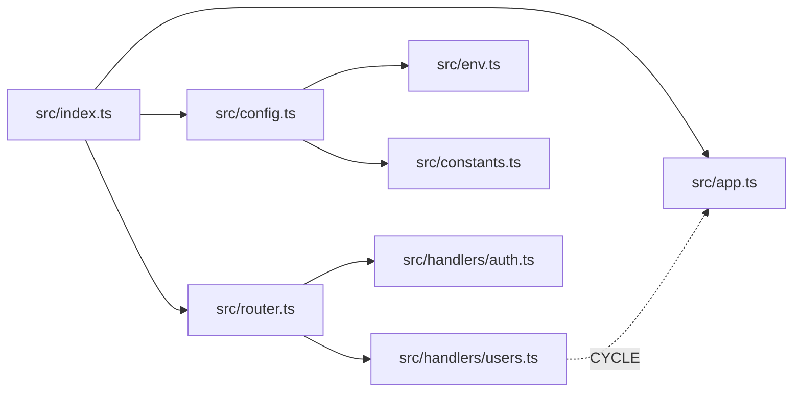
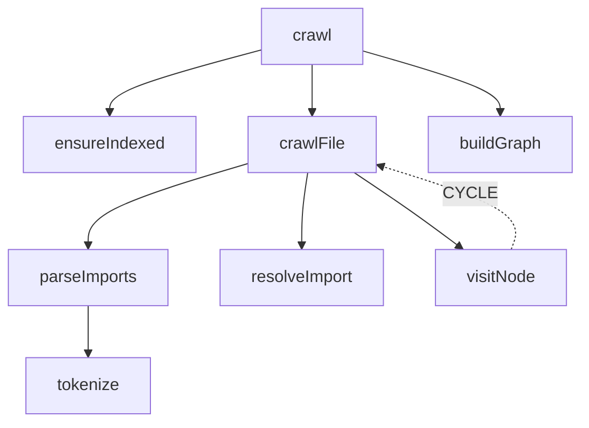

# Graph-It-Live CLI Reference

The `graph-it` CLI gives you full access to the dependency analysis engine of Graph-It-Live — **no VS Code required**. Run it in CI pipelines, pre-commit hooks, shell scripts, or in any terminal.

---

## Table of Contents

- [Installation](#installation)
- [Quick Start](#quick-start)
- [Global Options](#global-options)
- [Output Formats](#output-formats)
- [Commands](#commands)
  - [graph-it (no arguments)](#graph-it-no-arguments)
  - [scan](#scan)
  - [summary](#summary)
  - [explain](#explain)
  - [path](#path)
  - [check](#check)
  - [trace](#trace)
  - [query](#query)
  - [stats](#stats)
  - [wiki](#wiki)
  - [tool](#tool)
  - [serve](#serve)
  - [install](#install)
  - [update](#update)
- [MCP Tools Reference (via `graph-it tool`)](#mcp-tools-reference-via-graph-it-tool)
- [Advanced Analysis Workflows](#advanced-analysis-workflows)
  - [Pre-Refactor Safety Check](#pre-refactor-safety-check)
  - [Dead Code Audit](#dead-code-audit)
  - [Architecture Documentation](#architecture-documentation)
  - [CI Integration](#ci-integration)
  - [Piping & Scripting](#piping--scripting)
- [Tool Count: CLI vs MCP](#tool-count-cli-vs-mcp)

---

## Installation

**Prerequisite:** Node.js v22 or higher.

**Global install (recommended):**

```bash
npm install -g @magic5644/graph-it-live
```

After installation, `graph-it` is available system-wide:

```bash
graph-it --version
graph-it --help
```

**Without installing globally (via npx):**

```bash
npx @magic5644/graph-it-live scan
npx @magic5644/graph-it-live serve
```

**From VS Code extension:**

If you have the VS Code extension installed, you can expose the bundled binary to your PATH with:

```bash
graph-it install     # adds graph-it to your system PATH
```

---

## Quick Start

## `review-pr`

Run deterministic local PR review: `graph-it review-pr --base origin/main [--head <ref>] [--depth 3] [--max-files 200] --format json|toon|markdown`. The command exits non-zero for invalid refs or invalid limits; risk is data, not a gate by default. MCP clients can call `graphitlive_review_pr` with the same bounded parameters and `response_format`. Results expose signature/dependent/cycle/unused-export/test-candidate score factors; unavailable local capabilities and bounded work are limitations, not negative findings. Markdown output escapes table and HTML control characters. The Action emits `vscode://magic5644.graph-it-live/graph-it-live.reviewCallGraph?file=<workspace-relative>&symbol=<encoded>&depth=3` only when a risky symbol has a workspace-relative file; the extension accepts depth 1–5 and validates the path again.

### GitHub Actions consumer workflow

The composite Action has no trigger of its own. Consumer repositories must add a `pull_request` workflow; see [`examples/graph-it-review-gate.yml`](examples/graph-it-review-gate.yml). It installs `@magic5644/graph-it-live@latest` in a temporary prefix and runs `graph-it review-pr --workspace "$GITHUB_WORKSPACE"` against the checked-out consumer repository. It never installs or builds consumer dependencies.

`cli-version` is optional: omit it to use npm `latest`, or supply an npm version, tag, or range. The Action validates the CLI's actual `graph-it-live vX.Y.Z` output, logs it, exposes it as `outputs.cli-version`, and rejects versions below `1.12.0`. It also exposes `risk` and `score` outputs.

Use `magic5644/Graph-It-Live/.github/actions/graph-it-review-gate@v1.12.0` only after the manual npm publication and immutable Git tag release are complete. Never use `pull_request_target` to inspect untrusted PR code. Set `comment: false` for fork PRs; then grant only `contents: read` rather than `pull-requests: write`.

```bash
# 1. Go to your project root
cd /path/to/your/project

# 2. Index the workspace
graph-it scan

# 3. Get a workspace overview
graph-it summary

# 4. Analyze a specific file
graph-it summary src/main.ts

# 5. Find what depends on a file
graph-it tool find_referencing_files --filePath=$(pwd)/src/utils.ts

# 6. Scan for dead code
graph-it check
```

---

## Global Options

These options are available for every command:

| Option | Shorthand | Default | Description |
|--------|-----------|---------|-------------|
| `--workspace <path>` | `-w` | auto-detected from `cwd` | Root directory of the project to analyze |
| `--format <format>` | `-f` | `text` | Output format: `text`, `json`, `toon`, `markdown`, `mermaid` |
| `--help` | `-h` | — | Show help for the current command |
| `--version` | `-v` | — | Print the installed version |

**Workspace auto-detection:** If `--workspace` is omitted, `graph-it` looks for a `package.json`, `tsconfig.json`, `pyproject.toml`, or `Cargo.toml` in the current directory and its ancestors.

```bash
# Explicit workspace
graph-it scan --workspace /abs/path/to/project

# Let it auto-detect from cwd
cd /path/to/project && graph-it scan
```

---

## Output Formats

All analysis commands support multiple output formats via `--format`:

| Format | Description | Best for |
|--------|-------------|----------|
| `text` *(default)* | Human-readable structured text | Terminal inspection |
| `json` | Standard JSON | Scripting, piping to `jq` |
| `toon` | Compact Token-Oriented Object Notation | AI consumption (30–60% token savings) |
| `markdown` | Data wrapped in a Markdown code block | Reports, documentation |
| `mermaid` | Mermaid flowchart diagram syntax | Architecture docs, README, Notion |

**Format availability per command:**

| Format | scan | summary | explain | path | check | trace | query | tool |
|--------|:----:|:-------:|:-------:|:----:|:-----:|:-----:|:-----:|:----:|
| `text` | ✓ | ✓ | ✓ | ✓ | ✓ | ✓ | ✓ | ✓ |
| `json` | ✓ | ✓ | ✓ | ✓ | ✓ | ✓ | ✓ | ✓ |
| `toon` | ✓ | ✓ | ✓ | ✓ | ✓ | ✓ | ✓ | ✓ |
| `markdown` | ✓ | ✓ | ✓ | ✓ | ✓ | ✓ | — | ✓ |
| `mermaid` | — | — | — | ✓ | — | ✓ | — | — |

**Examples:**

```bash
graph-it summary src/app.ts --format json
graph-it path src/index.ts --format mermaid      # → paste in GitHub, Notion, VS Code Preview
graph-it check --format markdown                  # → paste in a PR description
graph-it summary --format toon                    # → feed to an LLM
```

---

## Commands

### graph-it (no arguments)

Launches interactive mode when invoked without a command in a TTY session.

```
graph-it [options]
```

**Behavior:**

- If `stdin` is a TTY, starts the interactive REPL.
- If `stdin` is not a TTY, interactive mode is not started. Use direct commands such as `graph-it summary`, `graph-it trace`, or `graph-it check`.
- REPL session default output format is `text` unless changed with `/format`.

#### REPL slash commands

| Command | Description |
|--------|-------------|
| `/query` | Query the codebase with natural language (no quotes needed for multi-word questions) |
| `/wiki` | Generate a navigable markdown wiki from the call graph |
| `/trace` | Run trace flow for a selected file and optional symbol |
| `/path` | Set session workspace scope (directory) |
| `/file` | Set active file context for context-aware commands |
| `/check-dependencies` | Check incoming and outgoing dependencies |
| `/cycles` | List confirmed dependency cycles for a file |
| `/summary` | Summarize current file context or workspace |
| `/architecture` | Build workspace architecture graph |
| `/check` | Find unused exports |
| `/format` | Set preferred output format for the session |
| `/command` | Run a raw CLI command line inside REPL |
| `/export` | Export dependency graph as standalone HTML (vis.js). Optional `--output <path>` / `-o <path>`. Scope: active file context → workspace scope (set via `/path`) → full workspace |
| `/help` | Show REPL command help |
| `/quit` | Exit interactive mode |

#### Post-result actions

After each result, the REPL supports contextual actions:

- drill-down into current file/symbol context
- export current structured result in another format
- save current output to file
- set default session format
- run context-aware follow-up actions (for example dependency, cycle, trace, dead-code, or architecture follow-ups)

#### Session state

REPL session state is in-memory for the current invocation and tracks:

- `workspaceRoot`
- `lastFile`
- `lastSymbol`
- `lastResult`
- `lastCommandLine`
- `preferredFormat`
- `recentFiles` (max 5, newest first)
- `tipCounter`

#### Tips

The REPL tip system includes:

- general rotating tips
- command-step tips (for example trace/check-dependencies/cycles/result steps)
- persona-tagged tips (role-oriented hints)

#### Save path safety

When saving from REPL:

- writes are restricted to paths inside the workspace root
- path checks are enforced using resolved/real paths
- symlink targets are refused for overwrite

### scan

Index (or re-index) the workspace. Must be run before other analysis commands on first use; subsequent commands index automatically if needed.

```
graph-it scan [options]
```

**Options:**

| Option | Default | Description |
|--------|---------|-------------|
| `--workspace, -w` | auto-detected | Project root to index |
| `--format, -f` | `text` | Output format |

**What it does:**

1. Walks the workspace and parses every source file
2. Builds a dependency graph in memory (import/export edges)
3. Constructs a reverse index for O(1) "who imports this?" lookups
4. Prints index statistics: files indexed, total edges, duration

**Output (text):**

```
Indexed 347 files, 1 824 edges in 3.2 s
  TypeScript: 284 files
  JavaScript: 63 files
  Cycles detected: 2
```

**Examples:**

```bash
graph-it scan
graph-it scan --workspace /path/to/project
graph-it scan --format json       # → { "files": 347, "edges": 1824, ... }
```

> **Tip:** In CI, run `graph-it scan` as a warm-up step before chaining other commands.

---

### summary

Print a workspace overview: index statistics plus (optionally) a codemap for a specific file.

```
graph-it summary [file] [options]
```

**Arguments:**

| Argument | Description |
|----------|-------------|
| `file` *(optional)* | Source file to generate a codemap for |

**Options:**

| Option | Default | Description |
|--------|---------|-------------|
| `--workspace, -w` | auto-detected | Project root |
| `--format, -f` | `text` | Output format |

**What it does (no file argument):**

Prints overall statistics: files indexed, edges, cycles, index freshness.

**What it does (with file argument):**

Returns index statistics **plus** a structured codemap for the file:
- Exported symbols
- Internal symbols
- Direct dependencies (files imported)
- Dependents (files that import this one)
- Call flow (intra-file symbol call order)
- Cycle indicators

**Output (text, with file):**

```
=== Index Status ===
Files: 347   Edges: 1824   Cycles: 2

=== Codemap: src/Spider.ts ===
Exports:  Spider, SpiderOptions
Internals: crawlFile, resolveImport, visitNode
Deps:     Parser.ts, PathResolver.ts, Cache.ts
Dependents: SpiderBuilder.ts, extension.ts
Call flow: crawl → crawlFile → resolveImport → visitNode
Cycles:   none
```

**Examples:**

```bash
graph-it summary
graph-it summary src/api/router.ts
graph-it summary src/api/router.ts --format markdown   # paste in docs
graph-it summary src/api/router.ts --format toon       # feed to LLM
```

---

### explain

Analyze the internal call hierarchy of a file — which functions call which, in what order, including recursive cycles.

```
graph-it explain <file> [options]
```

**Arguments:**

| Argument | Description |
|----------|-------------|
| `<file>` | Source file to analyze (absolute or relative to workspace root) |

**Options:**

| Option | Default | Description |
|--------|---------|-------------|
| `--workspace, -w` | auto-detected | Project root |
| `--format, -f` | `text` | Output format |

**What it does:**

Uses AST analysis (Tree-sitter + ts-morph) to map every symbol in the file and construct a call graph:
- Which symbols are exported vs. internal
- Which functions/methods call each other
- Entry points (symbols called by nobody internally)
- Cycle detection (recursive calls)

**Output (text):**

```
File: src/mcp/mcpServer.ts

Entry points: initializeServer(), main()

initializeServer()
  └── registerAllTools()         [call #1]
  └── setupFileWatcher()         [call #2]
  └── startListening()           [call #3]
      └── handleToolCall()
          ├── validateWorkspace()
          └── invokeWorker()

Cycles: none
```

**Examples:**

```bash
graph-it explain src/mcp/mcpServer.ts
graph-it explain src/analyzer/Spider.ts --format json
graph-it explain src/extension/GraphProvider.ts --format markdown
```

> **Use case:** Understand how data flows through a complex file before refactoring — without reading every line.

---

### path

Crawl the full dependency graph starting from an entry file (BFS traversal) and display all reachable files with their dependency relationships.

```
graph-it path <file> [options]
```

**Arguments:**

| Argument | Description |
|----------|-------------|
| `<file>` | Entry file to start crawling from |

**Options:**

| Option | Default | Description |
|--------|---------|-------------|
| `--workspace, -w` | auto-detected | Project root |
| `--format, -f` | `text` | Output format (`mermaid` generates a flowchart) |
| `--maxDepth <N>` | unlimited | Maximum traversal depth |

**What it does:**

Starting from `<file>`, follows all import edges recursively (BFS) and returns:
- The complete list of reachable files
- Direct dependency edges
- Cycle detection (circular imports highlighted)
- Depth at which each file is reached

**Output (text):**

```
src/index.ts (depth 0)
  → src/app.ts (depth 1)
  → src/config.ts (depth 1)
      → src/env.ts (depth 2)
      → src/constants.ts (depth 2)
  → src/router.ts (depth 1)
      → src/handlers/auth.ts (depth 2)
      → src/handlers/users.ts (depth 2)
          ⟲ src/app.ts [CYCLE]

Total: 8 files, 2 cycles
```

**Output (mermaid):**



**Examples:**

```bash
graph-it path src/index.ts
graph-it path src/index.ts --maxDepth 3
graph-it path src/index.ts --format mermaid > architecture.md
graph-it path src/index.ts --format json | jq '.files | length'
```

> **Use case:** Generate an architecture diagram in seconds. Pipe `--format mermaid` output directly into your README, Notion page, or Confluence doc.

---

### check

Find unused exported symbols (dead code) — either workspace-wide, scoped to a directory, or for a single file.

```
graph-it check [target] [options]
```

**Arguments:**

| Argument | Description |
|----------|-------------|
| *(none)* | Scan the entire workspace for unused exports |
| `<directory>` | Scan a specific directory and its subdirectories |
| `<file>` | Check a single file for unused exported symbols |

**Options:**

| Option | Default | Description |
|--------|---------|-------------|
| `--workspace, -w` | auto-detected | Project root |
| `--format, -f` | `text` | Output format |

**What it does:**

Combines the dependency graph with export analysis to find symbols that are exported but never imported anywhere in the project. Reports:
- File path of the symbol
- Symbol name and type (function, class, variable, type alias…)
- Whether it is completely unreferenced or only referenced within the same file

**Output (text, workspace-wide):**

```
Dead code scan — 347 files analyzed

src/utils/legacy.ts
  ⚠  formatDate        [function]   — exported, never imported
  ⚠  LegacyConfig      [interface]  — exported, never imported

src/api/deprecated.ts
  ⚠  oldHandler        [function]   — exported, never imported

3 unused exports found across 2 files.
```

**Output (text, single file):**

```
Checking src/utils/helpers.ts

  ✓  formatDate        used in 4 files
  ✗  parseQueryString  not used anywhere
  ✓  clamp             used in 2 files

1 unused export found.
```

**Examples:**

```bash
# Workspace-wide dead code scan
graph-it check

# Scope to a directory
graph-it check src/utils/

# Single file check
graph-it check src/api/handlers.ts

# Output as JSON for scripting
graph-it check --format json | jq '[.[] | select(.unusedCount > 0)]'

# Output as Markdown for PR descriptions
graph-it check --format markdown > dead-code-report.md
```

> **Use case:** Run `graph-it check` in a pre-commit hook or CI step to prevent dead code from accumulating.

---

### trace

Trace the complete execution path from a starting symbol — following every function call recursively until leaf functions are reached.

```
graph-it trace <file>#<Symbol> [options]
```

**Arguments:**

| Argument | Format | Description |
|----------|--------|-------------|
| `<file>#<Symbol>` | `path/to/file.ts#FunctionName` | Entry symbol (file path + `#` + symbol name) |

**Options:**

| Option | Default | Description |
|--------|---------|-------------|
| `--workspace, -w` | auto-detected | Project root |
| `--format, -f` | `text` | Output format (`mermaid` generates a call flowchart) |
| `--maxDepth <N>` | `10` | Maximum recursion depth |

**What it does:**

Starting from the specified symbol, follows every outgoing call edge recursively (DFS) and returns a tree showing the complete execution flow:
- Each function call with its file location
- Call ordering (numbered edges)
- Recursive calls / cycles detected and labelled

**Output (text):**

```
Trace: src/analyzer/Spider.ts#crawl

crawl (Spider.ts)
  ├─[1] ensureIndexed (runtime.ts)
  ├─[2] crawlFile (Spider.ts)
  │     ├─[1] parseImports (Parser.ts)
  │     │     └─[1] tokenize (lexer.ts)
  │     ├─[2] resolveImport (PathResolver.ts)
  │     └─[3] visitNode (Spider.ts)
  │           ⟲ crawlFile [CYCLE — recursive]
  └─[3] buildGraph (GraphBuilder.ts)

Depth reached: 4   Cycles: 1
```

**Output (mermaid):**



**Examples:**

```bash
graph-it trace src/index.ts#main
graph-it trace src/api.ts#handleRequest --format mermaid
graph-it trace src/Spider.ts#crawl --maxDepth 5
graph-it trace src/mcp/mcpServer.ts#initializeServer --format json
```

> **Use case:** Before changing a function signature, run `trace` to see every downstream function that will be affected, all the way to leaf functions.

---

### query

Answer a natural language question about the codebase using the call graph. When an LLM API key is configured the answer is synthesised by the model; otherwise a heuristic fallback is used and a warning is printed to stderr.

```
graph-it query "<question>" [options]
```

**Arguments:**

| Argument | Description |
|----------|-------------|
| `<question>` | Natural language question about the codebase (max 1024 characters) |

**Options:**

| Option | Default | Description |
|--------|---------|-------------|
| `--workspace, -w` | auto-detected | Project root |
| `--depth <N>` | `2` | BFS depth for call graph traversal (1–5) |
| `--token-budget <N>` | `4000` | Max tokens for the subgraph context (500–16000) |
| `--format <fmt>` | `text` | Output format: `text`, `json`, `toon` |

**LLM configuration (environment variables):**

| Variable | Description |
|----------|-------------|
| `ANTHROPIC_API_KEY` | Use Anthropic (`claude-haiku-4-5`) |
| `OPENAI_API_KEY` | Use OpenAI-compatible provider |
| `OPENAI_BASE_URL` | Base URL for OpenAI-compatible endpoint |
| `OPENAI_MODEL` | Model name for OpenAI-compatible provider |

When neither key is set, the command falls back to a heuristic analysis and prints a notice to stderr.

**Examples:**

```bash
graph-it query "how does Spider crawl files"
graph-it query "how does Spider crawl files" --format text
graph-it query "what calls CallGraphIndexer" --depth 3
graph-it query "explain the MCP server architecture" --token-budget 8000
graph-it query "what is the entry point for the CLI" --format json
```

> **Breaking change:** `CallGraphIndexer` SCHEMA_VERSION was bumped from 2 to 3 alongside this feature. The index is automatically rebuilt on first use after upgrading.

---

### stats

Report session-level token metrics with strict separation between:
- **estimated JSON vs TOON encoding sizes** (chars/4 heuristic), and
- **real provider-reported LLM usage** (`llmUsage`).

```
graph-it stats [options]
```

**Options:**

| Option | Default | Description |
|--------|---------|-------------|
| `--workspace, -w` | auto-detected | Project root |
| `--stats-dir <dir>` | `~/.graph-it/stats` | Override persisted stats directory |
| `--format, -f` | `text` | Output format (`text`, `json`, `markdown`) |

**What it reports:**
- current process session (`byTool`, totals, `llmUsage`)
- persisted history (`bySource`, `byTool`)
- required wording that `llmUsage` is never summed into estimated encoding totals

**Local zero-LLM proof workflow:**

```bash
# Runs architecture, codemap, impact, and call-graph analyses twice (JSON + TOON).
# ANTHROPIC_API_KEY and OPENAI_API_KEY are removed from child processes.
# Raw outputs and report.json are written under .reports/context-economy/.
npm run test:context-economy
```

The generated `report.json` stores, for every corpus operation:

- `llmUsage.calls = 0` and `llmUsage.tokensUsed = 0`;
- raw JSON and TOON output paths;
- UTF-8 bytes, characters, and `estimateTokenSavings()` values;
- persisted CLI session snapshots, which also must show zero provider usage.

The `chars / 4` values are **encoding estimates**, not provider billing tokens or a
claim that an LLM was called. Local graph traversal performs no LLM request. The
optional `query` command may use an LLM only to extract keywords; without a
provider key it uses the deterministic heuristic fallback. MCP response synthesis
belongs to the calling AI client, not to Graph-It-Live's local analyzers.

**TOON secondary benchmark workflow:**

```bash
# Primary + secondary payload benchmarks for session-stats TOON encoding
npx vitest bench tests/benchmarks/sessionStatsToon.bench.ts
```

**Examples:**

```bash
graph-it stats
graph-it stats --format json
graph-it stats --stats-dir /tmp/graph-it-stats --format markdown
```

---

### wiki

Generate a navigable markdown wiki from the call graph. Creates one article per source file with hub scores, symbol lists, caller/callee cross-links, and a grouped index — all with relative links only (portable, can be committed to the repo).

```
graph-it wiki [options]
```

**Options:**

| Option | Default | Description |
|--------|---------|-------------|
| `--output <dir>` | `wiki` | Output directory (relative to workspace root, or absolute) |
| `--top <N>` | `10` | Number of top hub files to list in the index (1–50) |
| `--format <fmt>` | `markdown` | Output summary format: `markdown`, `json`, `toon` |
| `--workspace, -w` | auto-detected | Project root |

**Examples:**

```bash
graph-it wiki                                  # write to ./wiki/
graph-it wiki --output docs/wiki               # write to ./docs/wiki/
graph-it wiki --top 20 --format json           # JSON summary, top 20 hubs
graph-it wiki --output /tmp/preview            # absolute output path
```

**Output structure:**

```
wiki/
  index.md          # Grouped file index with hub scores
  articles/
    src_foo.ts.md   # One article per source file
    src_bar.ts.md
    ...
```

Each article contains:
- Hub score (0–100, higher = more depended-upon)
- Symbols (functions, classes, interfaces, types)
- Called by (callers from other files)
- Calls (callees in other files)
- All internal links are **relative** — safe to commit and view on any OS

> **REPL equivalent:** Use `/wiki` inside `graph-it` interactive mode.
> **MCP equivalent:** `graphitlive_generate_wiki` tool.

---

### tool

Invoke any of the 22 MCP analysis tools directly from the terminal — full MCP parity without a running server.

```
graph-it tool <name> [--<param>=<value>...] [options]
graph-it tool --list
graph-it tool --args '<json>' <name>
```

**Arguments:**

| Argument | Description |
|----------|-------------|
| `<name>` | MCP tool name (see `--list`) |
| `--list` | Print all 22 available tools with one-line descriptions |

**Options:**

| Option | Default | Description |
|--------|---------|-------------|
| `--<param>=<value>` | — | Pass individual parameters directly |
| `--args '<json>'` | — | Pass all parameters as a JSON string |
| `--workspace, -w` | auto-detected | Project root |
| `--format, -f` | `text` | Output format |

**List all tools:**

```bash
graph-it tool --list
```

Output:
```
Available MCP tools:

  analyze_dependencies           Show direct imports and exports of a file
  crawl_dependency_graph         Full dependency tree from an entry file (BFS)
  find_referencing_files         All files that import a given file
  expand_node                    Incrementally expand dependencies of a node
  parse_imports                  Raw import statements parsed from a file
  verify_dependency_usage        Check if an import is actually used in source
  resolve_module_path            Resolve a module specifier to its absolute path
  get_index_status               Current state of the dependency index
  invalidate_files               Flush cache entries for specific files
  rebuild_index                  Trigger a full index rebuild
  get_symbol_graph               Symbol-level call graph within a file
  find_unused_symbols            Detect dead/unused exported symbols
  get_symbol_dependents          All symbols that depend on a given symbol
  trace_function_execution       Full recursive call chain from a symbol
  get_symbol_callers             All callers of a symbol across the project
  analyze_breaking_changes       Detect breaking API changes between two versions
  get_impact_analysis            Full impact analysis of changing a file/symbol
  analyze_file_logic             Intra-file call hierarchy (AST-based)
  generate_codemap               AI-friendly structural overview of a file (TOON)
  query_call_graph               BFS callers/callees via the SQLite call graph index
  scan_dead_code                 Workspace-wide scan for unused exported symbols
  query_natural_language         Answer a natural language question about the codebase (LLM or heuristic)
  generate_wiki                  Generate a navigable markdown wiki from the call graph
```

**Calling a tool with parameters:**

```bash
# Using --param=value syntax
graph-it tool analyze_dependencies --filePath=/abs/path/to/file.ts

# Using --args JSON syntax (useful for complex/nested params)
graph-it tool --args '{"filePath":"/abs/path/to/file.ts"}' analyze_dependencies

# With format
graph-it tool get_symbol_callers --filePath=/abs/path/to/Spider.ts --symbolName=crawl --format json
```

**Examples per tool:**

```bash
# Index status
graph-it tool get_index_status

# Analyze direct imports/exports of a file
graph-it tool analyze_dependencies --filePath=$(pwd)/src/app.ts

# Full dependency graph from entry file (BFS)
graph-it tool crawl_dependency_graph --entryFile=$(pwd)/src/index.ts

# All files that import a given file
graph-it tool find_referencing_files --filePath=$(pwd)/src/utils.ts

# Check if an import is actually used in source code
graph-it tool verify_dependency_usage --filePath=$(pwd)/src/app.ts --dependency=lodash

# Resolve a module specifier to its absolute path
graph-it tool resolve_module_path --filePath=$(pwd)/src/app.ts --modulePath=./utils

# Symbol-level call graph within a file
graph-it tool get_symbol_graph --filePath=$(pwd)/src/Spider.ts

# Find all callers of a specific symbol across the project
graph-it tool get_symbol_callers --filePath=$(pwd)/src/Spider.ts --symbolName=crawl

# Find all symbols that depend on a specific symbol
graph-it tool get_symbol_dependents --filePath=$(pwd)/src/Spider.ts --symbolName=Spider

# Trace complete execution path from a symbol
graph-it tool trace_function_execution --filePath=$(pwd)/src/Spider.ts --symbolName=crawl

# Detect breaking API changes between two versions of a file
graph-it tool analyze_breaking_changes --filePath=$(pwd)/src/api.ts --newFilePath=$(pwd)/src/api.new.ts

# Full impact analysis of changing a file
graph-it tool get_impact_analysis --filePath=$(pwd)/src/utils.ts

# Generate AI-friendly codemap of a file
graph-it tool generate_codemap --filePath=$(pwd)/src/Spider.ts

# Intra-file call hierarchy
graph-it tool analyze_file_logic --filePath=$(pwd)/src/mcp/mcpServer.ts

# Cross-file call graph (BFS from a symbol)
graph-it tool query_call_graph --filePath=$(pwd)/src/Spider.ts --symbolName=crawl --depth=3

# Workspace-wide dead code scan
graph-it tool scan_dead_code

# Scoped dead code scan
graph-it tool scan_dead_code --scopePath=$(pwd)/src/utils/

# Detect unused exports in a single file
graph-it tool find_unused_symbols --filePath=$(pwd)/src/api.ts

# Force cache flush for a file after editing
graph-it tool invalidate_files --filePaths='["$(pwd)/src/api.ts"]'

# Full index rebuild
graph-it tool rebuild_index

# Expand a node incrementally
graph-it tool expand_node --filePath=$(pwd)/src/app.ts --depth=2

# Parse raw import statements (no path resolution)
graph-it tool parse_imports --filePath=$(pwd)/src/app.ts
```

---

### serve

Start the MCP stdio server — enables any MCP-compatible AI client (Claude Desktop, Claude Code, Cursor, Windsurf, etc.) to connect to Graph-It-Live without VS Code.

```
graph-it serve [options]
```

**Options:**

| Option | Default | Description |
|--------|---------|-------------|
| `--workspace, -w` | auto-detected | Project root the server will analyze |

**What it does:**

Launches the full 22-tool MCP server process on `stdio`. The server:
- Accepts MCP JSON-RPC messages from stdin
- Performs dependency analysis on the workspace
- Returns results on stdout
- Auto-invalidates the cache when files change (via `chokidar`, debounced 300 ms)

**MCP client configuration:**

```bash
# Claude Code CLI (adds to your Claude config)
claude mcp add graph-it -- graph-it serve

# VS Code / Cursor (.vscode/mcp.json or .cursor/mcp.json)
{
  "servers": {
    "graph-it-live": {
      "type": "stdio",
      "command": "graph-it",
      "args": ["serve"],
      "env": { "WORKSPACE_ROOT": "${workspaceFolder}" }
    }
  }
}

# Claude Desktop (~/Library/Application Support/Claude/claude_desktop_config.json)
{
  "mcpServers": {
    "graph-it-live": {
      "command": "graph-it",
      "args": ["serve"],
      "env": { "WORKSPACE_ROOT": "/path/to/your/project" }
    }
  }
}
```

**Environment variables:**

| Variable | Default | Description |
|----------|---------|-------------|
| `WORKSPACE_ROOT` | `cwd` | Absolute path to project root |
| `EXCLUDE_NODE_MODULES` | `true` | Whether to skip `node_modules` |
| `MAX_DEPTH` | `50` | Maximum dependency depth |

---

### install

Symlink the `graph-it` binary into your system `PATH` so it can be invoked from any directory without `npx`.

```
graph-it install
```

> **Note:** This is a VS Code extension convenience command. When using the npm global install, `graph-it` is already on your PATH.

---

### update

Check npm for a newer version of `@magic5644/graph-it-live` and install it if one is available.

```
graph-it update
```

Requires an active internet connection and `npm` in `PATH`.

---

## MCP Tools Reference (via `graph-it tool`)

The `graph-it tool` command provides direct access to all 21 analysis tools (the MCP server exposes 22 including `set_workspace`, which is server-management only and not needed in CLI context — see [Tool Count: CLI vs MCP](#tool-count-cli-vs-mcp)).

### Tool Details

#### `analyze_dependencies`

**What it returns:** All direct `import` / `require` statements in a file, resolved to absolute paths, plus all exported symbols with their types.

```bash
graph-it tool analyze_dependencies --filePath=/abs/path/to/file.ts
```

**Output fields:** `imports[]`, `exports[]`, `filePath`, `language`

---

#### `crawl_dependency_graph`

**What it returns:** The full BFS dependency tree starting from an entry file — all reachable files, edges, cycle information, and depth data.

```bash
graph-it tool crawl_dependency_graph --entryFile=/abs/path/to/index.ts
graph-it tool crawl_dependency_graph --entryFile=/abs/path/to/index.ts --maxDepth=5
```

**Output fields:** `nodes[]`, `edges[]`, `circularDependencies[]`, `nodeCount`, `edgeCount`

Each node in `nodes[]` includes:
- `hubScore` (0–1): proportion of workspace files that import this node
- `communityId` (0+): path-based functional cluster — 0 = isolated, 1+ = first non-umbrella subdirectory group (e.g. files under `src/analyzer/` → same `communityId`)

---

#### `find_referencing_files`

**What it returns:** All files in the project that import the given file — an O(1) reverse lookup from the pre-built reverse index.

```bash
graph-it tool find_referencing_files --filePath=/abs/path/to/utils.ts
```

**Output fields:** `referencingFiles[]`, `count`

---

#### `expand_node`

**What it returns:** The immediate dependencies (one level) of a node, useful for incremental graph exploration without re-crawling the full tree.

```bash
graph-it tool expand_node --filePath=/abs/path/to/app.ts --depth=1
```

**Output fields:** `dependencies[]`, `filePath`

---

#### `parse_imports`

**What it returns:** Raw import statements parsed from the source file, without path resolution. Useful for inspecting import syntax and module specifiers directly.

```bash
graph-it tool parse_imports --filePath=/abs/path/to/app.ts
```

**Output fields:** `imports[]` (with `source`, `specifiers[]`, `type`)

---

#### `verify_dependency_usage`

**What it returns:** Whether a specific imported module is actually referenced in the source code (i.e., is it a live import or an unused one).

```bash
graph-it tool verify_dependency_usage --filePath=/abs/path/to/app.ts --dependency=lodash
```

**Output fields:** `isUsed` (boolean), `usageLocations[]`

---

#### `resolve_module_path`

**What it returns:** The absolute filesystem path that a module specifier resolves to, applying TypeScript path aliases, Node.js resolution rules, and workspace configuration.

```bash
graph-it tool resolve_module_path --filePath=/abs/path/to/app.ts --modulePath=@/utils/helpers
```

**Output fields:** `resolvedPath`, `exists` (boolean)

---

#### `get_index_status`

**What it returns:** Current state of the in-memory dependency index — number of indexed files, edges, index freshness, and memory usage.

```bash
graph-it tool get_index_status
```

**Output fields:** `files`, `edges`, `indexedAt`, `isStale`

---

#### `invalidate_files`

**What it does:** Removes specific files from the in-memory cache, forcing them to be re-analyzed on next access. Use after programmatic file edits.

```bash
graph-it tool invalidate_files --filePaths='["/abs/path/to/file.ts"]'
```

---

#### `rebuild_index`

**What it does:** Drops and rebuilds the entire dependency index from scratch. Useful after large refactors or when the index is stale.

```bash
graph-it tool rebuild_index
```

---

#### `get_symbol_graph`

**What it returns:** Symbol-level dependencies within a single file — which functions, classes, and variables are defined, and which call which internally.

```bash
graph-it tool get_symbol_graph --filePath=/abs/path/to/Spider.ts
```

**Output fields:** `symbols[]`, `dependencies[]`, `file`

---

#### `find_unused_symbols`

**What it returns:** Exported symbols in a file that are never imported or referenced elsewhere in the project.

```bash
graph-it tool find_unused_symbols --filePath=/abs/path/to/api.ts
```

**Output fields:** `unusedSymbols[]`, `totalExports`, `unusedCount`

---

#### `get_symbol_dependents`

**What it returns:** All symbols (across the entire project) that depend on a specific symbol — the reverse of `get_symbol_graph`.

```bash
graph-it tool get_symbol_dependents --filePath=/abs/path/to/Spider.ts --symbolName=Spider
```

**Output fields:** `dependents[]` (with `file`, `symbolName`, `type`)

---

#### `trace_function_execution`

**What it returns:** The complete recursive call chain from a starting symbol — DFS traversal following every outgoing call edge until leaf functions.

```bash
graph-it tool trace_function_execution --filePath=/abs/path/to/Spider.ts --symbolName=crawl
graph-it tool trace_function_execution --filePath=/abs/path/to/Spider.ts --symbolName=crawl --maxDepth=5
```

**Output fields:** `callTree` (nested), `cycles[]`, `maxDepth`

---

#### `get_symbol_callers`

**What it returns:** All callers of a specific symbol across the entire project — an O(1) lookup from the pre-built reverse symbol index.

```bash
graph-it tool get_symbol_callers --filePath=/abs/path/to/Spider.ts --symbolName=crawl
```

**Output fields:** `callers[]` (with `file`, `symbolName`, `line`)

---

#### `analyze_breaking_changes`

**What it returns:** Whether changes to a file introduce breaking changes — altered function signatures, removed exports, changed parameter types — and which callers are affected.

```bash
graph-it tool analyze_breaking_changes --filePath=/abs/path/to/api.ts --newFilePath=/abs/path/to/api.new.ts
```

**Output fields:** `breakingChanges[]`, `affectedCallers[]`, `severity`

---

#### `get_impact_analysis`

**What it returns:** A full impact report for changing a file — combines `find_referencing_files`, `get_symbol_callers`, and `analyze_breaking_changes` into a single structured result.

```bash
graph-it tool get_impact_analysis --filePath=/abs/path/to/utils.ts
```

**Output fields:** `referencingFiles[]`, `symbolCallers[]`, `breakingChanges[]`, `totalImpact`

---

#### `analyze_file_logic`

**What it returns:** Intra-file call hierarchy from AST analysis — entry points, call order, internal cycles, symbol types.

```bash
graph-it tool analyze_file_logic --filePath=/abs/path/to/mcpServer.ts
```

**Output fields:** `symbols[]`, `callEdges[]`, `entryPoints[]`, `cycles[]`

---

#### `generate_codemap`

**What it returns:** A structured, AI-friendly overview of a file in a single call: exports, internals, dependencies, dependents, call flow, and cycles.

```bash
graph-it tool generate_codemap --filePath=/abs/path/to/Spider.ts --format toon
```

**Output fields:** `exports[]`, `internals[]`, `dependencies[]`, `dependents[]`, `callFlow`, `cycles[]`

> **Tip:** Use `--format toon` to reduce token consumption by 30–60% when feeding this to an LLM.

---

#### `query_call_graph`

**What it returns:** BFS neighbourhood of callers and callees from a symbol, using the SQLite call graph index built by the Live Call Graph engine.

```bash
graph-it tool query_call_graph --filePath=/abs/path/to/Spider.ts --symbolName=crawl --depth=3
```

**Output fields:** `nodes[]`, `edges[]`, `cycles[]`

> **Note:** Requires the call graph index to have been built (auto-triggered on first use or when the VS Code panel is opened).

---

#### `scan_dead_code`

**What it returns:** All unused exported symbols found across the entire workspace (or a scoped directory), combining dependency graph analysis with export tracking.

```bash
# Entire workspace
graph-it tool scan_dead_code

# Scoped to a directory
graph-it tool scan_dead_code --scopePath=/abs/path/to/src/utils/
```

**Output fields:** `unusedSymbols[]` (with `file`, `symbol`, `type`), `totalScanned`, `unusedCount`

---

#### `query_natural_language`

**What it returns:** A natural language answer to a question about the codebase, grounded in a call graph subgraph. When an LLM key is configured the model synthesises the answer; otherwise a heuristic summary is returned.

**Parameters:**

| Parameter | Type | Default | Description |
|-----------|------|---------|-------------|
| `question` | string | — | Natural language question (max 1024 characters) |
| `depth` | number | `2` | BFS depth for call graph traversal (1–5) |
| `tokenBudget` | number | `4000` | Max tokens for subgraph context (500–16000) |
| `fileFilter` | string | — | Glob pattern to restrict which files are included |
| `outputFormat` | string | `toon` | Subgraph format passed to the LLM: `toon` or `json` |

```bash
graph-it tool query_natural_language --question="how does Spider crawl files"
graph-it tool query_natural_language --question="what calls CallGraphIndexer" --depth=3
graph-it tool query_natural_language --question="explain the MCP server" --tokenBudget=8000
```

**LLM configuration:**
- `ANTHROPIC_API_KEY` → uses `claude-haiku-4-5`
- `OPENAI_API_KEY` + `OPENAI_BASE_URL` + `OPENAI_MODEL` → uses OpenAI-compatible provider
- No key set → heuristic fallback (warning printed to stderr)

> **Note:** The LLM calling this tool performs the synthesis — the tool returns a structured subgraph that the model interprets.

---

#### `generate_wiki`

Generate a navigable markdown wiki from the call graph. One article per source file, hub scores, symbol lists, caller/callee cross-links, and a grouped index — all with relative links only.

| Parameter | Type | Default | Description |
|-----------|------|---------|-------------|
| `workspaceRoot` | string | configured workspace | Absolute path to workspace root |
| `outputDir` | string | `wiki` | Output directory for wiki files |
| `topHubsLimit` | number | `10` | Number of top hub files to list (1–50) |
| `response_format` | string | `json` | Output summary format: `json`, `markdown`, or `toon` |

```bash
graph-it tool generate_wiki
graph-it tool generate_wiki --outputDir=docs/wiki
graph-it tool generate_wiki --topHubsLimit=20 --response_format=toon
```

---

## Advanced Analysis Workflows

### Pre-Refactor Safety Check

Before modifying a module, understand its full impact surface:

```bash
# 1. Find all files that import the module
graph-it tool find_referencing_files --filePath=$(pwd)/src/UserService.ts

# 2. Find all callers of the function you're changing
graph-it tool get_symbol_callers --filePath=$(pwd)/src/UserService.ts --symbolName=getUser

# 3. Detect if your new signature breaks anything
graph-it tool analyze_breaking_changes \
  --filePath=$(pwd)/src/UserService.ts \
  --newFilePath=$(pwd)/src/UserService.proposed.ts

# 4. Full combined impact report
graph-it tool get_impact_analysis --filePath=$(pwd)/src/UserService.ts

# 5. Trace the full execution tree from your entry point
graph-it trace src/UserService.ts#getUser --format mermaid
```

---

### Dead Code Audit

Find and remove unreachable code safely:

```bash
# Workspace-wide scan (shows all unused exports)
graph-it check --format json > dead-code.json

# Count total unused exports
cat dead-code.json | jq '[.[].unusedCount] | add'

# Scope to a specific module
graph-it check src/utils/ --format markdown > utils-dead-code.md

# Single file audit
graph-it check src/api/handlers.ts
```

---

### Architecture Documentation

Generate dependency diagrams and documentation automatically:

```bash
# Mermaid flowchart for the main entry point
graph-it path src/index.ts --format mermaid > docs/architecture.md

# Codemap for every file in a module (pipe through xargs)
find src/analyzer -name "*.ts" | xargs -I{} graph-it summary {} --format markdown >> docs/analyzer-reference.md

# AI-friendly overview of the whole project
graph-it summary --format toon > project-overview.toon

# Execution flow diagram for a critical function
graph-it trace src/mcp/mcpServer.ts#initializeServer --format mermaid > docs/server-flow.md
```

---

### CI Integration

Run dependency checks in your CI pipeline:

```bash
#!/bin/bash
# .github/scripts/dependency-check.sh

set -euo pipefail

echo "=== Indexing workspace ==="
graph-it scan --workspace .

echo "=== Dead code check ==="
DEAD=$(graph-it check --format json | jq '[.[].unusedCount] | add // 0')
echo "Unused exports: $DEAD"
if [ "$DEAD" -gt 10 ]; then
  echo "⚠ Too many unused exports ($DEAD). Clean up dead code before merging."
  exit 1
fi

echo "=== Checking for circular dependencies ==="
CYCLES=$(graph-it tool get_index_status --format json | jq '.cycles // 0')
if [ "$CYCLES" -gt 0 ]; then
  echo "⚠ $CYCLES circular dependency/ies detected."
  graph-it path src/index.ts --format json | jq '.cycles[]'
fi

echo "✅ Dependency checks passed."
```

---

### Piping & Scripting

Because all commands support `--format json`, the output integrates naturally with `jq` and shell pipelines:

```bash
# Find the 10 most-imported files in the project
graph-it scan --format json \
  | jq -r '.files[] | "\(.importedBy) \(.path)"' \
  | sort -rn | head -10

# List all TypeScript files with circular dependencies
graph-it tool crawl_dependency_graph --entryFile=$(pwd)/src/index.ts --format json \
  | jq -r '.cycles[] | .files[]' | sort -u

# Generate a report of all files that depend on a utility module
graph-it tool find_referencing_files \
  --filePath=$(pwd)/src/utils/format.ts \
  --format json | jq -r '.referencingFiles[]'

# Check if a specific import is unused in a file
graph-it tool verify_dependency_usage \
  --filePath=$(pwd)/src/app.ts \
  --dependency=lodash \
  --format json | jq '.isUsed'
```

---

## Tool Count: CLI vs MCP

The CLI exposes **22 tools** via `graph-it tool --list`, while the MCP server provides **23 tools** in total. This is by design:

| Context | Tool count | Notes |
|---------|-----------|-------|
| `graph-it tool --list` | 22 | All analysis tools |
| MCP server (`graph-it serve`) | 23 | Same 22 + `set_workspace` |

The extra tool, `set_workspace`, is a **server management tool** — it tells a running MCP server instance which directory to analyze. In CLI context this is handled by the `--workspace` flag (or auto-detection from `cwd`), so it is intentionally excluded from the CLI tool list.

**Summary:** The CLI gives you 100% parity with the MCP analysis tools. `set_workspace` is the only tool that exists in MCP but not in the CLI, and it would be redundant there.
