```mermaid
classDiagram
    class ILanguageAnalyzer {
        <<interface>>
        +parseImports(filePath: string)*
        +resolvePath(fromFile: string, moduleSpecifier: string)*
    }

    class ISymbolAnalyzer {
        <<interface>>
        +analyzeFile(filePath: string)*
        +getSymbolDependencies(filePath: string)*
    }

    class ILogger {
        <<interface>>
        +level: LogLevel
        +setLevel(level: LogLevel)*
        +debug(message: string)*
        +info(message: string)*
        +warn(message: string)*
        +error(message: string)*
    }

    class ICallGraphQueryService {
        <<interface>>
        +findExternalCallers(filePath: string, symbolNames: string[])*
        +isIndexed()*
    }

    class Parser {
        +parseImports(filePath: string)
        +resolvePath(fromFile: string, moduleSpecifier: string)
    }

    class PythonParser {
        +parseImports(filePath: string)
        +resolvePath(fromFile: string, moduleSpecifier: string)
    }

    class RustParser {
        +parseImports(filePath: string)
        +resolvePath(fromFile: string, moduleSpecifier: string)
    }

    class GoParser {
        +parseImports(filePath: string)
        +resolvePath(fromFile: string, moduleSpecifier: string)
    }

    class JavaParser {
        +parseImports(filePath: string)
        +resolvePath(fromFile: string, moduleSpecifier: string)
    }

    class CSharpParser {
        +parseImports(filePath: string)
        +resolvePath(fromFile: string, moduleSpecifier: string)
    }

    class SymbolAnalyzer {
        +analyzeFile(filePath: string)
        +getSymbolDependencies(filePath: string)
    }

    class PythonSymbolAnalyzer {
        +analyzeFile(filePath: string)
        +getSymbolDependencies(filePath: string)
    }

    class RustSymbolAnalyzer {
        +analyzeFile(filePath: string)
        +getSymbolDependencies(filePath: string)
    }

    class ConsoleLogger {
        +level: LogLevel
        +setLevel(level: LogLevel)
        +debug(message: string)
        +info(message: string)
        +warn(message: string)
        +error(message: string)
    }

    class StderrLogger {
        +level: LogLevel
        +setLevel(level: LogLevel)
        +debug(message: string)
        +info(message: string)
        +warn(message: string)
        +error(message: string)
    }

    class NullLogger {
        +level: LogLevel
        +setLevel(level: LogLevel)
        +debug(message: string)
        +info(message: string)
        +warn(message: string)
        +error(message: string)
    }

    class VsCodeLogger {
        +level: LogLevel
        +setLevel(level: LogLevel)
        +debug(message: string)
        +info(message: string)
        +warn(message: string)
        +error(message: string)
    }

    class CallGraphViewService {
        +findExternalCallers(filePath: string, symbolNames: string[])
        +isIndexed()
    }

    class Spider {
        -builder: SpiderBuilder
        -symbolAnalyzer: ISymbolAnalyzer
        +crawl(entryFile: string)
        +getSymbolGraph(filePath: string)
    }

    class SpiderBuilder {
        +withLanguages(languages: string[])
        +withMaxDepth(depth: number)
        +build()
    }

    class SymbolReverseIndex {
        +addDependency(sourceFile: string, targetFile: string)
        +removeDependenciesFromSource(sourceFile: string)
        +getDependents(targetFile: string)
    }

    class ReverseIndex {
        +addDependency(sourceFile: string, targetFile: string)
        +getDependents(targetFile: string)
    }

    class CallGraphIndexer {
        -db: Database
        +indexFile(filePath: string)
        +invalidateFile(filePath: string)
        +markCycles(cycleEdges: Edge[])
        +getDb()
    }

    class GraphExtractor {
        +extract(filePath: string)
    }

    class LspCallHierarchyAnalyzer {
        +buildIntraFileGraph(filePath: string)
    }

    class FileReader {
        +readFile(filePath: string)
        +readFileSync(filePath: string)
    }

    class PathResolver {
        +resolve(fromFile: string, moduleSpecifier: string)
    }

    class Cache~T~ {
        -entries: Map~string, T~
        +get(key: string)
        +set(key: string, value: T)
        +clear()
    }

    ILanguageAnalyzer <|.. Parser
    ILanguageAnalyzer <|.. PythonParser
    ILanguageAnalyzer <|.. RustParser
    ILanguageAnalyzer <|.. GoParser
    ILanguageAnalyzer <|.. JavaParser
    ILanguageAnalyzer <|.. CSharpParser

    ISymbolAnalyzer <|.. SymbolAnalyzer
    ISymbolAnalyzer <|.. PythonSymbolAnalyzer
    ISymbolAnalyzer <|.. RustSymbolAnalyzer

    ILogger <|.. ConsoleLogger
    ILogger <|.. StderrLogger
    ILogger <|.. NullLogger
    ILogger <|.. VsCodeLogger

    ICallGraphQueryService <|.. CallGraphViewService

    Spider o-- SpiderBuilder
    Spider o-- ISymbolAnalyzer
    Spider o-- SymbolReverseIndex
    Spider o-- CallGraphIndexer
    CallGraphIndexer o-- GraphExtractor
```

# Class Hierarchy - Graph-It-Live

High-level class hierarchy showing core interfaces, implementations, and relationships across the extension (excluding test classes).

**Coverage:** ~45 core classes across 4 architectural layers  
**Last Generated:** 2026-09-15  
**Scope:** Production code only (src/, excluding tests and fixtures)

## Core Architecture Layers

### Language Analysis Layer (ILanguageAnalyzer)
Handles import parsing and path resolution for different languages:
- `Parser` - TypeScript/JavaScript
- `PythonParser` - Python
- `RustParser` - Rust
- `GoParser` - Go
- `JavaParser` - Java
- `CSharpParser` - C#

### Symbol Analysis Layer (ISymbolAnalyzer)
Extracts symbols and dependencies via AST analysis:
- `SymbolAnalyzer` - TypeScript/JavaScript (ts-morph)
- `PythonSymbolAnalyzer` - Python (tree-sitter WASM)
- `RustSymbolAnalyzer` - Rust (tree-sitter WASM)

### Logging Layer (ILogger)
Provides structured logging across the extension:
- `ConsoleLogger` - stdout/stderr output
- `StderrLogger` - stderr-only
- `NullLogger` - no-op
- `VsCodeLogger` - VS Code extension logging

### Call Graph Layer (ICallGraphQueryService)
SQLite-backed call graph querying:
- `CallGraphViewService` - query external callers, index status

### Core Engine
Spider orchestration with reverse indexing:
- `Spider` - main analysis engine
- `SpiderBuilder` - fluent configuration
- `SymbolReverseIndex` - bidirectional dependency tracking
- `ReverseIndex` - file-level reverse deps

### Utilities
- `FileReader` - async/sync file I/O
- `PathResolver` - module specifier resolution
- `Cache<T>` - generic memoization
- `LspCallHierarchyAnalyzer` - intra-file call hierarchy
- `GraphExtractor` - tree-sitter symbol extraction
- `CallGraphIndexer` - sql.js indexing
- `ReviewGateAnalyzer` - local Git diff analysis for `review-pr` (risk score, evidence, capability limits)
- `WikiGenerator` - Markdown wiki generation from the call graph index
- `QueryEngine` - natural-language query resolution over the call graph

---

---

## Key Design Patterns

| Pattern | Classes | Benefit |
|---------|---------|---------|
| **Strategy** | Parser family, SymbolAnalyzer family | Language-agnostic analysis |
| **Interface Segregation** | ILanguageAnalyzer, ISymbolAnalyzer, ILogger | Decoupled components |
| **Builder** | SpiderBuilder | Fluent configuration API |
| **Repository** | ReverseIndex, SymbolReverseIndex | Abstracted dependency storage |
| **Adapter** | ConsoleLogger, StderrLogger, VsCodeLogger | Multi-target logging |

## Implementation Count by Layer

- **Language Parsers**: 6 implementations
- **Symbol Analyzers**: 3 implementations  
- **Loggers**: 4 implementations
- **Call Graph**: 1 service implementation
- **Core Engine**: 5 core classes

## Related Documentation

- [MCP_PAYLOAD_LIMITS.md](../MCP_PAYLOAD_LIMITS.md) - API boundaries
- [PERFORMANCE_OPTIMIZATIONS.md](../PERFORMANCE_OPTIMIZATIONS.md) - Caching strategy
- [../../../AGENTS.md](../../../AGENTS.md) - Architecture overview

## Notes for Maintainers

- **VS Code agnostic**: analyzer/ and mcp/ have zero vscode imports
- **Extensibility**: New language support only requires implementing ILanguageAnalyzer + ISymbolAnalyzer
- **Lazy cleanup**: ReverseIndex cleanup happens during queries, not immediately
- **WASM support**: Tree-sitter used for Python/Rust/Go via web-tree-sitter
